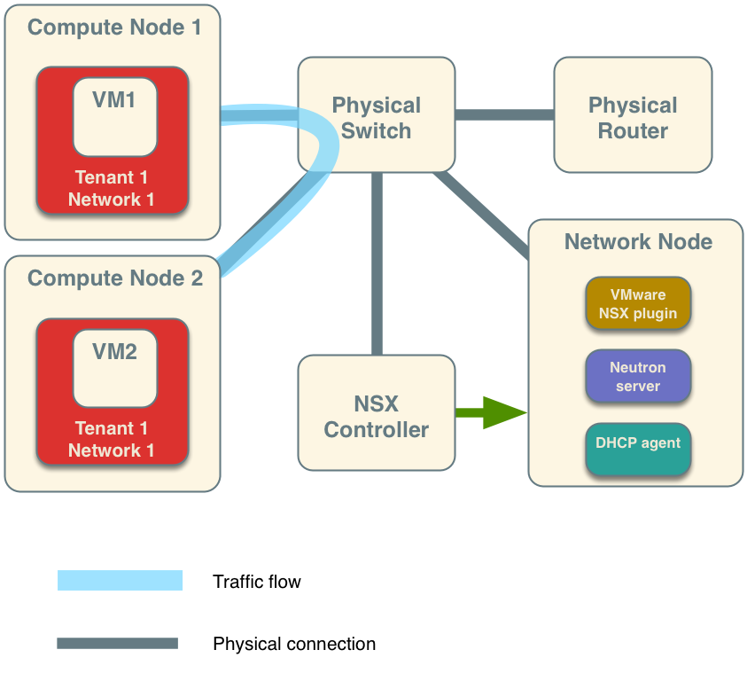
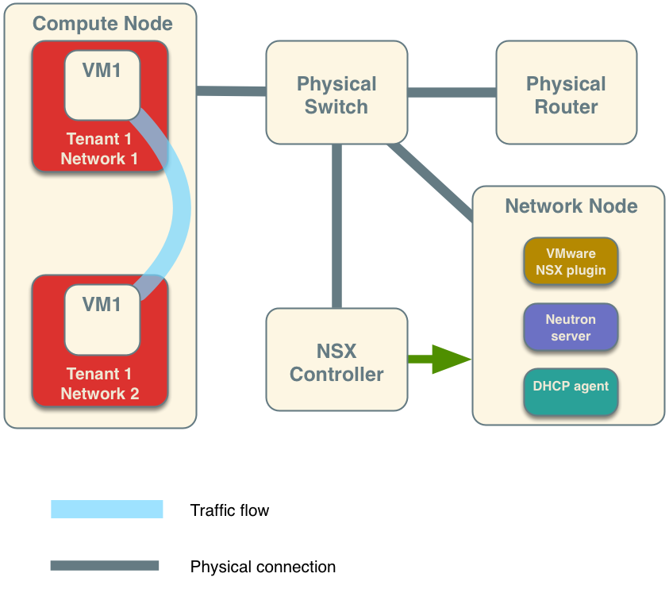

=======================
Networking architecture
=======================

Before you deploy Networking, it is useful to understand the Networking
services and how they interact with the OpenStack components.

Overview
~~~~~~~~

Networking is a standalone component in the OpenStack modular
architecture. It is positioned alongside OpenStack components such as
Compute, Image service, Identity, or Dashboard. Like those
components, a deployment of Networking often involves deploying several
services to a variety of hosts.

The Networking server uses the neutron-server daemon to expose the
Networking API and enable administration of the configured Networking
plug-in. Typically, the plug-in requires access to a database for
persistent storage (also similar to other OpenStack services).

If your deployment uses a controller host to run centralized Compute
components, you can deploy the Networking server to that same host.
However, Networking is entirely standalone and can be deployed to a
dedicated host. Depending on your configuration, Networking can also
include the following agents:

+----------------------------+---------------------------------------------+
| Agent                      | Description                                 |
+============================+=============================================+
|**plug-in agent**           |                                             |
|(``neutron-*-agent``)       | Runs on each hypervisor to perform          |
|                            | local vSwitch configuration. The agent that |
|                            | runs, depends on the plug-in that you use.  |
|                            | Certain plug-ins do not require an agent.   |
+----------------------------+---------------------------------------------+
|**dhcp agent**              |                                             |
|(``neutron-dhcp-agent``)    | Provides DHCP services to project networks. |
|                            | Required by certain plug-ins.               |
+----------------------------+---------------------------------------------+
|**l3 agent**                |                                             |
|(``neutron-l3-agent``)      | Provides L3/NAT forwarding to provide       |
|                            | external network access for VMs on project  |
|                            | networks. Required by certain plug-ins.     |
+----------------------------+---------------------------------------------+
|**metering agent**          |                                             |
|(``neutron-metering-agent``)| Provides L3 traffic metering for project    |
|                            | networks.                                   |
+----------------------------+---------------------------------------------+

These agents interact with the main neutron process through RPC (for
example, RabbitMQ or Qpid) or through the standard Networking API. In
addition, Networking integrates with OpenStack components in a number of
ways:

-  Networking relies on the Identity service (keystone) for the
   authentication and authorization of all API requests.

-  Compute (nova) interacts with Networking through calls to its
   standard API. As part of creating a VM, the ``nova-compute`` service
   communicates with the Networking API to plug each virtual NIC on the
   VM into a particular network.

-  The dashboard (horizon) integrates with the Networking API, enabling
   administrators and project users to create and manage network services
   through a web-based GUI.

VMware NSX integration
~~~~~~~~~~~~~~~~~~~~~~

OpenStack Networking uses the NSX plug-in to integrate with an existing
VMware vCenter deployment. When installed on the network nodes, the NSX
plug-in enables a NSX controller to centrally manage configuration
settings and push them to managed network nodes. Network nodes are
considered managed when they are added as hypervisors to the NSX
controller.

The diagrams below depict some VMware NSX deployment examples. The first
diagram illustrates the traffic flow between VMs on separate Compute
nodes, and the second diagram between two VMs on a single compute node.
Note the placement of the VMware NSX plug-in and the neutron-server
service on the network node. The green arrow indicates the management
relationship between the NSX controller and the network node.

