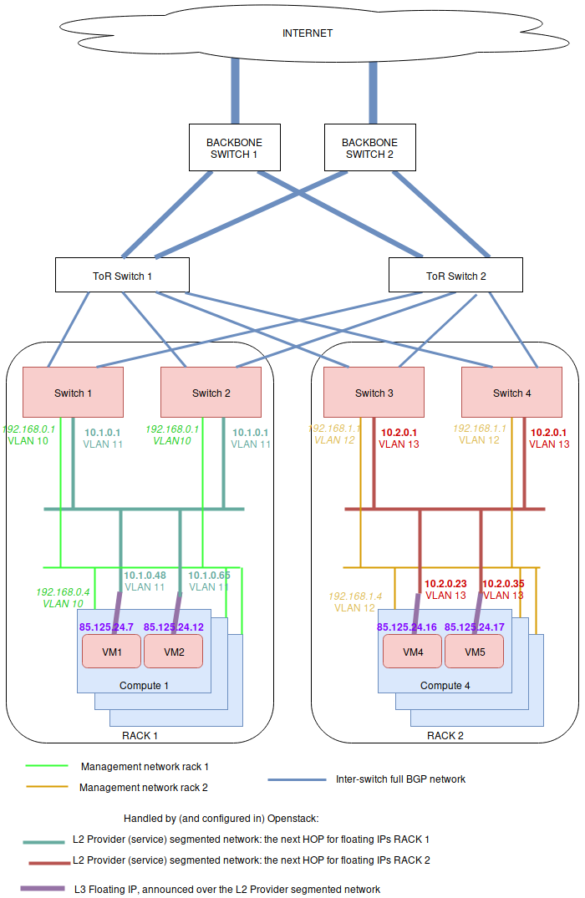

.. _config-bgp-floating-ip-over-l2-segmented-network:

==========================================
BGP floating IPs over l2 segmented network
==========================================

The general principle is that L2 connectivity will be bound to a single rack.
Everything outside the switches of the rack will be routed using BGP. To
perform the BGP announcement, neutron-dynamic-routing is leveraged.

To achieve this, on each rack, servers are setup with a different management
network using a vlan ID per rack (light green and orange network below).
Note that a unique vlan ID per rack isn't mandatory, it's also possible to
use the same vlan ID on all racks. The point here is only to isolate L2
segments (typically, routing between the switch of each racks will be done
over BGP, without L2 connectivity).

On the OpenStack side, a provider network must be setup, which is using a
different subnet range and vlan ID for each rack. This includes:

* an address scope

* some network segments for that network, which are attached to a named
  physical network

* a subnet pool using that address scope
* one provider network subnet per segment (each subnet+segment pair matches
  one rack physical network name)

A segment is attached to a specific vlan and physical network name. In the
above figure, the provider network is represented by 2 subnets: the dark green
and the red ones. The dark green subnet is on one network segment, and the red
one on another. Both subnet are of the subnet service type
"network:floatingip_agent_gateway", so that they cannot be used by virtual
machines directly.

On top of all of this, a floating IP subnet without a segment is added, which
spans in all of the racks. This subnet must have the below service types:

* network:routed

* network:floatingip

* network:router_gateway

Since the network:routed subnet isn't bound to a segment, it can be used on all
racks. As the service types network:floatingip and network:router_gateway are
used for the provider network, the subnet can only be used for floating IPs and
router gateways, meaning that the subnet using segments will be used as
floating IP gateways (ie: the next HOP to reach these floating IP / router
external gateways).

Configuring the Neutron API side
--------------------------------

On the controller side (ie: API and RPC server), only the Neutron Dynamic
Routing Python library must be installed (for example, in the Debian case,
that would be the neutron-dynamic-routing-common and
python3-neutron-dynamic-routing packages). On top of that, "segments" and
"bgp" must be added to the list of plugins in service_plugins. For example
in neutron.conf:

.. code-block:: ini

   [DEFAULT]
   service_plugins=router,metering,qos,trunk,segments,bgp

The BGP agent
-------------

The neutron-bgp-agent must be installed. Best is to install it twice per rack,
on any machine (it doesn't mater much where). Then each of these BGP agents
will establish a session with one switch, and advertise all of the BGP
configuration.

Setting-up BGP peering with the switches
----------------------------------------

A peer that represents the network equipment must be created. Then a matching
BGP speaker needs to be created. Then, the BGP speaker must be
associated to a dynamic-routing-agent (in our example, the dynamic-routing
agents run on compute 1 and 4). Finally, the peer is added to the BGP speaker,
so the speaker initiates a BGP session to the network equipment.

.. code-block:: console

   $ # Create a BGP peer to represent the switch 1,
   $ # which runs FRR on 10.1.0.253 with AS 64601
   $ openstack bgp peer create \
         --peer-ip 10.1.0.253 \
         --remote-as 64601 \
         rack1-switch-1

   $ # Create a BGP speaker on compute-1
   $ BGP_SPEAKER_ID_COMPUTE_1=$(openstack bgp speaker create \
         --local-as 64999 --ip-version 4 mycloud-compute-1.example.com \
         --format value -c id)

   $ # Get the agent ID of the dragent running on compute 1
   $ BGP_AGENT_ID_COMPUTE_1=$(openstack network agent list \
         --host mycloud-compute-1.example.com --agent-type bgp \
         --format value -c ID)

   $ # Add the BGP speaker to the dragent of compute 1
   $ openstack bgp dragent add speaker \
         ${BGP_AGENT_ID_COMPUTE_1} ${BGP_SPEAKER_ID_COMPUTE_1}

   $ # Add the BGP peer to the speaker of compute 1
   $ openstack bgp speaker add peer \
         compute-1.example.com rack1-switch-1

   $ # Tell the speaker not to advertize tenant networks
   $ openstack bgp speaker set \
         --no-advertise-tenant-networks mycloud-compute-1.example.com

It is possible to repeat this operation for a 2nd machine on the same rack,
if the deployment is using bonding (and then, LACP between both switches),
as per the figure above. It also can be done on each rack. One way to
deploy is to select two computers in each rack (for example, one compute
node and one network node), and install the neutron-dynamic-routing-agent
on each of them, so they can "talk" to both switches of the rack. All of
this depends on what the configuration is on the switch side. It may be
that you only need to talk to two ToR racks in the whole deployment. The
thing you must know is that you can deploy as many dynamic-routing agent
as needed, and that one agent can talk to a single device.

Setting-up physical network names
---------------------------------

Before setting-up the provider network, the physical network name must be set
in each host, according to the rack names. On the compute or network nodes,
this is done in /etc/neutron/plugins/ml2/openvswitch_agent.ini using the
bridge_mappings directive:

.. code-block:: ini

   [ovs]
   bridge_mappings = physnet-rack1:br-ex

All of the physical networks created this way must be added in the
configuration of the neutron-server as well (ie: this is used by both
neutron-api and neutron-rpc-server). For example, with 3 racks,
here's how /etc/neutron/plugins/ml2/ml2_conf.ini should look like:

.. code-block:: ini

   [ml2_type_flat]
   flat_networks = physnet-rack1,physnet-rack2,physnet-rack3

   [ml2_type_vlan]
   network_vlan_ranges = physnet-rack1,physnet-rack2,physnet-rack3

Once this is done, the provider network can be created, using physnet-rack1
as "physical network".

Setting-up the provider network
-------------------------------

Everything that is in the provider network's scope will be advertised through
BGP. Here is how to create the network scope:

.. code-block:: console

   $ # Create the address scope
   $ openstack address scope create --share --ip-version 4 provider-addr-scope

Then, the network can be ceated using the physical network name set above:

.. code-block:: console

   $ # Create the provider network that spawns over all racks
   $ openstack network create --external --share \
         --provider-physical-network physnet-rack1 \
         --provider-network-type vlan \
         --provider-segment 11 \
         provider-network

This automatically creates a network AND a segment. Though by default, this
segment has no name, which isn't convenient. This name can be changed though:

.. code-block:: console

   $ # Get the network ID:
   $ PROVIDER_NETWORK_ID=$(openstack network show provider-network \
         --format value -c id)

   $ # Get the segment ID:
   $ FIRST_SEGMENT_ID=$(openstack network segment list \
         --format csv -c ID -c Network | \
         q -H -d, "SELECT ID FROM - WHERE Network='${PROVIDER_NETWORK_ID}'")

   $ # Set the 1st segment name, matching the rack name
   $ openstack network segment set --name segment-rack1 ${FIRST_SEGMENT_ID}

Setting-up the 2nd segment
--------------------------

The 2nd segment, which will be attached to our provider network, is created
this way:

.. code-block:: console

   $ # Create the 2nd segment, matching the 2nd rack name
   $ openstack network segment create \
         --physical-network physnet-rack2 \
         --network-type vlan \
         --segment 13 \
         --network provider-network \
         segment-rack2

Setting-up the provider subnets for the BGP next HOP routing
------------------------------------------------------------

These subnets will be in use in different racks, depending on what physical
network is in use in the machines. In order to use the address scope, subnet
pools must be used. Here is how to create the subnet pool with the two ranges
to use later when creating the subnets:

.. code-block:: console

   $ # Create the provider subnet pool which includes all ranges for all racks
   $ openstack subnet pool create \
         --pool-prefix 10.1.0.0/24 \
         --pool-prefix 10.2.0.0/24 \
         --address-scope provider-addr-scope \
         --share \
         provider-subnet-pool

Then, this is how to create the two subnets. In this example, we are keeping
the addresses in .1 for the gateway, .2 for the DHCP server, and .253 +.254,
as these addresses will be used by the switches for the BGP announcements:

.. code-block:: console

   $ # Create the subnet for the physnet-rack-1, using the segment-rack-1, and
   $ # the subnet_service_type network:floatingip_agent_gateway
   $ openstack subnet create \
         --service-type 'network:floatingip_agent_gateway' \
         --subnet-pool provider-subnet-pool \
         --subnet-range 10.1.0.0/24 \
         --allocation-pool start=10.1.0.3,end=10.1.0.252 \
         --gateway 10.1.0.1 \
         --network provider-network \
         --network-segment segment-rack1 \
         provider-subnet-rack1

   $ # The same, for the 2nd rack
   $ openstack subnet create \
         --service-type 'network:floatingip_agent_gateway' \
         --subnet-pool provider-subnet-pool \
         --subnet-range 10.2.0.0/24 \
         --allocation-pool start=10.2.0.3,end=10.2.0.252 \
         --gateway 10.2.0.1 \
         --network provider-network \
         --network-segment segment-rack2 \
         provider-subnet-rack2

Note the service types. network:floatingip_agent_gateway makes sure that these
subnets will be in use only as gateways (ie: the next BGP hop). The above can
be repeated for each new rack.

Adding a subnet for VM floating IPs and router gateways
-------------------------------------------------------

This is to be repeated each time a new subnet must be created for floating IPs
and router gateways. First, the range is added in the subnet pool, then the
subnet itself is created:

.. code-block:: console

   $ # Add a new prefix in the subnet pool for the floating IPs:
   $ openstack subnet pool set \
         --pool-prefix 203.0.113.0/24 \
         provider-subnet-pool

   $ # Create the floating IP subnet
   $ openstack subnet create vm-fip \
         --service-type 'network:routed' \
         --service-type 'network:floatingip' \
         --service-type 'network:router_gateway' \
         --subnet-pool provider-subnet-pool \
         --subnet-range 203.0.113.0/24 \
         --network provider-network

The service-type network:routed ensures we're using BGP through the provider
network to advertize the IPs. network:floatingip and network:router_gateway
limits the use of these IPs to floating IPs and router gateways.

Setting-up BGP advertizing
--------------------------

The provider network needs to be added to each of the BGP speakers. This means
each time a new rack is setup, the provider network must be added to the 2 BGP
speakers of that rack.

.. code-block:: console

   $ # Add the provider network to the BGP speakers.
   $ openstack bgp speaker add network \
         mycloud-compute-1.example.com provider-network
   $ openstack bgp speaker add network \
         mycloud-compute-4.example.com provider-network

In this example, we've selected two compute nodes that are also running an
instance of the neutron-dynamic-routing-agent daemon.

Per project operation
---------------------

This can be done by each customer. A subnet pool isn't mandatory, but it is
nice to have. Typically, the customer network will not be advertized through
BGP (but this can be done if needed).

.. code-block:: console

   $ # Create the tenant private network
   $ openstack network create tenant-network

   $ # Self-service network pool:
   $ openstack subnet pool create \
         --pool-prefix 192.168.130.0/23 \
         --share \
         tenant-subnet-pool

   $ # Self-service subnet:
   $ openstack subnet create \
         --network tenant-network \
         --subnet-pool tenant-subnet-pool \
         --prefix-length 24 \
         tenant-subnet-1

   $ # Create the router
   $ openstack router create tenant-router

   $ # Add the tenant subnet to the tenant router
   $ openstack router add subnet \
         tenant-router tenant-subnet-1

   $ # Set the router's default gateway. This will use one public IP.
   $ openstack router set \
         --external-gateway provider-network tenant-router

   $ # Create a first VM on the tenant subnet
   $ openstack server create --image debian-10.5.0-openstack-amd64.qcow2 \
         --flavor cpu2-ram6-disk20 \
         --nic net-id=tenant-network \
         --key-name yubikey-zigo \
         test-server-1

   $ # Eventually, add a floating IP
   $ openstack floating ip create provider-network
   +---------------------+--------------------------------------+
   | Field               | Value                                |
   +---------------------+--------------------------------------+
   | created_at          | 2020-12-15T11:48:36Z                 |
   | description         |                                      |
   | dns_domain          | None                                 |
   | dns_name            | None                                 |
   | fixed_ip_address    | None                                 |
   | floating_ip_address | 203.0.113.17                         |
   | floating_network_id | 859f5302-7b22-4c50-92f8-1f71d6f3f3f4 |
   | id                  | 01de252b-4b78-4198-bc28-1328393bf084 |
   | name                | 203.0.113.17                         |
   | port_details        | None                                 |
   | port_id             | None                                 |
   | project_id          | d71a5d98aef04386b57736a4ea4f3644     |
   | qos_policy_id       | None                                 |
   | revision_number     | 0                                    |
   | router_id           | None                                 |
   | status              | DOWN                                 |
   | subnet_id           | None                                 |
   | tags                | []                                   |
   | updated_at          | 2020-12-15T11:48:36Z                 |
   +---------------------+--------------------------------------+
   $ openstack server add floating ip test-server-1 203.0.113.17

Cumulus switch configuration
----------------------------

Because of the way Neutron works, for each new port associated with an IP
address, a GARP is issued, to inform the switch about the new MAC / IP
association. Unfortunately, this confuses the switches where they may think
they should use local ARP table to route the packet, rather than giving it to
the next HOP to route. The definitive solution would be to patch Neutron to
make it stop sending GARP for any port on a subnet with the network:routed
service type. Such patch would be hard to write, though lucky, there's a fix
that works (at least with Cumulus switches). Here's how.

In /etc/network/switchd.conf we change this:

.. code-block:: ini

   # configure a route instead of a neighbor with the same ip/mask
   #route.route_preferred_over_neigh = FALSE
   route.route_preferred_over_neigh = TRUE

and then simply restart switchd:

.. code-block:: console

   systemctl restart switchd

This reboots the switch ASIC of the switch, so it may be a dangerous thing to
do with no switch redundancy (so be careful when doing it). The completely safe
procedure, if having 2 switches per rack, looks like this:

.. code-block:: console

   # save clagd priority
   OLDPRIO=$(clagctl status | sed -r -n  's/.*Our.*Role: ([0-9]+) 0.*/\1/p')
   # make sure that this switch is not the primary clag switch. otherwise the
   # secondary switch will also shutdown all interfaces when loosing contact
   # with the primary switch.
   clagctl priority 16535

   # tell neighbors to not route through this router
   vtysh
   vtysh# router bgp 64999
   vtysh# bgp graceful-shutdown
   vtysh# exit
   systemctl restart switchd
   clagctl priority $OLDPRIO

Verification
------------

If everything goes well, the floating IPs are advertized over BGP through the
provider network. Here is an example with 4 VMs deployed on 2 racks. Neutron
is here picking-up IPs on the segmented network as Nexthop.

.. code-block:: console

   $ # Check the advertized routes:
   $ openstack bgp speaker list advertised routes \
         mycloud-compute-4.example.com
   +-----------------+-----------+
   | Destination     | Nexthop   |
   +-----------------+-----------+
   | 203.0.113.17/32 | 10.1.0.48 |
   | 203.0.113.20/32 | 10.1.0.65 |
   | 203.0.113.40/32 | 10.2.0.23 |
   | 203.0.113.55/32 | 10.2.0.35 |
   +-----------------+-----------+
