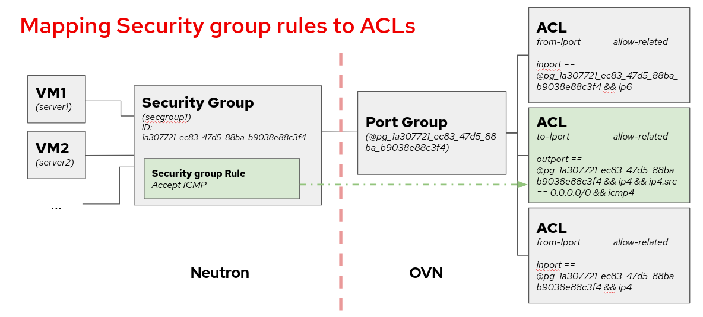
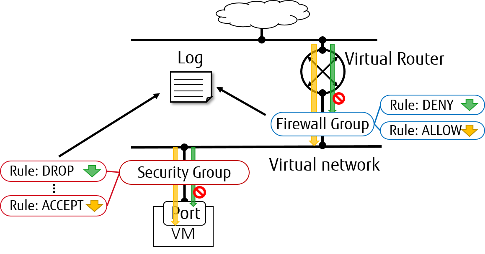

.. _config-logging:

========================
Packet Logging Framework
========================

Packet logging service is designed as a Neutron plug-in that captures network
packets for relevant resources (e.g. security group or firewall group) when the
registered events occur.

--------------
ML2/OVN Driver
--------------

Supported loggable resource types
~~~~~~~~~~~~~~~~~~~~~~~~~~~~~~~~~

From the Wallaby release the ML2/OVN driver supports the ``security_group``
resource.

The following diagram shows a mapping from Neutron security group framework to
the ACLs, which are the resources where we enable the logging when using
ML2/OVN. Each security group rule maps to an ACL associated to a port group
that contains all the ports belonging to the security group.

.. _contributors documentation: https://docs.openstack.org/neutron/latest/contributor/internals/ovn/ovn_network_logging.html

For more details on the developing peculiarities of this implementation, you
can check the `contributors documentation`_.

Service Configuration
~~~~~~~~~~~~~~~~~~~~~

To enable the logging service, add ``log`` to the ``service_plugins`` setting
in ``/etc/neutron/neutron.conf``:

.. code-block:: ini

     service_plugins = router,metering,log

It is possible to set parameters in ml2_conf.ini to tune how we want to log the
packets by modifying ``rate_limit`` and ``burst_limit`` in section
``[network_log]`` in ``/etc/neutron/plugins/ml2/ml2_conf.ini``:

* ``rate_limit`` - Limit the packet rate of the logs that are sent to the OVN
  controller, in packets per second. The higher the number, the more logs we
  will get in the log file.

* ``burst_limit`` - Increase the packet rate limit by the specified value for a
  short period of time.

.. code-block:: ini

     [network_log]
     rate_limit = 150
     burst_limit = 50

.. note::

     There is a minimum value for these parameters. For ``rate_limit`` it is
     100 and for ``burst_limit`` it is 25.

In order to make the changes to rate and burst effective, restart the
neutron-server service. To ensure the configuration for rate and burst was
updated, check the meter-band table on the OVN Northbound database. You need to
create at least one log object to see the meter band entry created.

.. code-block:: console

     $ ovn-nbctl list meter-band

Service workflow
~~~~~~~~~~~~~~~~
Create a logging resource with security group as resource type:

.. code-block:: console

   $ openstack network log create --resource-type security_group \
   --resource sg1 --event ALL log1

     +-----------------+--------------------------------------+
     | Field           | Value                                |
     +-----------------+--------------------------------------+
     | Description     |                                      |
     | Enabled         | True                                 |
     | Event           | ALL                                  |
     | ID              | 67b1f618-0b89-4b9c-b3e4-9378b4472175 |
     | Name            | log1                                 |
     | Project         | 74731b187a824a8d9b85a12b6eacbcbb     |
     | Resource        | 387494cb-392a-4760-8c36-09be2fdb0b49 |
     | Target          | None                                 |
     | Type            | security_group                       |
     | created_at      | 2023-07-31T09:44:34Z                 |
     | revision_number | 0                                    |
     | tenant_id       | 74731b187a824a8d9b85a12b6eacbcbb     |
     | updated_at      | 2023-07-31T09:44:34Z                 |
     +-----------------+--------------------------------------+

.. note::

     Due to the internal design of the ML2/OVN driver, there is one ACL that
     aggregates all dropped traffic, instead of having one drop ACL per
     security group. Since the smallest logging unit in OVN is the ACL, that
     means that if we choose to log DROP traffic, we will get traffic logged
     from all security groups.

     If we choose to log ALL traffic, we will get the accepted traffic
     from the selected security group, but the dropped traffic from all
     security groups.

     This can change in following releases if the ACL management is redesigned
     in OVN.

.. warning::

   We cannot assign individual ports when using ML2/OVN, so the ``--target``
   parameter is not used.

Just as with ML2/OVS, we can enable or disable logging objects at runtime. If
we have two objects targeted to log the same resource, as long as one of them
is enabled, the resource will be logged on the logfile.

Understanding the logging
~~~~~~~~~~~~~~~~~~~~~~~~~

In ML2/OVN we find the packet monitoring logging recorded on each
``ovn-controller.log`` file within the compute nodes. This means that we will
have as many logfiles as compute nodes, because each OVN controller has the
capacity of logging only the traffic they manage. The location of the OVN
controller log may differ depending on the distribution, please consult your
installation documentation for more details. The format of the logging is:

.. code-block:: console

   2023-01-08T17:57:28.283002425+00:00 stderr F
   2023-01-08T17:57:28Z|00094|acl_log(ovn_pinctrl0)|INFO|
   name="neutron-e9ebf19c-3d84-49ae-a81e-7a01035a8768", verdict=allow,
   severity=info, direction=to-lport: icmp, vlan_tci=0x0000,
   dl_src=fa:16:3e:d3:b4:48, dl_dst=fa:16:3e:9a:d9:7d, nw_src=10.0.0.67,
   nw_dst=192.168.100.11, nw_tos=0, nw_ecn=0, nw_ttl=63, nw_frag=no,
   icmp_type=8, icmp_code=0

In this example, the name is ``neutron-<security group log object ID>``. We can
also see the verdict, the severity, the direction of the datagram and the
content.

--------------
ML2/OVS Driver
--------------

Supported loggable resource types
~~~~~~~~~~~~~~~~~~~~~~~~~~~~~~~~~

From Rocky Release, the ML2/OVS driver supports both ``security_group`` and
``firewall_group`` as resource types in the Neutron packet logging framework.

Service Configuration
~~~~~~~~~~~~~~~~~~~~~

To enable the logging service, follow the below steps.

#. On Neutron controller node, add ``log`` to ``service_plugins`` setting in
   ``/etc/neutron/neutron.conf`` file. For example:

   .. code-block:: ini

     service_plugins = router,metering,log

#. To enable logging service for ``security_group`` in Layer 2, add ``log`` to
   option ``extensions`` in section ``[agent]`` in
   ``/etc/neutron/plugins/ml2/ml2_conf.ini`` for controller node and in
   ``/etc/neutron/plugins/ml2/openvswitch_agent.ini``
   for compute/network nodes. For example:

   .. code-block:: ini

     [agent]
     extensions = log

   .. note::

       Fwaas v2 log is currently only supported by openvswitch.

#. To enable logging service for ``firewall_group`` in Layer 3, add
   ``fwaas_v2_log`` to option ``extensions`` in section ``[AGENT]`` in
   ``/etc/neutron/l3_agent.ini`` for network nodes. For example:

   .. code-block:: ini

     [AGENT]
     extensions = fwaas_v2,fwaas_v2_log

#. On compute/network nodes, add configuration for logging service to
   ``[network_log]`` in ``/etc/neutron/plugins/ml2/openvswitch_agent.ini``
   and in ``/etc/neutron/l3_agent.ini`` as shown below:

   .. code-block:: ini

      [network_log]
      rate_limit = 100
      burst_limit = 25
      #local_output_log_base = <None>

   In which, ``rate_limit`` is used to configure the maximum number of packets
   to be logged per second (packets per second). When a high rate triggers
   ``rate_limit``, logging queues packets to be logged. ``burst_limit`` is
   used to configure the maximum of queued packets. And logged packets can be
   stored anywhere by using ``local_output_log_base``.

   .. note::

      - It requires at least ``100`` for ``rate_limit`` and at least ``25``
        for ``burst_limit``.
      - If ``rate_limit`` is unset, logging will log unlimited.
      - If we don't specify ``local_output_log_base``, logged packets will be
        stored in system journal like ``/var/log/syslog`` by default.

Trusted projects policy.yaml configuration
----------------------------------------------

With the default ``/etc/neutron/policy.yaml``, administrators must set up
resource logging on behalf of the cloud projects.

If projects are trusted to administer their own loggable resources  in their
cloud, neutron's policy file ``policy.yaml`` can be modified to allow this.

Modify ``/etc/neutron/policy.yaml`` entries as follows:

.. code-block:: yaml

   "get_loggable_resources": "rule:regular_user"
   "create_log": "rule:regular_user"
   "get_log": "rule:regular_user"
   "get_logs": "rule:regular_user"
   "update_log": "rule:regular_user"
   "delete_log": "rule:regular_user"

Service workflow for Operator
~~~~~~~~~~~~~~~~~~~~~~~~~~~~~

#. To check the loggable resources that are supported by framework:

   .. code-block:: console

      $ openstack network loggable resources list
      +-----------------+
      | Supported types |
      +-----------------+
      | security_group  |
      | firewall_group  |
      +-----------------+

   .. note::

      - In VM ports, logging for ``security_group`` in currently works with
        ``openvswitch`` firewall driver.
      - Logging for ``firewall_group`` works on internal router ports only. VM
        ports would be supported in the future.

#. Log creation:

   * Create a logging resource with an appropriate resource type

     .. code-block:: console

        $ openstack network log create --resource-type security_group \
          --description "Collecting all security events" \
          --event ALL Log_Created
        +-----------------+------------------------------------------------+
        | Field           | Value                                          |
        +-----------------+------------------------------------------------+
        | Description     | Collecting all security events                 |
        | Enabled         | True                                           |
        | Event           | ALL                                            |
        | ID              | 8085c3e6-0fa2-4954-b5ce-ff6207931b6d           |
        | Name            | Log_Created                                    |
        | Project         | 02568bd62b414221956f15dbe9527d16               |
        | Resource        | None                                           |
        | Target          | None                                           |
        | Type            | security_group                                 |
        | created_at      | 2017-07-05T02:56:43Z                           |
        | revision_number | 0                                              |
        | tenant_id       | 02568bd62b414221956f15dbe9527d16               |
        | updated_at      | 2017-07-05T02:56:43Z                           |
        +-----------------+------------------------------------------------+

     .. warning::

        In the case of ``--resource`` and ``--target`` are not specified from the
        request, these arguments will be assigned to ``ALL`` by default. Hence,
        there is an enormous range of log events will be created.

   * Create logging resource with a given resource (sg1 or fwg1)

     .. code-block:: console

        $ openstack network log create my-log --resource-type security_group --resource sg1
        $ openstack network log create my-log --resource-type firewall_group --resource fwg1

   * Create logging resource with a given target (portA)

     .. code-block:: console

        $ openstack network log create my-log --resource-type security_group --target portA

   * Create logging resource for only the given target (portB) and the given
     resource (sg1 or fwg1)

     .. code-block:: console

        $ openstack network log create my-log --resource-type security_group --target portB --resource sg1
        $ openstack network log create my-log --resource-type firewall_group --target portB --resource fwg1

   .. note::

      - The ``Enabled`` field is set to ``True`` by default. If enabled, logged
        events are written to the destination if ``local_output_log_base`` is
        configured or ``/var/log/syslog`` in default.
      - The ``Event`` field will be set to ``ALL`` if ``--event`` is not specified
        from log creation request.

#. Enable/Disable log

   We can ``enable`` or ``disable`` logging objects at runtime. It means that
   it will apply to all registered ports with the logging object immediately.
   For example:

   .. code-block:: console

      $ openstack network log set --disable Log_Created
      $ openstack network log show Log_Created
       +-----------------+------------------------------------------------+
       | Field           | Value                                          |
       +-----------------+------------------------------------------------+
       | Description     | Collecting all security events                 |
       | Enabled         | False                                          |
       | Event           | ALL                                            |
       | ID              | 8085c3e6-0fa2-4954-b5ce-ff6207931b6d           |
       | Name            | Log_Created                                    |
       | Project         | 02568bd62b414221956f15dbe9527d16               |
       | Resource        | None                                           |
       | Target          | None                                           |
       | Type            | security_group                                 |
       | created_at      | 2017-07-05T02:56:43Z                           |
       | revision_number | 1                                              |
       | tenant_id       | 02568bd62b414221956f15dbe9527d16               |
       | updated_at      | 2017-07-05T03:12:01Z                           |
       +-----------------+------------------------------------------------+

Logged events description
~~~~~~~~~~~~~~~~~~~~~~~~~

Currently, packet logging framework supports to collect ``ACCEPT`` or ``DROP``
or both events related to registered resources. As mentioned above, Neutron
packet logging framework offers two loggable resources through the ``log``
service plug-in: ``security_group`` and ``firewall_group``.

The  general characteristics of each event will be shown as the following:

* Log every ``DROP`` event: Every ``DROP`` security events will be generated
  when an incoming or outgoing session is blocked by the security groups or
  firewall groups

* Log an ``ACCEPT`` event: The ``ACCEPT`` security event will be generated only
  for each ``NEW`` incoming or outgoing session that is allowed by security
  groups or firewall groups. More details for the ``ACCEPT`` events are shown
  as bellow:

  * North/South ``ACCEPT``: For a North/South session there would be a single
    ``ACCEPT`` event irrespective of direction.

  * East/West ``ACCEPT``/``ACCEPT``: In an intra-project East/West session
    where the originating port allows the session and the destination port
    allows the session, i.e. the traffic is allowed, there would be two
    ``ACCEPT`` security events generated, one from the perspective of the
    originating port and one from the perspective of the destination port.

  * East/West ``ACCEPT``/``DROP``: In an intra-project East/West session
    initiation where the originating port allows the session and the
    destination port does not allow the session there would be ``ACCEPT``
    security events generated from the perspective of the originating port and
    ``DROP`` security events generated from the perspective of the destination
    port.

#. The security events that are collected by security group should include:

   * A timestamp of the flow.
   * A status of the flow ``ACCEPT``/``DROP``.
   * An indication of the originator of the flow, e.g which project or log
     resource generated the events.
   * An identifier of the associated instance interface (neutron port id).
   * A layer 2, 3 and 4 information (mac, address, port, protocol, etc).

   * Security event record format:

     Logged data of an ``ACCEPT`` event would look like:

     .. code-block:: console

         May 5 09:05:07 action=ACCEPT project_id=736672c700cd43e1bd321aeaf940365c
         log_resource_ids=['4522efdf-8d44-4e19-b237-64cafc49469b', '42332d89-df42-4588-a2bb-3ce50829ac51']
         vm_port=e0259ade-86de-482e-a717-f58258f7173f
         ethernet(dst='fa:16:3e:ec:36:32',ethertype=2048,src='fa:16:3e:50:aa:b5'),
         ipv4(csum=62071,dst='10.0.0.4',flags=2,header_length=5,identification=36638,offset=0,
         option=None,proto=6,src='172.24.4.10',tos=0,total_length=60,ttl=63,version=4),
         tcp(ack=0,bits=2,csum=15097,dst_port=80,offset=10,option=[TCPOptionMaximumSegmentSize(kind=2,length=4,max_seg_size=1460),
         TCPOptionSACKPermitted(kind=4,length=2), TCPOptionTimestamps(kind=8,length=10,ts_ecr=0,ts_val=196418896),
         TCPOptionNoOperation(kind=1,length=1), TCPOptionWindowScale(kind=3,length=3,shift_cnt=3)],
         seq=3284890090,src_port=47825,urgent=0,window_size=14600)

     Logged data of a ``DROP`` event:

     .. code-block:: console

         May 5 09:05:07 action=DROP project_id=736672c700cd43e1bd321aeaf940365c
         log_resource_ids=['4522efdf-8d44-4e19-b237-64cafc49469b'] vm_port=e0259ade-86de-482e-a717-f58258f7173f
         ethernet(dst='fa:16:3e:ec:36:32',ethertype=2048,src='fa:16:3e:50:aa:b5'),
         ipv4(csum=62071,dst='10.0.0.4',flags=2,header_length=5,identification=36638,offset=0,
         option=None,proto=6,src='172.24.4.10',tos=0,total_length=60,ttl=63,version=4),
         tcp(ack=0,bits=2,csum=15097,dst_port=80,offset=10,option=[TCPOptionMaximumSegmentSize(kind=2,length=4,max_seg_size=1460),
         TCPOptionSACKPermitted(kind=4,length=2), TCPOptionTimestamps(kind=8,length=10,ts_ecr=0,ts_val=196418896),
         TCPOptionNoOperation(kind=1,length=1), TCPOptionWindowScale(kind=3,length=3,shift_cnt=3)],
         seq=3284890090,src_port=47825,urgent=0,window_size=14600)

#. The events that are collected by firewall group should include:

   * A timestamp of the flow.
   * A status of the flow ``ACCEPT``/``DROP``.
   * The identifier of log objects that are collecting this event
   * An identifier of the associated instance interface (neutron port id).
   * A layer 2, 3 and 4 information (mac, address, port, protocol, etc).

   * Security event record format:

     Logged data of an ``ACCEPT`` event would look like:

     .. code-block:: console

         Jul 26 14:46:20:
         action=ACCEPT, log_resource_ids=[u'2e030f3a-e93d-4a76-bc60-1d11c0f6561b'], port=9882c485-b808-4a34-a3fb-b537642c66b2
         pkt=ethernet(dst='fa:16:3e:8f:47:c5',ethertype=2048,src='fa:16:3e:1b:3e:67')
         ipv4(csum=47423,dst='10.10.1.16',flags=2,header_length=5,identification=27969,offset=0,option=None,proto=1,src='10.10.0.5',tos=0,total_length=84,ttl=63,version=4)
         icmp(code=0,csum=41376,data=echo(data='\xe5\xf2\xfej\x00\x00\x00\x00\x00\x00\x00\x00\x00\x00\x00\x00\x00\x00\x00\x00
         \x00\x00\x00\x00\x00\x00\x00\x00\x00\x00\x00\x00\x00\x00\x00\x00\x00\x00\x00\x00\x00\x00\x00\x00\x00\x00\x00\x00\x00
         \x00\x00\x00\x00\x00\x00\x00',id=29185,seq=0),type=8)

     Logged data of a ``DROP`` event:

     .. code-block:: console

         Jul 26 14:51:20:
         action=DROP, log_resource_ids=[u'2e030f3a-e93d-4a76-bc60-1d11c0f6561b'], port=9882c485-b808-4a34-a3fb-b537642c66b2
         pkt=ethernet(dst='fa:16:3e:32:7d:ff',ethertype=2048,src='fa:16:3e:28:83:51')
         ipv4(csum=17518,dst='10.10.0.5',flags=2,header_length=5,identification=57874,offset=0,option=None,proto=1,src='10.10.1.16',tos=0,total_length=84,ttl=63,version=4)
         icmp(code=0,csum=23772,data=echo(data='\x8a\xa0\xac|\x00\x00\x00\x00\x00\x00\x00\x00\x00\x00\x00\x00\x00\x00\x00\x00
         \x00\x00\x00\x00\x00\x00\x00\x00\x00\x00\x00\x00\x00\x00\x00\x00\x00\x00\x00\x00\x00\x00\x00\x00\x00\x00\x00\x00\x00
         \x00\x00\x00\x00\x00\x00\x00',id=25601,seq=5),type=8)

.. note::

   No other extraneous events are generated within the security event logs,
   e.g. no debugging data, etc.
