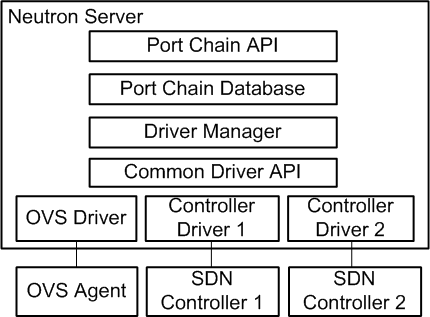
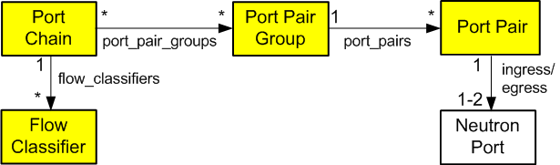

.. _adv-config-sfc:

=========================
Service Function Chaining
=========================

Service function chain (SFC) essentially refers to the
software-defined networking (SDN) version of
policy-based routing (PBR). In many cases, SFC involves security,
although it can include a variety of other features.

Fundamentally, SFC routes packets through one or more service functions
instead of conventional routing that routes packets using destination IP
address. Service functions essentially emulate a series of physical network
devices with cables linking them together.

A basic example of SFC involves routing packets from one location to another
through a firewall that lacks a "next hop" IP address from a conventional
routing perspective. A more complex example involves an ordered series of
service functions, each implemented using multiple instances (VMs). Packets
must flow through one instance and a hashing algorithm distributes flows
across multiple instances at each hop.

Architecture
~~~~~~~~~~~~

All OpenStack Networking services and OpenStack Compute instances connect to
a virtual network via ports making it possible to create a traffic steering
model for service chaining using only ports. Including these ports in a
port chain enables steering of traffic through one or more instances
providing service functions.

A port chain, or service function path, consists of the following:

* A set of ports that define the sequence of service functions.
* A set of flow classifiers that specify the classified traffic flows
  entering the chain.

If a service function involves a pair of ports, the first port acts as the
ingress port of the service function and the second port acts as the egress
port. If both ports use the same value, they function as a single virtual
bidirectional port.

A port chain is a unidirectional service chain. The first port acts as the
head of the service function chain and the second port acts as the tail of the
service function chain. A bidirectional service function chain consists of
two unidirectional port chains.

A flow classifier can only belong to one port chain to prevent ambiguity as
to which chain should handle packets in the flow. A check prevents such
ambiguity. However, you can associate multiple flow classifiers with a port
chain because multiple flows can request the same service function path.

Currently, SFC lacks support for multi-project service functions.

The port chain plug-in supports backing service providers including the OVS
driver and a variety of SDN controller drivers. The common driver API enables
different drivers to provide different implementations for the service chain
path rendering.

See the `networking-sfc documentation
<https://docs.openstack.org/networking-sfc/latest/>`_ for more information.

Resources
~~~~~~~~~

Port chain
----------

* ``id`` - Port chain ID
* ``project_id`` - Project ID
* ``name`` - Readable name
* ``description`` - Readable description
* ``port_pair_groups`` - List of port pair group IDs
* ``flow_classifiers`` - List of flow classifier IDs
* ``chain_parameters`` - Dictionary of chain parameters

A port chain consists of a sequence of port pair groups. Each port pair group
is a hop in the port chain. A group of port pairs represents service functions
providing equivalent functionality. For example, a group of firewall service
functions.

A flow classifier identifies a flow. A port chain can contain multiple flow
classifiers. Omitting the flow classifier effectively prevents steering of
traffic through the port chain.

The ``chain_parameters`` attribute contains one or more parameters for the
port chain. Currently, it only supports a correlation parameter that
defaults to ``mpls`` for consistency with Open vSwitch (OVS)
capabilities. Future values for the correlation parameter may include
the network service header (NSH).

Port pair group
---------------

* ``id`` - Port pair group ID
* ``project_id`` - Project ID
* ``name`` - Readable name
* ``description`` - Readable description
* ``port_pairs`` - List of service function port pairs

A port pair group may contain one or more port pairs. Multiple port
pairs enable load balancing/distribution over a set of functionally
equivalent service functions.

Port pair
---------

* ``id`` - Port pair ID
* ``project_id`` - Project ID
* ``name`` - Readable name
* ``description`` - Readable description
* ``ingress`` - Ingress port
* ``egress`` - Egress port
* ``service_function_parameters`` - Dictionary of service function parameters

A port pair represents a service function instance that includes an ingress and
egress port. A service function containing a bidirectional port uses the same
ingress and egress port.

The ``service_function_parameters`` attribute includes one or more parameters
for the service function. Currently, it only supports a correlation parameter
that determines association of a packet with a chain. This parameter defaults
to ``none`` for legacy service functions that lack support for correlation such
as the NSH. If set to ``none``, the data plane implementation must provide
service function proxy functionality.

Flow classifier
---------------

* ``id`` - Flow classifier ID
* ``project_id`` - Project ID
* ``name`` - Readable name
* ``description`` - Readable description
* ``ethertype`` - Ethertype (IPv4/IPv6)
* ``protocol`` - IP protocol
* ``source_port_range_min`` - Minimum source protocol port
* ``source_port_range_max`` - Maximum source protocol port
* ``destination_port_range_min`` - Minimum destination protocol port
* ``destination_port_range_max`` - Maximum destination protocol port
* ``source_ip_prefix`` - Source IP address or prefix
* ``destination_ip_prefix`` - Destination IP address or prefix
* ``logical_source_port`` - Source port
* ``logical_destination_port`` - Destination port
* ``l7_parameters`` - Dictionary of L7 parameters

A combination of the source attributes defines the source of the flow. A
combination of the destination attributes defines the destination of the flow.
The ``l7_parameters`` attribute is a place holder that may be used to support
flow classification using layer 7 fields, such as a URL. If unspecified, the
``logical_source_port`` and ``logical_destination_port`` attributes default to
``none``, the ``ethertype`` attribute defaults to ``IPv4``, and all other
attributes default to a wildcard value.

Operations
~~~~~~~~~~

Create a port chain
-------------------

The following example uses the ``openstack`` command-line interface (CLI) to
create a port chain consisting of three service function instances to handle
HTTP (TCP) traffic flows from 192.0.2.11:1000 to 198.51.100.11:80.

* Instance 1

  * Name: vm1
  * Function: Firewall
  * Port pair: [p1, p2]

* Instance 2

  * Name: vm2
  * Function: Firewall
  * Port pair: [p3, p4]

* Instance 3

  * Name: vm3
  * Function: Intrusion detection system (IDS)
  * Port pair: [p5, p6]

.. note::

   The example network ``net1`` must exist before creating ports on it.

#. Source the credentials of the project that owns the ``net1`` network.

#. Create ports on network ``net1`` and record the UUID values.

   .. code-block:: console

      $ openstack port create p1 --network net1
      $ openstack port create p2 --network net1
      $ openstack port create p3 --network net1
      $ openstack port create p4 --network net1
      $ openstack port create p5 --network net1
      $ openstack port create p6 --network net1

#. Launch service function instance ``vm1`` using ports ``p1`` and ``p2``,
   ``vm2`` using ports ``p3`` and ``p4``, and ``vm3`` using ports ``p5``
   and ``p6``.

   .. code-block:: console

      $ openstack server create --nic port-id=P1_ID --nic port-id=P2_ID vm1
      $ openstack server create --nic port-id=P3_ID --nic port-id=P4_ID vm2
      $ openstack server create --nic port-id=P5_ID --nic port-id=P6_ID vm3

   Replace ``P1_ID``, ``P2_ID``, ``P3_ID``, ``P4_ID``, ``P5_ID``, and
   ``P6_ID`` with the UUIDs of the respective ports.

   .. note::

      This command requires additional options to successfully launch an
      instance. See the
      `CLI reference <https://docs.openstack.org/cli-reference/openstack.html>`_
      for more information.

   Alternatively, you can launch each instance with one network interface and
   attach additional ports later.

#. Create flow classifier ``FC1`` that matches the appropriate packet headers.

   .. code-block:: console

      $ openstack sfc flow classifier create \
        --description "HTTP traffic from 192.0.2.11 to 198.51.100.11" \
        --ethertype IPv4 \
        --source-ip-prefix 192.0.2.11/32 \
        --destination-ip-prefix 198.51.100.11/32 \
        --protocol tcp \
        --source-port 1000:1000 \
        --destination-port 80:80 FC1

   .. note::

      When using the (default) OVS driver, the ``--logical-source-port``
      parameter is also required

#. Create port pair ``PP1`` with ports ``p1`` and ``p2``, ``PP2`` with ports
   ``p3`` and ``p4``, and ``PP3`` with ports ``p5`` and ``p6``.

   .. code-block:: console

      $ openstack sfc port pair create \
        --description "Firewall SF instance 1" \
        --ingress p1 \
        --egress p2 PP1

      $ openstack sfc port pair create \
        --description "Firewall SF instance 2" \
        --ingress p3 \
        --egress p4 PP2

      $ openstack sfc port pair create \
        --description "IDS SF instance" \
        --ingress p5 \
        --egress p6 PP3

#. Create port pair group ``PPG1`` with port pair ``PP1`` and ``PP2`` and
   ``PPG2`` with port pair ``PP3``.

   .. code-block:: console

      $ openstack sfc port pair group create \
        --port-pair PP1 --port-pair PP2 PPG1
      $ openstack sfc port pair group create \
        --port-pair PP3 PPG2

   .. note::

      You can repeat the ``--port-pair`` option for multiple port pairs of
      functionally equivalent service functions.

#. Create port chain ``PC1`` with port pair groups ``PPG1`` and ``PPG2`` and
   flow classifier ``FC1``.

   .. code-block:: console

      $ openstack sfc port chain create \
        --port-pair-group PPG1 --port-pair-group PPG2 \
        --flow-classifier FC1 PC1

   .. note::

      You can repeat the ``--port-pair-group`` option to specify additional
      port pair groups in the port chain. A port chain must contain at least
      one port pair group.

      You can repeat the ``--flow-classifier`` option to specify multiple
      flow classifiers for a port chain. Each flow classifier identifies
      a flow.

Update a port chain or port pair group
--------------------------------------

* Use the :command:`openstack sfc port chain set` command to dynamically add or
  remove port pair groups or flow classifiers on a port chain.

  * For example, add port pair group ``PPG3`` to port chain ``PC1``:

    .. code-block:: console

       $ openstack sfc port chain set \
         --port-pair-group PPG1 --port-pair-group PPG2 --port-pair-group PPG3 \
         --flow-classifier FC1 PC1

  * For example, add flow classifier ``FC2`` to port chain ``PC1``:

    .. code-block:: console

       $ openstack sfc port chain set \
         --port-pair-group PPG1 --port-pair-group PPG2 \
         --flow-classifier FC1 --flow-classifier FC2 PC1

    SFC steers traffic matching the additional flow classifier to the
    port pair groups in the port chain.

* Use the :command:`openstack sfc port pair group set` command to perform
  dynamic scale-out or scale-in operations by adding or removing port pairs
  on a port pair group.

  .. code-block:: console

     $ openstack sfc port pair group set \
       --port-pair PP1 --port-pair PP2 --port-pair PP4 PPG1

  SFC performs load balancing/distribution over the additional service
  functions in the port pair group.
