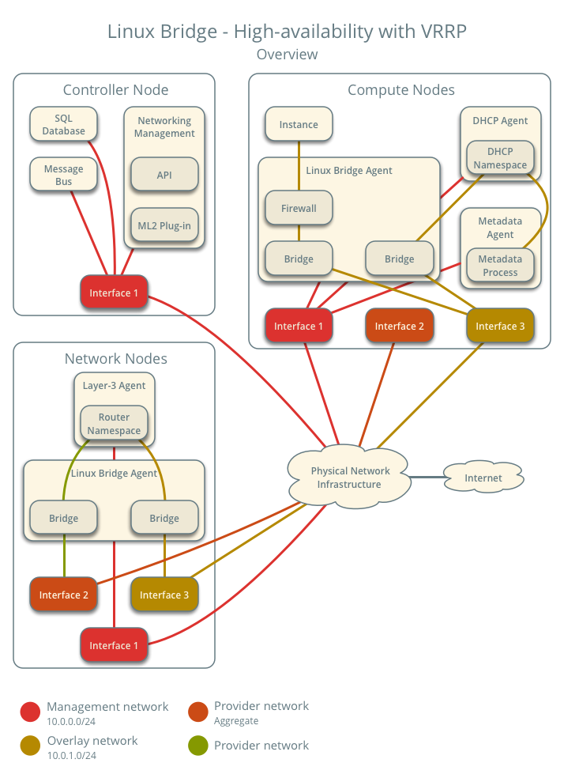
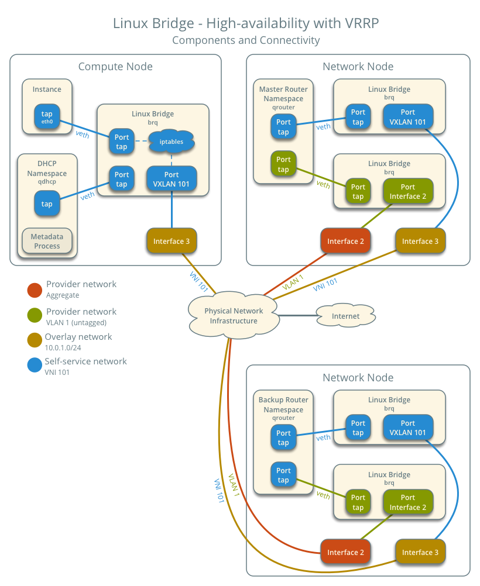

.. _deploy-lb-ha-vrrp:

==========================================
Linux bridge: High availability using VRRP
==========================================

.. include:: shared/deploy-ha-vrrp.txt

.. warning::

   This high-availability mechanism is not compatible with the layer-2
   population mechanism. You must disable layer-2 population in the
   ``linuxbridge_agent.ini`` file and restart the Linux bridge agent
   on all existing network and compute nodes prior to deploying the example
   configuration.

Prerequisites
~~~~~~~~~~~~~

Add one network node with the following components:

* Three network interfaces: management, provider, and overlay.
* OpenStack Networking layer-2 agent, layer-3 agent, and any
  dependencies.

.. note::

   You can keep the DHCP and metadata agents on each compute node or
   move them to the network nodes.

Architecture
~~~~~~~~~~~~

The following figure shows components and connectivity for one self-service
network and one untagged (flat) network. The master router resides on network
node 1. In this particular case, the instance resides on the same compute
node as the DHCP agent for the network. If the DHCP agent resides on another
compute node, the latter only contains a DHCP namespace and Linux bridge
with a port on the overlay physical network interface.

Example configuration
~~~~~~~~~~~~~~~~~~~~~

Use the following example configuration as a template to add support for
high-availability using VRRP to an existing operational environment that
supports self-service networks.

Controller node
---------------

#. In the ``neutron.conf`` file:

   * Enable VRRP.

     .. code-block:: ini

        [DEFAULT]
        l3_ha = True

#. Restart the following services:

   * Server

Network node 1
--------------

No changes.

Network node 2
--------------

#. Install the Networking service Linux bridge layer-2 agent and layer-3
   agent.

#. In the ``neutron.conf`` file, configure common options:

   .. include:: shared/deploy-config-neutron-common.txt

#. In the ``linuxbridge_agent.ini`` file, configure the layer-2 agent.

   .. code-block:: ini

      [linux_bridge]
      physical_interface_mappings = provider:PROVIDER_INTERFACE

      [vxlan]
      enable_vxlan = True
      local_ip = OVERLAY_INTERFACE_IP_ADDRESS

      [securitygroup]
      firewall_driver = iptables

   .. warning::

      By default, Linux uses UDP port ``8472`` for VXLAN tunnel traffic. This
      default value  doesn't follow the IANA standard, which assigned UDP port
      ``4789`` for VXLAN communication. As a consequence, if this node is part
      of a mixed deployment, where nodes with both OVS and Linux bridge must
      communicate over VXLAN tunnels, it is recommended that a line containing
      ``udp_dstport = 4789`` be added to the [vxlan] section of all the Linux
      bridge agents. OVS follows the IANA standard.

   Replace ``PROVIDER_INTERFACE`` with the name of the underlying interface
   that handles provider networks. For example, ``eth1``.

   Replace ``OVERLAY_INTERFACE_IP_ADDRESS`` with the IP address of the
   interface that handles VXLAN overlays for self-service networks.

#. In the ``l3_agent.ini`` file, configure the layer-3 agent.

   .. code-block:: ini

      [DEFAULT]
      interface_driver = linuxbridge

#. Start the following services:

   * Linux bridge agent
   * Layer-3 agent

Compute nodes
-------------

No changes.

Verify service operation
------------------------

#. Source the administrative project credentials.
#. Verify presence and operation of the agents.

   .. code-block:: console

      $ openstack network agent list
      +--------------------------------------+--------------------+----------+-------------------+-------+-------+---------------------------+
      | ID                                   | Agent Type         | Host     | Availability Zone | Alive | State | Binary                    |
      +--------------------------------------+--------------------+----------+-------------------+-------+-------+---------------------------+
      | 09de6af6-c5f1-4548-8b09-18801f068c57 | Linux bridge agent | compute2 | None              | True  | UP    | neutron-linuxbridge-agent |
      | 188945d1-9e70-4803-a276-df924e0788a4 | Linux bridge agent | compute1 | None              | True  | UP    | neutron-linuxbridge-agent |
      | e76c440d-d5f6-4316-a674-d689630b629e | DHCP agent         | compute1 | nova              | True  | UP    | neutron-dhcp-agent        |
      | e67367de-6657-11e6-86a4-931cd04404bb | DHCP agent         | compute2 | nova              | True  | UP    | neutron-dhcp-agent        |
      | e8174cae-6657-11e6-89f0-534ac6d0cb5c | Metadata agent     | compute1 | None              | True  | UP    | neutron-metadata-agent    |
      | ece49ec6-6657-11e6-bafb-c7560f19197d | Metadata agent     | compute2 | None              | True  | UP    | neutron-metadata-agent    |
      | 598f6357-4331-4da5-a420-0f5be000bec9 | L3 agent           | network1 | nova              | True  | UP    | neutron-l3-agent          |
      | f4734e0f-bcd5-4922-a19d-e31d56b0a7ae | Linux bridge agent | network1 | None              | True  | UP    | neutron-linuxbridge-agent |
      | 670e5805-340b-4182-9825-fa8319c99f23 | Linux bridge agent | network2 | None              | True  | UP    | neutron-linuxbridge-agent |
      | 96224e89-7c15-42e9-89c4-8caac7abdd54 | L3 agent           | network2 | nova              | True  | UP    | neutron-l3-agent          |
      +--------------------------------------+--------------------+----------+-------------------+-------+-------+---------------------------+

Create initial networks
-----------------------

.. include:: shared/deploy-ha-vrrp-initialnetworks.txt

Verify network operation
------------------------

.. include:: shared/deploy-ha-vrrp-verifynetworkoperation.txt

Verify failover operation
-------------------------

.. include:: shared/deploy-ha-vrrp-verifyfailoveroperation.txt

Keepalived VRRP health check
----------------------------

.. include:: shared/keepalived-vrrp-healthcheck.txt

Network traffic flow
~~~~~~~~~~~~~~~~~~~~

This high-availability mechanism simply augments :ref:`deploy-lb-selfservice`
with failover of layer-3 services to another router if the master router
fails. Thus, you can reference :ref:`Self-service network traffic flow
<deploy-lb-selfservice-networktrafficflow>` for normal operation.
