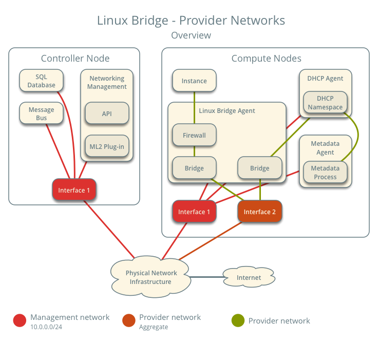
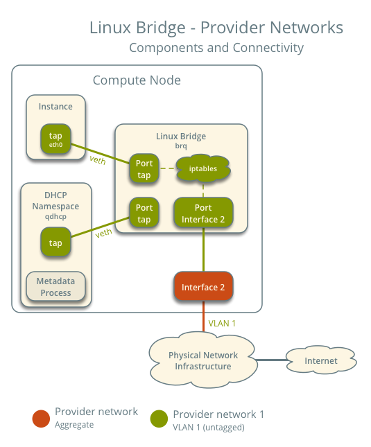
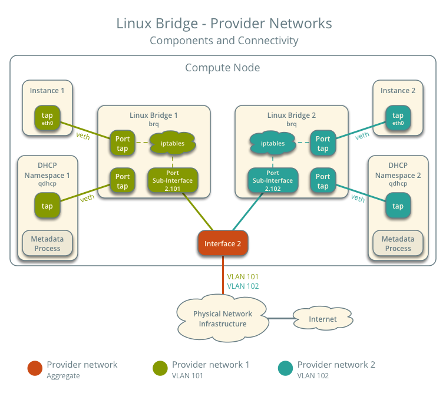
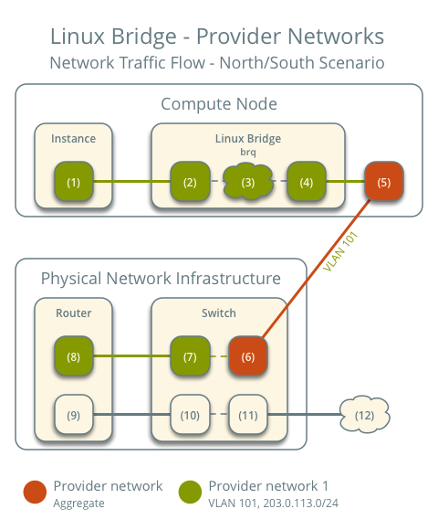
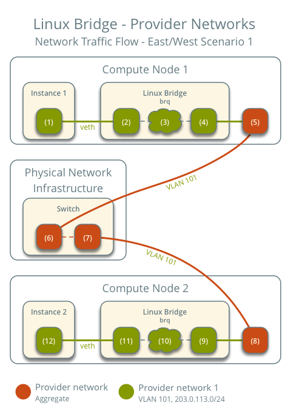
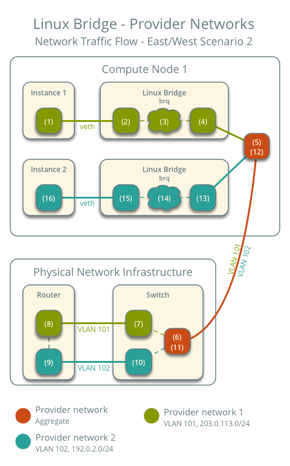

.. _deploy-lb-provider:

===============================
Linux bridge: Provider networks
===============================

The provider networks architecture example provides layer-2 connectivity
between instances and the physical network infrastructure using VLAN
(802.1q) tagging. It supports one untagged (flat) network and and up to
4095 tagged (VLAN) networks. The actual quantity of VLAN networks depends
on the physical network infrastructure. For more information on provider
networks, see :ref:`intro-os-networking-provider`.

Prerequisites
~~~~~~~~~~~~~

One controller node with the following components:

* Two network interfaces: management and provider.
* OpenStack Networking server service and ML2 plug-in.

Two compute nodes with the following components:

* Two network interfaces: management and provider.
* OpenStack Networking Linux bridge layer-2 agent, DHCP agent, metadata agent,
  and any dependencies.

.. note::

   Larger deployments typically deploy the DHCP and metadata agents on a
   subset of compute nodes to increase performance and redundancy. However,
   too many agents can overwhelm the message bus. Also, to further simplify
   any deployment, you can omit the metadata agent and use a configuration
   drive to provide metadata to instances.

Architecture
~~~~~~~~~~~~

The following figure shows components and connectivity for one untagged
(flat) network. In this particular case, the instance resides on the
same compute node as the DHCP agent for the network. If the DHCP agent
resides on another compute node, the latter only contains a DHCP namespace
and Linux bridge with a port on the provider physical network interface.

The following figure describes virtual connectivity among components for
two tagged (VLAN) networks. Essentially, each network uses a separate
bridge that contains a port on the VLAN sub-interface on the provider
physical network interface. Similar to the single untagged network case,
the DHCP agent may reside on a different compute node.

.. note::

   These figures omit the controller node because it does not handle instance
   network traffic.

Example configuration
~~~~~~~~~~~~~~~~~~~~~

Use the following example configuration as a template to deploy provider
networks in your environment.

Controller node
---------------

#. Install the Networking service components that provides the
   ``neutron-server`` service and ML2 plug-in.

#. In the ``neutron.conf`` file:

   * Configure common options:

     .. include:: shared/deploy-config-neutron-common.txt

   * Disable service plug-ins because provider networks do not require
     any. However, this breaks portions of the dashboard that manage
     the Networking service. See the
     `Queens Install Tutorials and Guides <../install/>`__
     for more information.

     .. code-block:: ini

        [DEFAULT]
        service_plugins =

   * Enable two DHCP agents per network so both compute nodes can
     provide DHCP service provider networks.

     .. code-block:: ini

        [DEFAULT]
        dhcp_agents_per_network = 2

   * If necessary, :ref:`configure MTU <config-mtu>`.

#. In the ``ml2_conf.ini`` file:

   * Configure drivers and network types:

     .. code-block:: ini

        [ml2]
        type_drivers = flat,vlan
        tenant_network_types =
        mechanism_drivers = linuxbridge
        extension_drivers = port_security

   * Configure network mappings:

     .. code-block:: ini

        [ml2_type_flat]
        flat_networks = provider

        [ml2_type_vlan]
        network_vlan_ranges = provider

     .. note::

        The ``tenant_network_types`` option contains no value because the
        architecture does not support self-service networks.

     .. note::

        The ``provider`` value in the ``network_vlan_ranges`` option lacks VLAN
        ID ranges to support use of arbitrary VLAN IDs.

#. Populate the database.

   .. code-block:: console

      # su -s /bin/sh -c "neutron-db-manage --config-file /etc/neutron/neutron.conf \
        --config-file /etc/neutron/plugins/ml2/ml2_conf.ini upgrade head" neutron

#. Start the following services:

   * Server

Compute nodes
-------------

#. Install the Networking service Linux bridge layer-2 agent.

#. In the ``neutron.conf`` file, configure common options:

   .. include:: shared/deploy-config-neutron-common.txt

#. In the ``linuxbridge_agent.ini`` file, configure the Linux bridge agent:

   .. code-block:: ini

      [linux_bridge]
      physical_interface_mappings = provider:PROVIDER_INTERFACE

      [vxlan]
      enable_vxlan = False

      [securitygroup]
      firewall_driver = iptables

   Replace ``PROVIDER_INTERFACE`` with the name of the underlying interface
   that handles provider networks. For example, ``eth1``.

#. In the ``dhcp_agent.ini`` file, configure the DHCP agent:

   .. code-block:: ini

      [DEFAULT]
      interface_driver = linuxbridge
      enable_isolated_metadata = True
      force_metadata = True

   .. note::

      The ``force_metadata`` option forces the DHCP agent to provide
      a host route to the metadata service on ``169.254.169.254``
      regardless of whether the subnet contains an interface on a
      router, thus maintaining similar and predictable metadata behavior
      among subnets.

#. In the ``metadata_agent.ini`` file, configure the metadata agent:

   .. code-block:: ini

      [DEFAULT]
      nova_metadata_host = controller
      metadata_proxy_shared_secret = METADATA_SECRET

   The value of ``METADATA_SECRET`` must match the value of the same option
   in the ``[neutron]`` section of the ``nova.conf`` file.

#. Start the following services:

   * Linux bridge agent
   * DHCP agent
   * Metadata agent

Verify service operation
------------------------

#. Source the administrative project credentials.
#. Verify presence and operation of the agents:

   .. code-block:: console

      $ openstack network agent list
      +--------------------------------------+--------------------+----------+-------------------+-------+-------+---------------------------+
      | ID                                   | Agent Type         | Host     | Availability Zone | Alive | State | Binary                    |
      +--------------------------------------+--------------------+----------+-------------------+-------+-------+---------------------------+
      | 09de6af6-c5f1-4548-8b09-18801f068c57 | Linux bridge agent | compute2 |                   | True  | UP    | neutron-linuxbridge-agent |
      | 188945d1-9e70-4803-a276-df924e0788a4 | Linux bridge agent | compute1 |                   | True  | UP    | neutron-linuxbridge-agent |
      | e76c440d-d5f6-4316-a674-d689630b629e | DHCP agent         | compute1 | nova              | True  | UP    | neutron-dhcp-agent        |
      | e67367de-6657-11e6-86a4-931cd04404bb | DHCP agent         | compute2 | nova              | True  | UP    | neutron-dhcp-agent        |
      | e8174cae-6657-11e6-89f0-534ac6d0cb5c | Metadata agent     | compute1 |                   | True  | UP    | neutron-metadata-agent    |
      | ece49ec6-6657-11e6-bafb-c7560f19197d | Metadata agent     | compute2 |                   | True  | UP    | neutron-metadata-agent    |
      +--------------------------------------+--------------------+----------+-------------------+-------+-------+---------------------------+

Create initial networks
-----------------------

.. include:: shared/deploy-provider-initialnetworks.txt

Verify network operation
------------------------

.. include:: shared/deploy-provider-verifynetworkoperation.txt

Network traffic flow
~~~~~~~~~~~~~~~~~~~~

.. include:: shared/deploy-provider-networktrafficflow.txt

North-south scenario: Instance with a fixed IP address
------------------------------------------------------

* The instance resides on compute node 1 and uses provider network 1.
* The instance sends a packet to a host on the Internet.

The following steps involve compute node 1.

#. The instance interface (1) forwards the packet to the provider
   bridge instance port (2) via ``veth`` pair.
#. Security group rules (3) on the provider bridge handle firewalling
   and connection tracking for the packet.
#. The VLAN sub-interface port (4) on the provider bridge forwards
   the packet to the physical network interface (5).
#. The physical network interface (5) adds VLAN tag 101 to the packet and
   forwards it to the physical network infrastructure switch (6).

The following steps involve the physical network infrastructure:

#. The switch removes VLAN tag 101 from the packet and forwards it to the
   router (7).
#. The router routes the packet from the provider network (8) to the
   external network (9) and forwards the packet to the switch (10).
#. The switch forwards the packet to the external network (11).
#. The external network (12) receives the packet.

.. note::

   Return traffic follows similar steps in reverse.

East-west scenario 1: Instances on the same network
---------------------------------------------------

Instances on the same network communicate directly between compute nodes
containing those instances.

* Instance 1 resides on compute node 1 and uses provider network 1.
* Instance 2 resides on compute node 2 and uses provider network 1.
* Instance 1 sends a packet to instance 2.

The following steps involve compute node 1:

#. The instance 1 interface (1) forwards the packet to the provider
   bridge instance port (2) via ``veth`` pair.
#. Security group rules (3) on the provider bridge handle firewalling
   and connection tracking for the packet.
#. The VLAN sub-interface port (4) on the provider bridge forwards
   the packet to the physical network interface (5).
#. The physical network interface (5) adds VLAN tag 101 to the packet and
   forwards it to the physical network infrastructure switch (6).

The following steps involve the physical network infrastructure:

#. The switch forwards the packet from compute node 1 to compute node 2 (7).

The following steps involve compute node 2:

#. The physical network interface (8) removes VLAN tag 101 from the packet
   and forwards it to the VLAN sub-interface port (9) on the provider bridge.
#. Security group rules (10) on the provider bridge handle firewalling
   and connection tracking for the packet.
#. The provider bridge instance port (11) forwards the packet to
   the instance 2 interface (12) via ``veth`` pair.

.. note::

   Return traffic follows similar steps in reverse.

East-west scenario 2: Instances on different networks
-----------------------------------------------------

Instances communicate via router on the physical network infrastructure.

* Instance 1 resides on compute node 1 and uses provider network 1.
* Instance 2 resides on compute node 1 and uses provider network 2.
* Instance 1 sends a packet to instance 2.

.. note::

   Both instances reside on the same compute node to illustrate how VLAN
   tagging enables multiple logical layer-2 networks to use the same
   physical layer-2 network.

The following steps involve the compute node:

#. The instance 1 interface (1) forwards the packet to the provider
   bridge instance port (2) via ``veth`` pair.
#. Security group rules (3) on the provider bridge handle firewalling
   and connection tracking for the packet.
#. The VLAN sub-interface port (4) on the provider bridge forwards
   the packet to the physical network interface (5).
#. The physical network interface (5) adds VLAN tag 101 to the packet and
   forwards it to the physical network infrastructure switch (6).

The following steps involve the physical network infrastructure:

#. The switch removes VLAN tag 101 from the packet and forwards it to the
   router (7).
#. The router routes the packet from provider network 1 (8) to provider
   network 2 (9).
#. The router forwards the packet to the switch (10).
#. The switch adds VLAN tag 102 to the packet and forwards it to compute
   node 1 (11).

The following steps involve the compute node:

#. The physical network interface (12) removes VLAN tag 102 from the packet
   and forwards it to the VLAN sub-interface port (13) on the provider bridge.
#. Security group rules (14) on the provider bridge handle firewalling
   and connection tracking for the packet.
#. The provider bridge instance port (15) forwards the packet to
   the instance 2 interface (16) via ``veth`` pair.

.. note::

   Return traffic follows similar steps in reverse.
