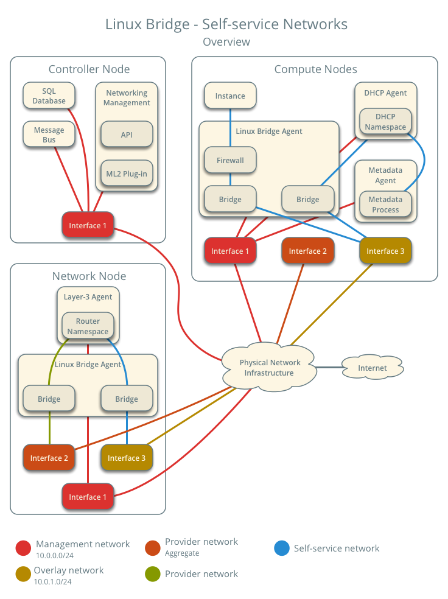
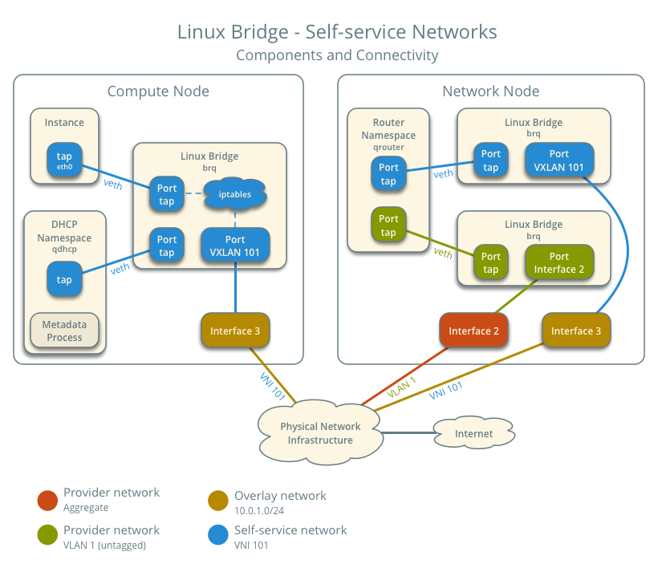
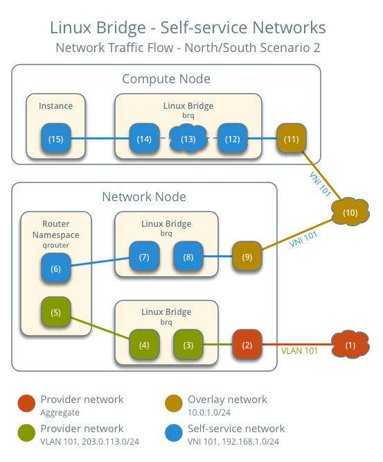
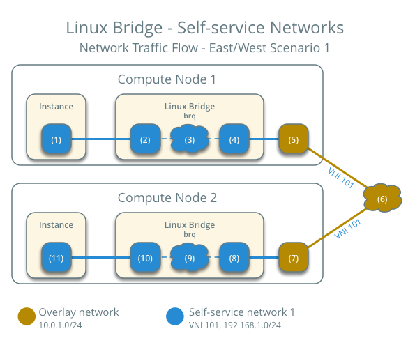
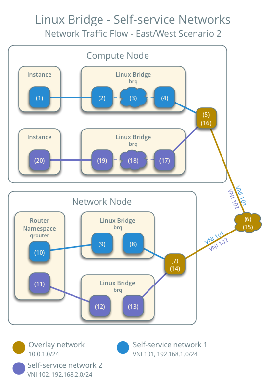

.. _deploy-lb-selfservice:

===================================
Linux bridge: Self-service networks
===================================

This architecture example augments :ref:`deploy-lb-provider` to support
a nearly limitless quantity of entirely virtual networks. Although the
Networking service supports VLAN self-service networks, this example
focuses on VXLAN self-service networks. For more information on
self-service networks, see :ref:`intro-os-networking-selfservice`.

.. note::

   The Linux bridge agent lacks support for other overlay protocols such
   as GRE and Geneve.

Prerequisites
~~~~~~~~~~~~~

Add one network node with the following components:

* Three network interfaces: management, provider, and overlay.
* OpenStack Networking Linux bridge layer-2 agent, layer-3 agent, and any
    dependencies.

Modify the compute nodes with the following components:

* Add one network interface: overlay.

.. note::

   You can keep the DHCP and metadata agents on each compute node or
   move them to the network node.

Architecture
~~~~~~~~~~~~

The following figure shows components and connectivity for one self-service
network and one untagged (flat) provider network. In this particular case, the
instance resides on the same compute node as the DHCP agent for the network.
If the DHCP agent resides on another compute node, the latter only contains
a DHCP namespace and Linux bridge with a port on the overlay physical network
interface.

Example configuration
~~~~~~~~~~~~~~~~~~~~~

Use the following example configuration as a template to add support for
self-service networks to an existing operational environment that supports
provider networks.

Controller node
---------------

#. In the ``neutron.conf`` file:

   * Enable routing and allow overlapping IP address ranges.

     .. code-block:: ini

        [DEFAULT]
        service_plugins = router

#. In the ``ml2_conf.ini`` file:

   * Add ``vxlan`` to type drivers and project network types.

     .. code-block:: ini

        [ml2]
        type_drivers = flat,vlan,vxlan
        tenant_network_types = vxlan

   * Enable the layer-2 population mechanism driver.

     .. code-block:: ini

        [ml2]
        mechanism_drivers = linuxbridge,l2population

   * Configure the VXLAN network ID (VNI) range.

     .. code-block:: ini

        [ml2_type_vxlan]
        vni_ranges = VNI_START:VNI_END

     Replace ``VNI_START`` and ``VNI_END`` with appropriate numerical
     values.

#. Restart the following services:

   * Server

Network node
------------

#. Install the Networking service layer-3 agent.

#. In the ``neutron.conf`` file, configure common options:

   .. include:: shared/deploy-config-neutron-common.txt

#. In the ``linuxbridge_agent.ini`` file, configure the layer-2 agent.

   .. code-block:: ini

      [linux_bridge]
      physical_interface_mappings = provider:PROVIDER_INTERFACE

      [vxlan]
      enable_vxlan = True
      l2_population = True
      local_ip = OVERLAY_INTERFACE_IP_ADDRESS

      [securitygroup]
      firewall_driver = iptables

   .. warning::

      By default, Linux uses UDP port ``8472`` for VXLAN tunnel traffic. This
      default value  doesn't follow the IANA standard, which assigned UDP port
      ``4789`` for VXLAN communication. As a consequence, if this node is part
      of a mixed deployment, where nodes with both OVS and Linux bridge must
      communicate over VXLAN tunnels, it is recommended that a line containing
      ``udp_dstport = 4789`` be added to the [vxlan] section of all the Linux
      bridge agents. OVS follows the IANA standard.

   Replace ``PROVIDER_INTERFACE`` with the name of the underlying interface
   that handles provider networks. For example, ``eth1``.

   Replace ``OVERLAY_INTERFACE_IP_ADDRESS`` with the IP address of the
   interface that handles VXLAN overlays for self-service networks.

#. In the ``l3_agent.ini`` file, configure the layer-3 agent.

   .. code-block:: ini

      [DEFAULT]
      interface_driver = linuxbridge

#. Start the following services:

   * Linux bridge agent
   * Layer-3 agent

Compute nodes
-------------

#. In the ``linuxbridge_agent.ini`` file, enable VXLAN support including
   layer-2 population.

   .. code-block:: ini

      [vxlan]
      enable_vxlan = True
      l2_population = True
      local_ip = OVERLAY_INTERFACE_IP_ADDRESS

   .. warning::

      By default, Linux uses UDP port ``8472`` for VXLAN tunnel traffic. This
      default value  doesn't follow the IANA standard, which assigned UDP port
      ``4789`` for VXLAN communication. As a consequence, if this node is part
      of a mixed deployment, where nodes with both OVS and Linux bridge must
      communicate over VXLAN tunnels, it is recommended that a line containing
      ``udp_dstport = 4789`` be added to the [vxlan] section of all the Linux
      bridge agents. OVS follows the IANA standard.

   Replace ``OVERLAY_INTERFACE_IP_ADDRESS`` with the IP address of the
   interface that handles VXLAN overlays for self-service networks.

#. Restart the following services:

   * Linux bridge agent

Verify service operation
------------------------

#. Source the administrative project credentials.
#. Verify presence and operation of the agents.

   .. code-block:: console

      $ openstack network agent list
      +--------------------------------------+--------------------+----------+-------------------+-------+-------+---------------------------+
      | ID                                   | Agent Type         | Host     | Availability Zone | Alive | State | Binary                    |
      +--------------------------------------+--------------------+----------+-------------------+-------+-------+---------------------------+
      | 09de6af6-c5f1-4548-8b09-18801f068c57 | Linux bridge agent | compute2 | None              | True  | UP    | neutron-linuxbridge-agent |
      | 188945d1-9e70-4803-a276-df924e0788a4 | Linux bridge agent | compute1 | None              | True  | UP    | neutron-linuxbridge-agent |
      | e76c440d-d5f6-4316-a674-d689630b629e | DHCP agent         | compute1 | nova              | True  | UP    | neutron-dhcp-agent        |
      | e67367de-6657-11e6-86a4-931cd04404bb | DHCP agent         | compute2 | nova              | True  | UP    | neutron-dhcp-agent        |
      | e8174cae-6657-11e6-89f0-534ac6d0cb5c | Metadata agent     | compute1 | None              | True  | UP    | neutron-metadata-agent    |
      | ece49ec6-6657-11e6-bafb-c7560f19197d | Metadata agent     | compute2 | None              | True  | UP    | neutron-metadata-agent    |
      | 598f6357-4331-4da5-a420-0f5be000bec9 | L3 agent           | network1 | nova              | True  | UP    | neutron-l3-agent          |
      | f4734e0f-bcd5-4922-a19d-e31d56b0a7ae | Linux bridge agent | network1 | None              | True  | UP    | neutron-linuxbridge-agent |
      +--------------------------------------+--------------------+----------+-------------------+-------+-------+---------------------------+

Create initial networks
-----------------------

.. include:: shared/deploy-selfservice-initialnetworks.txt

Verify network operation
------------------------

.. include:: shared/deploy-selfservice-verifynetworkoperation.txt

.. _deploy-lb-selfservice-networktrafficflow:

Network traffic flow
~~~~~~~~~~~~~~~~~~~~

.. include:: shared/deploy-selfservice-networktrafficflow.txt

North-south scenario 1: Instance with a fixed IP address
--------------------------------------------------------

For instances with a fixed IPv4 address, the network node performs SNAT
on north-south traffic passing from self-service to external networks
such as the Internet. For instances with a fixed IPv6 address, the network
node performs conventional routing of traffic between self-service and
external networks.

* The instance resides on compute node 1 and uses self-service network 1.
* The instance sends a packet to a host on the Internet.

The following steps involve compute node 1:

#. The instance interface (1) forwards the packet to the self-service
   bridge instance port (2) via ``veth`` pair.
#. Security group rules (3) on the self-service bridge handle
   firewalling and connection tracking for the packet.
#. The self-service bridge forwards the packet to the VXLAN interface (4)
   which wraps the packet using VNI 101.
#. The underlying physical interface (5) for the VXLAN interface forwards
   the packet to the network node via the overlay network (6).

The following steps involve the network node:

#. The underlying physical interface (7) for the VXLAN interface forwards
   the packet to the VXLAN interface (8) which unwraps the packet.
#. The self-service bridge router port (9) forwards the packet to the
   self-service network interface (10) in the router namespace.

   * For IPv4, the router performs SNAT on the packet which changes the
     source IP address to the router IP address on the provider network
     and sends it to the gateway IP address on the provider network via
     the gateway interface on the provider network (11).
   * For IPv6, the router sends the packet to the next-hop IP address,
     typically the gateway IP address on the provider network, via the
     provider gateway interface (11).

#. The router forwards the packet to the provider bridge router
   port (12).
#. The VLAN sub-interface port (13) on the provider bridge forwards
   the packet to the provider physical network interface (14).
#. The provider physical network interface (14) adds VLAN tag 101 to the packet
   and forwards it to the Internet via physical network infrastructure (15).

.. note::

   Return traffic follows similar steps in reverse. However, without a
   floating IPv4 address, hosts on the provider or external networks cannot
   originate connections to instances on the self-service network.

.. image:: figures/deploy-lb-selfservice-flowns1.png
   :alt: Self-service networks using Linux bridge - network traffic flow - north/south scenario 1

North-south scenario 2: Instance with a floating IPv4 address
-------------------------------------------------------------

For instances with a floating IPv4 address, the network node performs SNAT
on north-south traffic passing from the instance to external networks
such as the Internet and DNAT on north-south traffic passing from external
networks to the instance. Floating IP addresses and NAT do not apply to IPv6.
Thus, the network node routes IPv6 traffic in this scenario.

* The instance resides on compute node 1 and uses self-service network 1.
* A host on the Internet sends a packet to the instance.

The following steps involve the network node:

#. The physical network infrastructure (1) forwards the packet to the
   provider physical network interface (2).
#. The provider physical network interface removes VLAN tag 101 and forwards
   the packet to the VLAN sub-interface on the provider bridge.
#. The provider bridge forwards the packet to the self-service
   router gateway port on the provider network (5).

   * For IPv4, the router performs DNAT on the packet which changes the
     destination IP address to the instance IP address on the self-service
     network and sends it to the gateway IP address on the self-service
     network via the self-service interface (6).
   * For IPv6, the router sends the packet to the next-hop IP address,
     typically the gateway IP address on the self-service network, via
     the self-service interface (6).

#. The router forwards the packet to the self-service bridge router
   port (7).
#. The self-service bridge forwards the packet to the VXLAN interface (8)
   which wraps the packet using VNI 101.
#. The underlying physical interface (9) for the VXLAN interface forwards
   the packet to the network node via the overlay network (10).

The following steps involve the compute node:

#. The underlying physical interface (11) for the VXLAN interface forwards
   the packet to the VXLAN interface (12) which unwraps the packet.
#. Security group rules (13) on the self-service bridge handle firewalling
   and connection tracking for the packet.
#. The self-service bridge instance port (14) forwards the packet to
   the instance interface (15) via ``veth`` pair.

.. note::

   Egress instance traffic flows similar to north-south scenario 1, except SNAT
   changes the source IP address of the packet to the floating IPv4 address
   rather than the router IP address on the provider network.

East-west scenario 1: Instances on the same network
---------------------------------------------------

Instances with a fixed IPv4/IPv6 or floating IPv4 address on the same network
communicate directly between compute nodes containing those instances.

By default, the VXLAN protocol lacks knowledge of target location
and uses multicast to discover it. After discovery, it stores the
location in the local forwarding database. In large deployments,
the discovery process can generate a significant amount of network
that all nodes must process. To eliminate the latter and generally
increase efficiency, the Networking service includes the layer-2
population mechanism driver that automatically populates the
forwarding database for VXLAN interfaces. The example configuration
enables this driver. For more information, see :ref:`config-plugin-ml2`.

* Instance 1 resides on compute node 1 and uses self-service network 1.
* Instance 2 resides on compute node 2 and uses self-service network 1.
* Instance 1 sends a packet to instance 2.

The following steps involve compute node 1:

#. The instance 1 interface (1) forwards the packet to the
   self-service bridge instance port (2) via ``veth`` pair.
#. Security group rules (3) on the self-service bridge handle firewalling
   and connection tracking for the packet.
#. The self-service bridge forwards the packet to the VXLAN interface (4)
   which wraps the packet using VNI 101.
#. The underlying physical interface (5) for the VXLAN interface forwards
   the packet to compute node 2 via the overlay network (6).

The following steps involve compute node 2:

#. The underlying physical interface (7) for the VXLAN interface forwards
   the packet to the VXLAN interface (8) which unwraps the packet.
#. Security group rules (9) on the self-service bridge handle firewalling
   and connection tracking for the packet.
#. The self-service bridge instance port (10) forwards the packet to
   the instance 1 interface (11) via ``veth`` pair.

.. note::

   Return traffic follows similar steps in reverse.

East-west scenario 2: Instances on different networks
-----------------------------------------------------

Instances using a fixed IPv4/IPv6 address or floating IPv4 address communicate
via router on the network node. The self-service networks must reside on the
same router.

* Instance 1 resides on compute node 1 and uses self-service network 1.
* Instance 2 resides on compute node 1 and uses self-service network 2.
* Instance 1 sends a packet to instance 2.

.. note::

   Both instances reside on the same compute node to illustrate how VXLAN
   enables multiple overlays to use the same layer-3 network.

The following steps involve the compute node:

#. The instance 1 interface (1) forwards the packet to the self-service
   bridge instance port (2) via ``veth`` pair.
#. Security group rules (3) on the self-service bridge handle
   firewalling and connection tracking for the packet.
#. The self-service bridge forwards the packet to the VXLAN interface (4)
   which wraps the packet using VNI 101.
#. The underlying physical interface (5) for the VXLAN interface forwards
   the packet to the network node via the overlay network (6).

The following steps involve the network node:

#. The underlying physical interface (7) for the VXLAN interface forwards
   the packet to the VXLAN interface (8) which unwraps the packet.
#. The self-service bridge router port (9) forwards the packet to the
   self-service network 1 interface (10) in the router namespace.
#. The router sends the packet to the next-hop IP address, typically the
   gateway IP address on self-service network 2, via the self-service
   network 2 interface (11).
#. The router forwards the packet to the self-service network 2 bridge router
   port (12).
#. The self-service network 2 bridge forwards the packet to the VXLAN
   interface (13) which wraps the packet using VNI 102.
#. The physical network interface (14) for the VXLAN interface sends the
   packet to the compute node via the overlay network (15).

The following steps involve the compute node:

#. The underlying physical interface (16) for the VXLAN interface sends
   the packet to the VXLAN interface (17) which unwraps the packet.
#. Security group rules (18) on the self-service bridge handle firewalling
   and connection tracking for the packet.
#. The self-service bridge instance port (19) forwards the packet to
   the instance 2 interface (20) via ``veth`` pair.

.. note::

   Return traffic follows similar steps in reverse.

