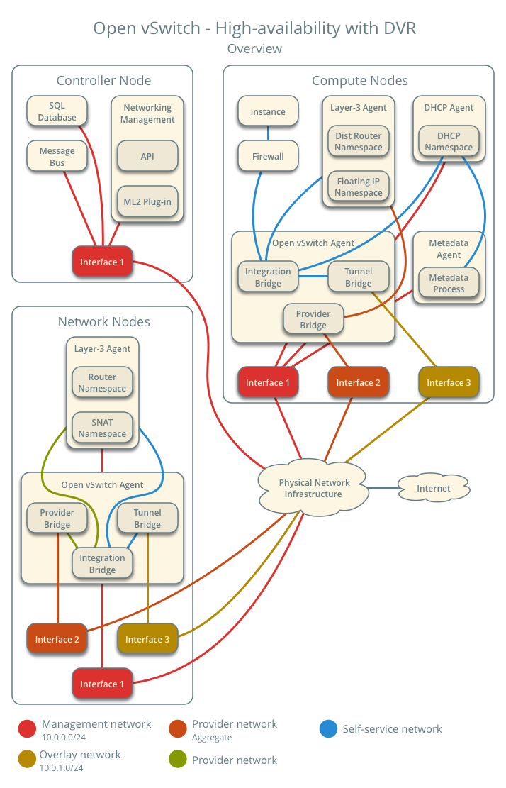
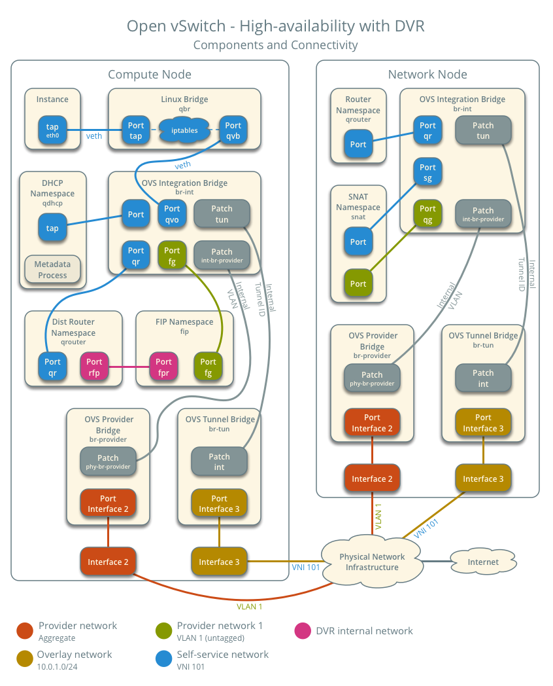
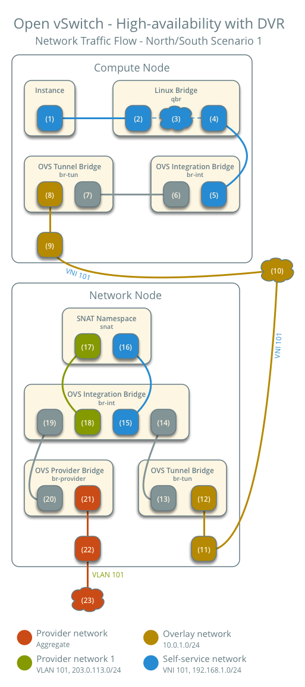
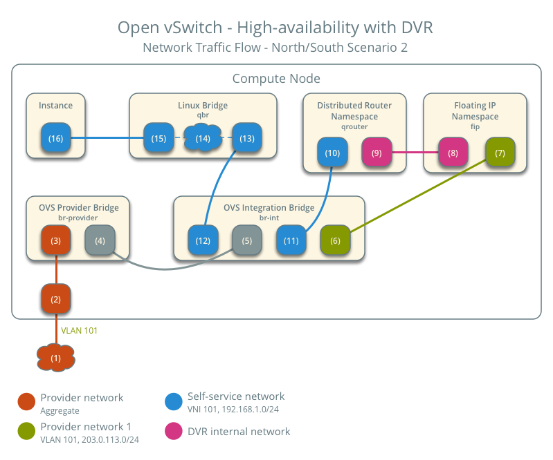
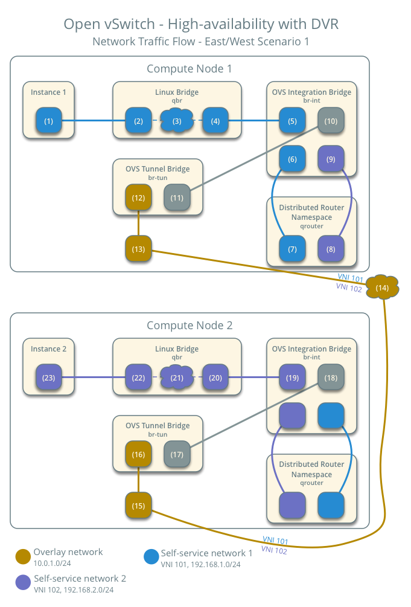

.. _deploy-ovs-ha-dvr:

=========================================
Open vSwitch: High availability using DVR
=========================================

This architecture example augments the self-service deployment example
with the Distributed Virtual Router (DVR) high-availability mechanism that
provides connectivity between self-service and provider networks on compute
nodes rather than network nodes for specific scenarios. For instances with a
floating IPv4 address, routing between self-service and provider networks
resides completely on the compute nodes to eliminate single point of
failure and performance issues with network nodes. Routing also resides
completely on the compute nodes for instances with a fixed or floating IPv4
address using self-service networks on the same distributed virtual router.
However, instances with a fixed IP address still rely on the network node for
routing and SNAT services between self-service and provider networks.

Consider the following attributes of this high-availability mechanism to
determine practicality in your environment:

* Only provides connectivity to an instance via the compute node on which
  the instance resides if the instance resides on a self-service network
  with a floating IPv4 address. Instances on self-service networks with
  only an IPv6 address or both IPv4 and IPv6 addresses rely on the network
  node for IPv6 connectivity.

* The instance of a router on each compute node consumes an IPv4 address
  on the provider network on which it contains a gateway.

Prerequisites
~~~~~~~~~~~~~

Modify the compute nodes with the following components:

* Install the OpenStack Networking layer-3 agent.

.. note::

   Consider adding at least one additional network node to provide
   high-availability for instances with a fixed IP address. See
   See :ref:`config-dvr-snat-ha-ovs` for more information.

Architecture
~~~~~~~~~~~~

The following figure shows components and connectivity for one self-service
network and one untagged (flat) network. In this particular case, the
instance resides on the same compute node as the DHCP agent for the network.
If the DHCP agent resides on another compute node, the latter only contains
a DHCP namespace with a port on the OVS integration bridge.

Example configuration
~~~~~~~~~~~~~~~~~~~~~

Use the following example configuration as a template to add support for
high-availability using DVR to an existing operational environment that
supports self-service networks.

Controller node
---------------

#. In the ``neutron.conf`` file:

   * Enable distributed routing by default for all routers.

     .. code-block:: ini

        [DEFAULT]
        router_distributed = True

#. Restart the following services:

   * Server

Network node
------------

#. In the ``openswitch_agent.ini`` file, enable distributed routing.

   .. code-block:: ini

      [agent]
      enable_distributed_routing = True

#. In the ``l3_agent.ini`` file, configure the layer-3 agent to provide
   SNAT services.

   .. code-block:: ini

      [DEFAULT]
      agent_mode = dvr_snat

#. Restart the following services:

   * Open vSwitch agent
   * Layer-3 agent

Compute nodes
-------------

#. Install the Networking service layer-3 agent.

#. In the ``openswitch_agent.ini`` file, enable distributed routing.

   .. code-block:: ini

      [agent]
      enable_distributed_routing = True

#. In the ``l3_agent.ini`` file, configure the layer-3 agent.

   .. code-block:: ini

      [DEFAULT]
      interface_driver = openvswitch
      agent_mode = dvr

#. Restart the following services:

   * Open vSwitch agent
   * Layer-3 agent

Verify service operation
------------------------

#. Source the administrative project credentials.
#. Verify presence and operation of the agents.

   .. code-block:: console

      $ openstack network agent list
      +--------------------------------------+--------------------+----------+-------------------+-------+-------+---------------------------+
      | ID                                   | Agent Type         | Host     | Availability Zone | Alive | State | Binary                    |
      +--------------------------------------+--------------------+----------+-------------------+-------+-------+---------------------------+
      | 05d980f2-a4fc-4815-91e7-a7f7e118c0db | L3 agent           | compute1 | nova              | True  | UP    | neutron-l3-agent          |
      | 1236bbcb-e0ba-48a9-80fc-81202ca4fa51 | Metadata agent     | compute2 | None              | True  | UP    | neutron-metadata-agent    |
      | 2a2e9a90-51b8-4163-a7d6-3e199ba2374b | L3 agent           | compute2 | nova              | True  | UP    | neutron-l3-agent          |
      | 457d6898-b373-4bb3-b41f-59345dcfb5c5 | Open vSwitch agent | compute2 | None              | True  | UP    | neutron-openvswitch-agent |
      | 513caa68-0391-4e53-a530-082e2c23e819 | Linux bridge agent | compute1 | None              | True  | UP    | neutron-linuxbridge-agent |
      | 71f15e84-bc47-4c2a-b9fb-317840b2d753 | DHCP agent         | compute2 | nova              | True  | UP    | neutron-dhcp-agent        |
      | 8805b962-de95-4e40-bdc2-7a0add7521e8 | L3 agent           | network1 | nova              | True  | UP    | neutron-l3-agent          |
      | a33cac5a-0266-48f6-9cac-4cef4f8b0358 | Open vSwitch agent | network1 | None              | True  | UP    | neutron-openvswitch-agent |
      | a6c69690-e7f7-4e56-9831-1282753e5007 | Metadata agent     | compute1 | None              | True  | UP    | neutron-metadata-agent    |
      | af11f22f-a9f4-404f-9fd8-cd7ad55c0f68 | DHCP agent         | compute1 | nova              | True  | UP    | neutron-dhcp-agent        |
      | bcfc977b-ec0e-4ba9-be62-9489b4b0e6f1 | Open vSwitch agent | compute1 | None              | True  | UP    | neutron-openvswitch-agent |
      +--------------------------------------+--------------------+----------+-------------------+-------+-------+---------------------------+

Create initial networks
-----------------------

Similar to the self-service deployment example, this configuration supports
multiple VXLAN self-service networks. After enabling high-availability, all
additional routers use distributed routing. The following procedure creates
an additional self-service network and router. The Networking service also
supports adding distributed routing to existing routers.

#. Source a regular (non-administrative) project credentials.
#. Create a self-service network.

   .. code-block:: console

      $ openstack network create selfservice2
      +-------------------------+--------------+
      | Field                   | Value        |
      +-------------------------+--------------+
      | admin_state_up          | UP           |
      | mtu                     | 1450         |
      | name                    | selfservice2 |
      | port_security_enabled   | True         |
      | revision_number         | 1            |
      | router:external         | Internal     |
      | shared                  | False        |
      | status                  | ACTIVE       |
      | tags                    | []           |
      +-------------------------+--------------+

#. Create a IPv4 subnet on the self-service network.

   .. code-block:: console

      $ openstack subnet create --subnet-range 192.0.2.0/24 \
        --network selfservice2 --dns-nameserver 8.8.4.4 selfservice2-v4
      +-------------------+---------------------------+
      | Field             | Value                     |
      +-------------------+---------------------------+
      | allocation_pools  | 192.0.2.2-192.0.2.254     |
      | cidr              | 192.0.2.0/24              |
      | dns_nameservers   | 8.8.4.4                   |
      | enable_dhcp       | True                      |
      | gateway_ip        | 192.0.2.1                 |
      | ip_version        | 4                         |
      | name              | selfservice2-v4           |
      | revision_number   | 1                         |
      | tags              | []                        |
      +-------------------+---------------------------+

#. Create a IPv6 subnet on the self-service network.

   .. code-block:: console

      $ openstack subnet create --subnet-range fd00:192:0:2::/64 --ip-version 6 \
        --ipv6-ra-mode slaac --ipv6-address-mode slaac --network selfservice2 \
        --dns-nameserver 2001:4860:4860::8844 selfservice2-v6
      +-------------------+------------------------------------------------------+
      | Field             | Value                                                |
      +-------------------+------------------------------------------------------+
      | allocation_pools  | fd00:192:0:2::2-fd00:192:0:2:ffff:ffff:ffff:ffff     |
      | cidr              | fd00:192:0:2::/64                                    |
      | dns_nameservers   | 2001:4860:4860::8844                                 |
      | enable_dhcp       | True                                                 |
      | gateway_ip        | fd00:192:0:2::1                                      |
      | ip_version        | 6                                                    |
      | ipv6_address_mode | slaac                                                |
      | ipv6_ra_mode      | slaac                                                |
      | name              | selfservice2-v6                                      |
      | revision_number   | 1                                                    |
      | tags              | []                                                   |
      +-------------------+------------------------------------------------------+

#. Create a router.

   .. code-block:: console

      $ openstack router create router2
      +-----------------------+---------+
      | Field                 | Value   |
      +-----------------------+---------+
      | admin_state_up        | UP      |
      | name                  | router2 |
      | revision_number       | 1       |
      | status                | ACTIVE  |
      | tags                  | []      |
      +-----------------------+---------+

#. Add the IPv4 and IPv6 subnets as interfaces on the router.

   .. code-block:: console

      $ openstack router add subnet router2 selfservice2-v4
      $ openstack router add subnet router2 selfservice2-v6

   .. note::

      These commands provide no output.

#. Add the provider network as a gateway on the router.

   .. code-block:: console

      $ openstack router set router2 --external-gateway provider1

Verify network operation
------------------------

#. Source the administrative project credentials.
#. Verify distributed routing on the router.

   .. code-block:: console

      $ openstack router show router2
      +-------------------------+---------+
      | Field                   | Value   |
      +-------------------------+---------+
      | admin_state_up          | UP      |
      | distributed             | True    |
      | ha                      | False   |
      | name                    | router2 |
      | revision_number         | 1       |
      | status                  | ACTIVE  |
      +-------------------------+---------+

#. On each compute node, verify creation of a ``qrouter`` namespace with
   the same ID.

   Compute node 1:

   .. code-block:: console

      # ip netns
      qrouter-78d2f628-137c-4f26-a257-25fc20f203c1

   Compute node 2:

   .. code-block:: console

      # ip netns
      qrouter-78d2f628-137c-4f26-a257-25fc20f203c1

#. On the network node, verify creation of the ``snat`` and ``qrouter``
   namespaces with the same ID.

   .. code-block:: console

      # ip netns
      snat-78d2f628-137c-4f26-a257-25fc20f203c1
      qrouter-78d2f628-137c-4f26-a257-25fc20f203c1

   .. note::

      The namespace for router 1 from :ref:`deploy-ovs-selfservice` should
      also appear on network node 1 because of creation prior to enabling
      distributed routing.

#. Launch an instance with an interface on the additional self-service network.
   For example, a CirrOS image using flavor ID 1.

   .. code-block:: console

      $ openstack server create --flavor 1 --image cirros --nic net-id=NETWORK_ID selfservice-instance2

   Replace ``NETWORK_ID`` with the ID of the additional self-service
   network.

#. Determine the IPv4 and IPv6 addresses of the instance.

   .. code-block:: console

      $ openstack server list
      +--------------------------------------+-----------------------+--------+----------------------------------------------------------+--------+---------+
      | ID                                   | Name                  | Status | Networks                                                 | Image  | Flavor  |
      +--------------------------------------+-----------------------+--------+----------------------------------------------------------+--------+---------+
      | bde64b00-77ae-41b9-b19a-cd8e378d9f8b | selfservice-instance2 | ACTIVE | selfservice2=fd00:192:0:2:f816:3eff:fe71:e93e, 192.0.2.4 | cirros | m1.tiny |
      +--------------------------------------+-----------------------+--------+----------------------------------------------------------+--------+---------+

#. Create a floating IPv4 address on the provider network.

   .. code-block:: console

      $ openstack floating ip create provider1
      +-------------------+--------------------------------------+
      | Field             | Value                                |
      +-------------------+--------------------------------------+
      | fixed_ip          | None                                 |
      | id                | 0174056a-fa56-4403-b1ea-b5151a31191f |
      | instance_id       | None                                 |
      | ip                | 203.0.113.17                         |
      | pool              | provider1                            |
      | revision_number   | 1                                    |
      | tags              | []                                   |
      +-------------------+--------------------------------------+

#. Associate the floating IPv4 address with the instance.

   .. code-block:: console

      $ openstack server add floating ip selfservice-instance2 203.0.113.17

   .. note::

       This command provides no output.

#. On the compute node containing the instance, verify creation of the
   ``fip`` namespace with the same ID as the provider network.

   .. code-block:: console

      # ip netns
      fip-4bfa3075-b4b2-4f7d-b88e-df1113942d43

Network traffic flow
~~~~~~~~~~~~~~~~~~~~

.. include:: shared/deploy-selfservice-networktrafficflow.txt

This section only contains flow scenarios that benefit from distributed
virtual routing or that differ from conventional operation. For other
flow scenarios, see :ref:`deploy-ovs-selfservice-networktrafficflow`.

North-south scenario 1: Instance with a fixed IP address
--------------------------------------------------------

Similar to :ref:`deploy-ovs-selfservice-networktrafficflow-ns1`, except
the router namespace on the network node becomes the SNAT namespace. The
network node still contains the router namespace, but it serves no purpose
in this case.

North-south scenario 2: Instance with a floating IPv4 address
-------------------------------------------------------------

For instances with a floating IPv4 address using a self-service network
on a distributed router, the compute node containing the instance performs
SNAT on north-south traffic passing from the instance to external networks
such as the Internet and DNAT on north-south traffic passing from external
networks to the instance. Floating IP addresses and NAT do not apply to
IPv6. Thus, the network node routes IPv6 traffic in this scenario.
north-south traffic passing between the instance and external networks
such as the Internet.

* Instance 1 resides on compute node 1 and uses self-service network 1.
* A host on the Internet sends a packet to the instance.

The following steps involve the compute node:

#. The physical network infrastructure (1) forwards the packet to the
   provider physical network interface (2).
#. The provider physical network interface forwards the packet to the
   OVS provider bridge provider network port (3).
#. The OVS provider bridge swaps actual VLAN tag 101 with the internal
   VLAN tag.
#. The OVS provider bridge ``phy-br-provider`` port (4) forwards the
   packet to the OVS integration bridge ``int-br-provider`` port (5).
#. The OVS integration bridge port for the provider network (6) removes
   the internal VLAN tag and forwards the packet to the provider network
   interface (7) in the floating IP namespace. This interface responds
   to any ARP requests for the instance floating IPv4 address.
#. The floating IP namespace routes the packet (8) to the distributed
   router namespace (9) using a pair of IP addresses on the DVR internal
   network. This namespace contains the instance floating IPv4 address.
#. The router performs DNAT on the packet which changes the destination
   IP address to the instance IP address on the self-service network via
   the self-service network interface (10).
#. The router forwards the packet to the OVS integration bridge port for
   the self-service network (11).
#. The OVS integration bridge adds an internal VLAN tag to the packet.
#. The OVS integration bridge removes the internal VLAN tag from the packet.
#. The OVS integration bridge security group port (12) forwards the packet
   to the security group bridge OVS port (13) via ``veth`` pair.
#. Security group rules (14) on the security group bridge handle firewalling
   and connection tracking for the packet.
#. The security group bridge instance port (15) forwards the packet to the
   instance interface (16) via ``veth`` pair.

.. note::

   Egress traffic follows similar steps in reverse, except SNAT changes
   the source IPv4 address of the packet to the floating IPv4 address.

East-west scenario 1: Instances on different networks on the same router
------------------------------------------------------------------------

Instances with fixed IPv4/IPv6 address or floating IPv4 address on the
same compute node communicate via router on the compute node. Instances
on different compute nodes communicate via an instance of the router on
each compute node.

.. note::

   This scenario places the instances on different compute nodes to
   show the most complex situation.

The following steps involve compute node 1:

#. The instance interface (1) forwards the packet to the security group
   bridge instance port (2) via ``veth`` pair.
#. Security group rules (3) on the security group bridge handle firewalling
   and connection tracking for the packet.
#. The security group bridge OVS port (4) forwards the packet to the OVS
   integration bridge security group port (5) via ``veth`` pair.
#. The OVS integration bridge adds an internal VLAN tag to the packet.
#. The OVS integration bridge port for self-service network 1 (6) removes the
   internal VLAN tag and forwards the packet to the self-service network 1
   interface in the distributed router namespace (6).
#. The distributed router namespace routes the packet to self-service network
   2.
#. The self-service network 2 interface in the distributed router namespace
   (8) forwards the packet to the OVS integration bridge port for
   self-service network 2 (9).
#. The OVS integration bridge adds an internal VLAN tag to the packet.
#. The OVS integration bridge exchanges the internal VLAN tag for an
   internal tunnel ID.
#. The OVS integration bridge ``patch-tun`` port (10) forwards the packet
   to the OVS tunnel bridge ``patch-int`` port (11).
#. The OVS tunnel bridge (12) wraps the packet using VNI 101.
#. The underlying physical interface (13) for overlay networks forwards
   the packet to compute node 2 via the overlay network (14).

The following steps involve compute node 2:

#. The underlying physical interface (15) for overlay networks forwards
   the packet to the OVS tunnel bridge (16).
#. The OVS tunnel bridge unwraps the packet and adds an internal tunnel ID
   to it.
#. The OVS tunnel bridge exchanges the internal tunnel ID for an internal
   VLAN tag.
#. The OVS tunnel bridge ``patch-int`` patch port (17) forwards the packet
   to the OVS integration bridge ``patch-tun`` patch port (18).
#. The OVS integration bridge removes the internal VLAN tag from the packet.
#. The OVS integration bridge security group port (19) forwards the packet
   to the security group bridge OVS port (20) via ``veth`` pair.
#. Security group rules (21) on the security group bridge handle firewalling
   and connection tracking for the packet.
#. The security group bridge instance port (22) forwards the packet to the
   instance 2 interface (23) via ``veth`` pair.

.. note::

   Routing between self-service networks occurs on the compute node containing
   the instance sending the packet. In this scenario, routing occurs on
   compute node 1 for packets from instance 1 to instance 2 and on compute
   node 2 for packets from instance 2 to instance 1.

