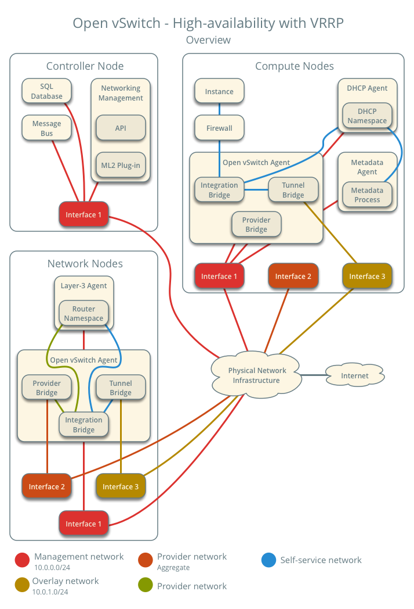
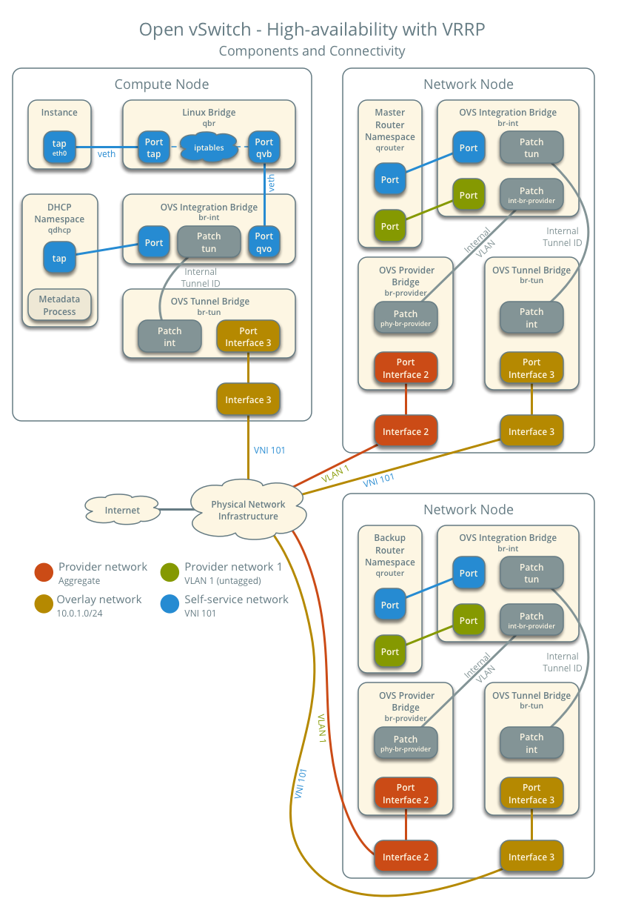

.. _deploy-ovs-ha-vrrp:

==========================================
Open vSwitch: High availability using VRRP
==========================================

.. include:: shared/deploy-ha-vrrp.txt

Prerequisites
~~~~~~~~~~~~~

Add one network node with the following components:

* Three network interfaces: management, provider, and overlay.
* OpenStack Networking layer-2 agent, layer-3 agent, and any
  dependencies.

.. note::

   You can keep the DHCP and metadata agents on each compute node or
   move them to the network nodes.

Architecture
~~~~~~~~~~~~

The following figure shows components and connectivity for one self-service
network and one untagged (flat) network. The master router resides on network
node 1. In this particular case, the instance resides on the same compute
node as the DHCP agent for the network. If the DHCP agent resides on another
compute node, the latter only contains a DHCP namespace and Linux bridge
with a port on the overlay physical network interface.

Example configuration
~~~~~~~~~~~~~~~~~~~~~

Use the following example configuration as a template to add support for
high-availability using VRRP to an existing operational environment that
supports self-service networks.

Controller node
---------------

#. In the ``neutron.conf`` file:

   * Enable VRRP.

     .. code-block:: ini

        [DEFAULT]
        l3_ha = True

#. Restart the following services:

   * Server

Network node 1
--------------

No changes.

Network node 2
--------------

#. Install the Networking service OVS layer-2 agent and layer-3 agent.

#. Install OVS.

#. In the ``neutron.conf`` file, configure common options:

   .. include:: shared/deploy-config-neutron-common.txt

#. Start the following services:

   * OVS

#. Create the OVS provider bridge ``br-provider``:

   .. code-block:: console

      $ ovs-vsctl add-br br-provider

#. Add the provider network interface as a port on the OVS provider
   bridge ``br-provider``:

   .. code-block:: console

      $ ovs-vsctl add-port br-provider PROVIDER_INTERFACE

   Replace ``PROVIDER_INTERFACE`` with the name of the underlying interface
   that handles provider networks. For example, ``eth1``.

#. In the ``openvswitch_agent.ini`` file, configure the layer-2 agent.

   .. code-block:: ini

      [ovs]
      bridge_mappings = provider:br-provider
      local_ip = OVERLAY_INTERFACE_IP_ADDRESS

      [agent]
      tunnel_types = vxlan
      l2_population = true

      [securitygroup]
      firewall_driver = iptables_hybrid

   Replace ``OVERLAY_INTERFACE_IP_ADDRESS`` with the IP address of the
   interface that handles VXLAN overlays for self-service networks.

#. In the ``l3_agent.ini`` file, configure the layer-3 agent.

   .. code-block:: ini

      [DEFAULT]
      interface_driver = openvswitch

#. Start the following services:

   * Open vSwitch agent
   * Layer-3 agent

Compute nodes
-------------

No changes.

Verify service operation
------------------------

#. Source the administrative project credentials.
#. Verify presence and operation of the agents.

   .. code-block:: console

      $ openstack network agent list
      +--------------------------------------+--------------------+----------+-------------------+-------+-------+---------------------------+
      | ID                                   | Agent Type         | Host     | Availability Zone | Alive | State | Binary                    |
      +--------------------------------------+--------------------+----------+-------------------+-------+-------+---------------------------+
      | 1236bbcb-e0ba-48a9-80fc-81202ca4fa51 | Metadata agent     | compute2 | None              | True  | UP    | neutron-metadata-agent    |
      | 457d6898-b373-4bb3-b41f-59345dcfb5c5 | Open vSwitch agent | compute2 | None              | True  | UP    | neutron-openvswitch-agent |
      | 71f15e84-bc47-4c2a-b9fb-317840b2d753 | DHCP agent         | compute2 | nova              | True  | UP    | neutron-dhcp-agent        |
      | 8805b962-de95-4e40-bdc2-7a0add7521e8 | L3 agent           | network1 | nova              | True  | UP    | neutron-l3-agent          |
      | a33cac5a-0266-48f6-9cac-4cef4f8b0358 | Open vSwitch agent | network1 | None              | True  | UP    | neutron-openvswitch-agent |
      | a6c69690-e7f7-4e56-9831-1282753e5007 | Metadata agent     | compute1 | None              | True  | UP    | neutron-metadata-agent    |
      | af11f22f-a9f4-404f-9fd8-cd7ad55c0f68 | DHCP agent         | compute1 | nova              | True  | UP    | neutron-dhcp-agent        |
      | bcfc977b-ec0e-4ba9-be62-9489b4b0e6f1 | Open vSwitch agent | compute1 | None              | True  | UP    | neutron-openvswitch-agent |
      | 7f00d759-f2c9-494a-9fbf-fd9118104d03 | Open vSwitch agent | network2 | None              | True  | UP    | neutron-openvswitch-agent |
      | b28d8818-9e32-4888-930b-29addbdd2ef9 | L3 agent           | network2 | nova              | True  | UP    | neutron-l3-agent          |
      +--------------------------------------+--------------------+----------+-------------------+-------+-------+---------------------------+

Create initial networks
-----------------------

.. include:: shared/deploy-ha-vrrp-initialnetworks.txt

Verify network operation
------------------------

.. include:: shared/deploy-ha-vrrp-verifynetworkoperation.txt

Verify failover operation
-------------------------

.. include:: shared/deploy-ha-vrrp-verifyfailoveroperation.txt

Keepalived VRRP health check
----------------------------

.. include:: shared/keepalived-vrrp-healthcheck.txt

Network traffic flow
~~~~~~~~~~~~~~~~~~~~

This high-availability mechanism simply augments :ref:`deploy-ovs-selfservice`
with failover of layer-3 services to another router if the master router
fails. Thus, you can reference :ref:`Self-service network traffic flow
<deploy-ovs-selfservice-networktrafficflow>` for normal operation.
