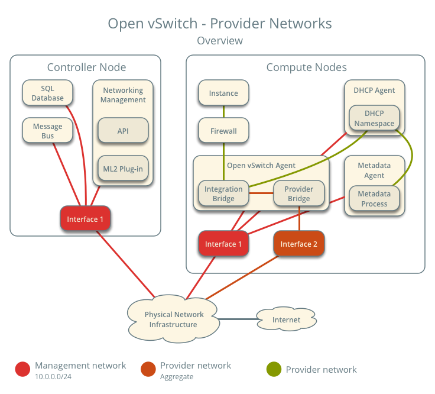
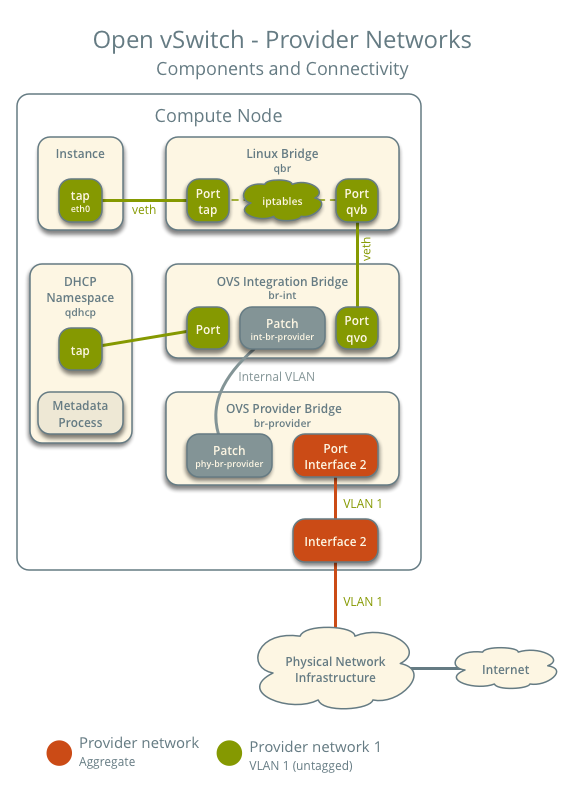
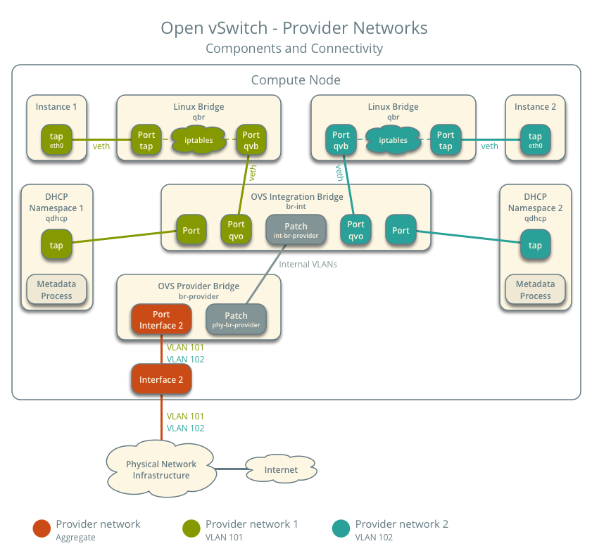
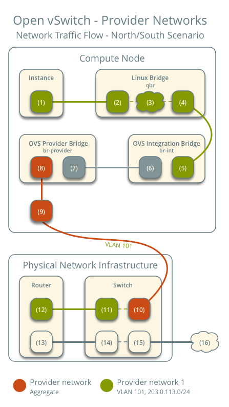
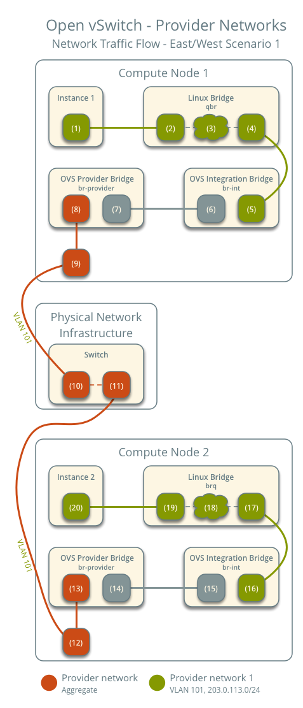
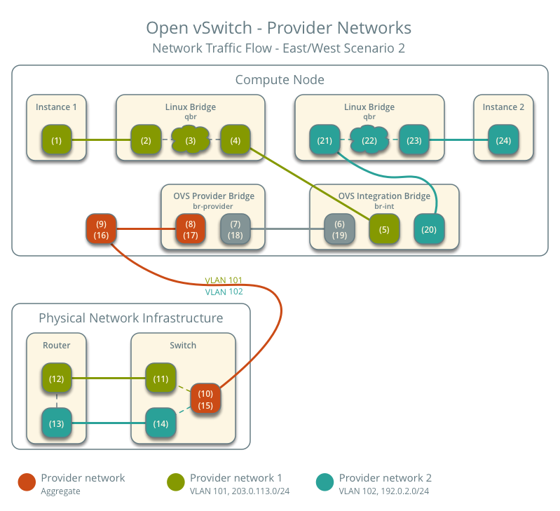

.. _deploy-ovs-provider:

===============================
Open vSwitch: Provider networks
===============================

This architecture example provides layer-2 connectivity between instances
and the physical network infrastructure using VLAN (802.1q) tagging. It
supports one untagged (flat) network and up to 4095 tagged (VLAN) networks.
The actual quantity of VLAN networks depends on the physical network
infrastructure. For more information on provider networks, see
:ref:`intro-os-networking-provider`.

.. warning::

   Linux distributions often package older releases of Open vSwitch that can
   introduce issues during operation with the Networking service. We recommend
   using at least the latest long-term stable (LTS) release of Open vSwitch
   for the best experience and support from Open vSwitch. See
   `<http://www.openvswitch.org>`__ for available releases and the
   `installation instructions
   <http://docs.openvswitch.org/en/latest/intro/install/general/>`__ for more
   details.

Prerequisites
~~~~~~~~~~~~~

One controller node with the following components:

* Two network interfaces: management and provider.
* OpenStack Networking server service and ML2 plug-in.

Two compute nodes with the following components:

* Two network interfaces: management and provider.
* OpenStack Networking Open vSwitch (OVS) layer-2 agent, DHCP agent, metadata
  agent, and any dependencies including OVS.

.. note::

   Larger deployments typically deploy the DHCP and metadata agents on a
   subset of compute nodes to increase performance and redundancy. However,
   too many agents can overwhelm the message bus. Also, to further simplify
   any deployment, you can omit the metadata agent and use a configuration
   drive to provide metadata to instances.

Architecture
~~~~~~~~~~~~

The following figure shows components and connectivity for one untagged
(flat) network. In this particular case, the instance resides on the
same compute node as the DHCP agent for the network. If the DHCP agent
resides on another compute node, the latter only contains a DHCP namespace
with a port on the OVS integration bridge.

The following figure describes virtual connectivity among components for
two tagged (VLAN) networks. Essentially, all networks use a single OVS
integration bridge with different internal VLAN tags. The internal VLAN
tags almost always differ from the network VLAN assignment in the Networking
service. Similar to the untagged network case, the DHCP agent may reside on
a different compute node.

.. note::

   These figures omit the controller node because it does not handle instance
   network traffic.

Example configuration
~~~~~~~~~~~~~~~~~~~~~

Use the following example configuration as a template to deploy provider
networks in your environment.

Controller node
---------------

#. Install the Networking service components that provide the
   ``neutron-server`` service and ML2 plug-in.

#. In the ``neutron.conf`` file:

   * Configure common options:

     .. include:: shared/deploy-config-neutron-common.txt

   * Disable service plug-ins because provider networks do not require
     any. However, this breaks portions of the dashboard that manage
     the Networking service. See the latest
     `Install Tutorials and Guides
     <../install/>`__ for more
     information.

     .. code-block:: ini

        [DEFAULT]
        service_plugins =

   * Enable two DHCP agents per network so both compute nodes can
     provide DHCP service provider networks.

     .. code-block:: ini

        [DEFAULT]
        dhcp_agents_per_network = 2

   * If necessary, :ref:`configure MTU <config-mtu>`.

#. In the ``ml2_conf.ini`` file:

   * Configure drivers and network types:

     .. code-block:: ini

        [ml2]
        type_drivers = flat,vlan
        tenant_network_types =
        mechanism_drivers = openvswitch
        extension_drivers = port_security

   * Configure network mappings:

     .. code-block:: ini

        [ml2_type_flat]
        flat_networks = provider

        [ml2_type_vlan]
        network_vlan_ranges = provider

     .. note::

        The ``tenant_network_types`` option contains no value because the
        architecture does not support self-service networks.

     .. note::

        The ``provider`` value in the ``network_vlan_ranges`` option lacks VLAN
        ID ranges to support use of arbitrary VLAN IDs.

#. Populate the database.

   .. code-block:: console

      # su -s /bin/sh -c "neutron-db-manage --config-file /etc/neutron/neutron.conf \
        --config-file /etc/neutron/plugins/ml2/ml2_conf.ini upgrade head" neutron

#. Start the following services:

   * Server

Compute nodes
-------------

#. Install the Networking service OVS layer-2 agent, DHCP agent, and
   metadata agent.

#. Install OVS.

#. In the ``neutron.conf`` file, configure common options:

   .. include:: shared/deploy-config-neutron-common.txt

#. In the ``openvswitch_agent.ini`` file, configure the OVS agent:

   .. code-block:: ini

      [ovs]
      bridge_mappings = provider:br-provider

      [securitygroup]
      firewall_driver = iptables_hybrid

#. In the ``dhcp_agent.ini`` file, configure the DHCP agent:

   .. code-block:: ini

      [DEFAULT]
      enable_isolated_metadata = True
      force_metadata = True

   .. note::

      The ``force_metadata`` option forces the DHCP agent to provide
      a host route to the metadata service on ``169.254.169.254``
      regardless of whether the subnet contains an interface on a
      router, thus maintaining similar and predictable metadata behavior
      among subnets.

#. In the ``metadata_agent.ini`` file, configure the metadata agent:

   .. code-block:: ini

      [DEFAULT]
      nova_metadata_host = controller
      metadata_proxy_shared_secret = METADATA_SECRET

   The value of ``METADATA_SECRET`` must match the value of the same option
   in the ``[neutron]`` section of the ``nova.conf`` file.

#. Start the following services:

   * OVS

#. Create the OVS provider bridge ``br-provider``:

   .. code-block:: console

      $ ovs-vsctl add-br br-provider

#. Add the provider network interface as a port on the OVS provider
   bridge ``br-provider``:

   .. code-block:: console

      $ ovs-vsctl add-port br-provider PROVIDER_INTERFACE

   Replace ``PROVIDER_INTERFACE`` with the name of the underlying interface
   that handles provider networks. For example, ``eth1``.

#. Start the following services:

   * OVS agent
   * DHCP agent
   * Metadata agent

Verify service operation
------------------------

#. Source the administrative project credentials.
#. Verify presence and operation of the agents:

   .. code-block:: console

      $ openstack network agent list
      +--------------------------------------+--------------------+----------+-------------------+-------+-------+---------------------------+
      | ID                                   | Agent Type         | Host     | Availability Zone | Alive | State | Binary                    |
      +--------------------------------------+--------------------+----------+-------------------+-------+-------+---------------------------+
      | 1236bbcb-e0ba-48a9-80fc-81202ca4fa51 | Metadata agent     | compute2 | None              | True  | UP    | neutron-metadata-agent    |
      | 457d6898-b373-4bb3-b41f-59345dcfb5c5 | Open vSwitch agent | compute2 | None              | True  | UP    | neutron-openvswitch-agent |
      | 71f15e84-bc47-4c2a-b9fb-317840b2d753 | DHCP agent         | compute2 | nova              | True  | UP    | neutron-dhcp-agent        |
      | a6c69690-e7f7-4e56-9831-1282753e5007 | Metadata agent     | compute1 | None              | True  | UP    | neutron-metadata-agent    |
      | af11f22f-a9f4-404f-9fd8-cd7ad55c0f68 | DHCP agent         | compute1 | nova              | True  | UP    | neutron-dhcp-agent        |
      | bcfc977b-ec0e-4ba9-be62-9489b4b0e6f1 | Open vSwitch agent | compute1 | None              | True  | UP    | neutron-openvswitch-agent |
      +--------------------------------------+--------------------+----------+-------------------+-------+-------+---------------------------+

Create initial networks
-----------------------

.. include:: shared/deploy-provider-initialnetworks.txt

Verify network operation
------------------------

.. include:: deploy-provider-verifynetworkoperation.txt

Network traffic flow
~~~~~~~~~~~~~~~~~~~~

.. include:: shared/deploy-provider-networktrafficflow.txt

North-south
-----------

* The instance resides on compute node 1 and uses provider network 1.
* The instance sends a packet to a host on the Internet.

The following steps involve compute node 1.

#. The instance interface (1) forwards the packet to the security group
   bridge instance port (2) via ``veth`` pair.
#. Security group rules (3) on the security group bridge handle firewalling
   and connection tracking for the packet.
#. The security group bridge OVS port (4) forwards the packet to the OVS
   integration bridge security group port (5) via ``veth`` pair.
#. The OVS integration bridge adds an internal VLAN tag to the packet.
#. The OVS integration bridge ``int-br-provider`` patch port (6) forwards
   the packet to the OVS provider bridge ``phy-br-provider`` patch port (7).
#. The OVS provider bridge swaps the internal VLAN tag with actual VLAN tag
   101.
#. The OVS provider bridge provider network port (8) forwards the packet to
   the physical network interface (9).
#. The physical network interface forwards the packet to the physical
   network infrastructure switch (10).

The following steps involve the physical network infrastructure:

#. The switch removes VLAN tag 101 from the packet and forwards it to the
   router (11).
#. The router routes the packet from the provider network (12) to the
   external network (13) and forwards the packet to the switch (14).
#. The switch forwards the packet to the external network (15).
#. The external network (16) receives the packet.

.. note::

   Return traffic follows similar steps in reverse.

East-west scenario 1: Instances on the same network
---------------------------------------------------

Instances on the same network communicate directly between compute nodes
containing those instances.

* Instance 1 resides on compute node 1 and uses provider network 1.
* Instance 2 resides on compute node 2 and uses provider network 1.
* Instance 1 sends a packet to instance 2.

The following steps involve compute node 1:

#. The instance 1 interface (1) forwards the packet to the security group
   bridge instance port (2) via ``veth`` pair.
#. Security group rules (3) on the security group bridge handle firewalling
   and connection tracking for the packet.
#. The security group bridge OVS port (4) forwards the packet to the OVS
   integration bridge security group port (5) via ``veth`` pair.
#. The OVS integration bridge adds an internal VLAN tag to the packet.
#. The OVS integration bridge ``int-br-provider`` patch port (6) forwards
   the packet to the OVS provider bridge ``phy-br-provider`` patch port (7).
#. The OVS provider bridge swaps the internal VLAN tag with actual VLAN tag
   101.
#. The OVS provider bridge provider network port (8) forwards the packet to
   the physical network interface (9).
#. The physical network interface forwards the packet to the physical
   network infrastructure switch (10).

The following steps involve the physical network infrastructure:

#. The switch forwards the packet from compute node 1 to compute node 2 (11).

The following steps involve compute node 2:

#. The physical network interface (12) forwards the packet to the OVS
   provider bridge provider network port (13).
#. The OVS provider bridge ``phy-br-provider`` patch port (14) forwards the
   packet to the OVS integration bridge ``int-br-provider`` patch port (15).
#. The OVS integration bridge swaps the actual VLAN tag 101 with the internal
   VLAN tag.
#. The OVS integration bridge security group port (16) forwards the packet
   to the security group bridge OVS port (17).
#. Security group rules (18) on the security group bridge handle firewalling
   and connection tracking for the packet.
#. The security group bridge instance port (19) forwards the packet to the
   instance 2 interface (20) via ``veth`` pair.

.. note::

   Return traffic follows similar steps in reverse.

East-west scenario 2: Instances on different networks
-----------------------------------------------------

Instances communicate via router on the physical network infrastructure.

* Instance 1 resides on compute node 1 and uses provider network 1.
* Instance 2 resides on compute node 1 and uses provider network 2.
* Instance 1 sends a packet to instance 2.

.. note::

   Both instances reside on the same compute node to illustrate how VLAN
   tagging enables multiple logical layer-2 networks to use the same
   physical layer-2 network.

The following steps involve the compute node:

#. The instance 1 interface (1) forwards the packet to the security group
   bridge instance port (2) via ``veth`` pair.
#. Security group rules (3) on the security group bridge handle firewalling
   and connection tracking for the packet.
#. The security group bridge OVS port (4) forwards the packet to the OVS
   integration bridge security group port (5) via ``veth`` pair.
#. The OVS integration bridge adds an internal VLAN tag to the packet.
#. The OVS integration bridge ``int-br-provider`` patch port (6) forwards
   the packet to the OVS provider bridge ``phy-br-provider`` patch port (7).
#. The OVS provider bridge swaps the internal VLAN tag with actual VLAN tag
   101.
#. The OVS provider bridge provider network port (8) forwards the packet to
   the physical network interface (9).
#. The physical network interface forwards the packet to the physical
   network infrastructure switch (10).

The following steps involve the physical network infrastructure:

#. The switch removes VLAN tag 101 from the packet and forwards it to the
   router (11).
#. The router routes the packet from provider network 1 (12) to provider
   network 2 (13).
#. The router forwards the packet to the switch (14).
#. The switch adds VLAN tag 102 to the packet and forwards it to compute
   node 1 (15).

The following steps involve the compute node:

#. The physical network interface (16) forwards the packet to the OVS
   provider bridge provider network port (17).
#. The OVS provider bridge ``phy-br-provider`` patch port (18) forwards the
   packet to the OVS integration bridge ``int-br-provider`` patch port (19).
#. The OVS integration bridge swaps the actual VLAN tag 102 with the internal
   VLAN tag.
#. The OVS integration bridge security group port (20) removes the internal
   VLAN tag and forwards the packet to the security group bridge OVS port
   (21).
#. Security group rules (22) on the security group bridge handle firewalling
   and connection tracking for the packet.
#. The security group bridge instance port (23) forwards the packet to the
   instance 2 interface (24) via ``veth`` pair.

.. note::

   Return traffic follows similar steps in reverse.
