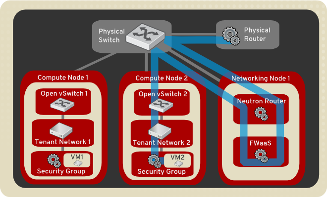

Firewall-as-a-Service (FWaaS)
~~~~~~~~~~~~~~~~~~~~~~~~~~~~~

The Firewall-as-a-Service (FWaaS) plug-in applies firewalls to
OpenStack objects such as projects, routers, and router ports.

.. note::

    We anticipate this to expand to VM ports in the Ocata cycle.

The central concepts with OpenStack firewalls are the notions of a firewall
policy and a firewall rule. A policy is an ordered collection of rules. A rule
specifies a collection of attributes (such as port ranges, protocol, and IP
addresses) that constitute match criteria and an action to take (allow or deny)
on matched traffic. A policy can be made public, so it can be shared across
projects.

Firewalls are implemented in various ways, depending on the driver used. For
example, an iptables driver implements firewalls using iptable rules. An
OpenVSwitch driver implements firewall rules using flow entries in flow tables.
A Cisco firewall driver manipulates NSX devices.

FWaaS v1
--------

The original FWaaS implementation, v1, provides protection for routers. When
a firewall is applied to a router, all internal ports are protected.

The following diagram depicts FWaaS v1 protection. It illustrates the flow of
ingress and egress traffic for the VM2 instance:

FWaaS v2
--------

The newer FWaaS implementation, v2, provides a much more granular service.
The notion of a firewall has been replaced with firewall group to indicate
that a firewall consists of two policies: an ingress policy and an egress
policy. A firewall group is applied not at the router level (all ports on a
router) but at the port level. Currently, router ports can be specified. For
Ocata, VM ports can also be specified.

FWaaS v1 versus v2
------------------

The following table compares v1 and v2 features.

+------------------------------------------+-----+------+
| Feature                                  | v1  | v2   |
+==========================================+=====+======+
| Supports L3 firewalling for routers      | YES | NO*  |
+------------------------------------------+-----+------+
| Supports L3 firewalling for router ports | NO  | YES  |
+------------------------------------------+-----+------+
| Supports L2 firewalling (VM ports)       | NO  | NO** |
+------------------------------------------+-----+------+
| CLI support                              | YES | YES  |
+------------------------------------------+-----+------+
| Horizon support                          | YES | NO   |
+------------------------------------------+-----+------+

\* A firewall group can be applied to all ports on a given router in order to
effect this.

\*\* This feature is planned for Ocata.

For further information, see `v1 configuration guide
<./fwaas-v1-scenario.html>`_ or
`v2 configuration guide <./fwaas-v2-scenario.html>`_.
