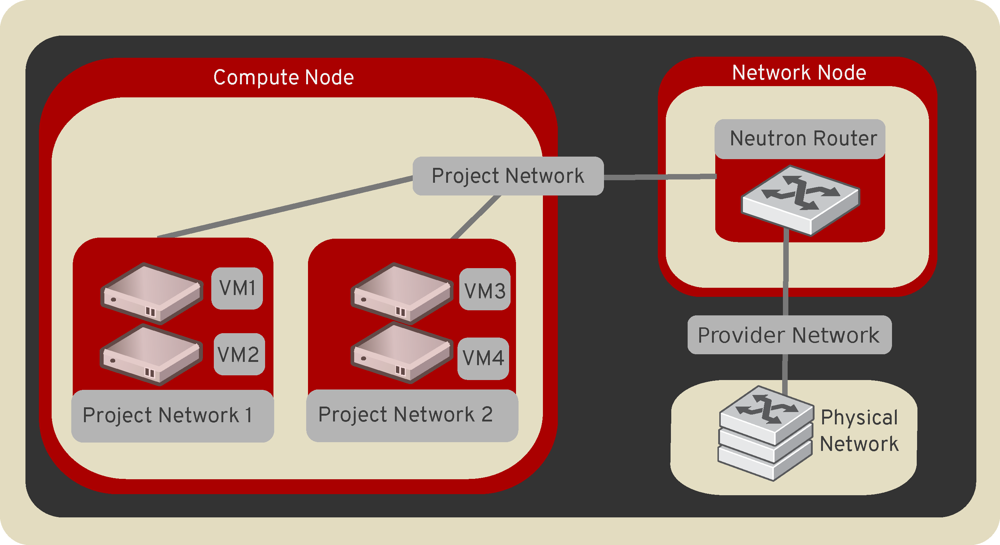

.. _intro-os-networking:

====================
OpenStack Networking
====================

OpenStack Networking allows you to create and manage network objects,
such as networks, subnets, and ports, which other OpenStack services
can use. Plug-ins can be implemented to accommodate different
networking equipment and software, providing flexibility to OpenStack
architecture and deployment.

The Networking service, code-named neutron, provides an API that lets you
define network connectivity and addressing in the cloud. The Networking
service enables operators to leverage different networking technologies
to power their cloud networking. The Networking service also provides an
API to configure and manage a variety of network services ranging from L3
forwarding and Network Address Translation (NAT) to perimeter firewalls, and
virtual private networks.

It includes the following components:

API server
  The OpenStack Networking API includes support for Layer 2 networking
  and IP Address Management (IPAM), as well as an extension for a Layer 3
  router construct that enables routing between Layer 2 networks and gateways
  to external networks. OpenStack Networking includes a growing list of
  plug-ins that enable interoperability with various commercial and open
  source network technologies, including routers, switches, virtual
  switches and software-defined networking (SDN) controllers.

OpenStack Networking plug-in and agents
  Plugs and unplugs ports, creates networks or subnets, and provides
  IP addressing. The chosen plug-in and agents differ depending on the
  vendor and technologies used in the particular cloud. It is
  important to mention that only one plug-in can be used at a time.

Messaging queue
  Accepts and routes RPC requests between agents to complete API operations.
  Message queue is used in the ML2 plug-in for RPC between the neutron
  server and neutron agents that run on each hypervisor, in the ML2
  mechanism drivers for Open vSwitch and Linux bridge.

Concepts
~~~~~~~~

To configure rich network topologies, you can create and configure networks
and subnets and instruct other OpenStack services like Compute to attach
virtual devices to ports on these networks.
OpenStack Compute is a prominent consumer of OpenStack Networking to provide
connectivity for its instances.
In particular, OpenStack Networking supports each project having multiple
private networks and enables projects to choose their own IP addressing scheme,
even if those IP addresses overlap with those that other projects use. There
are two types of network, project and provider networks. It is possible to
share any of these types of networks among projects as part of the network
creation process.

.. _intro-os-networking-provider:

Provider networks
-----------------

Provider networks offer layer-2 connectivity to instances with optional
support for DHCP and metadata services. These networks connect, or map, to
existing layer-2 networks in the data center, typically using VLAN (802.1q)
tagging to identify and separate them.

Provider networks generally offer simplicity, performance, and reliability
at the cost of flexibility. By default only administrators can create or
update provider networks because they require configuration of physical
network infrastructure. It is possible to change the user who is allowed to
create or update provider networks with the following parameters of
``policy.yaml``:

* ``create_network:provider:physical_network``
* ``update_network:provider:physical_network``

.. warning::

   The creation and modification of provider networks enables use of
   physical network resources, such as VLAN-s. Enable these changes
   only for trusted projects.

Also, provider networks only handle layer-2 connectivity for instances, thus
lacking support for features such as routers and floating IP addresses.

In many cases, operators who are already familiar with virtual networking
architectures that rely on physical network infrastructure for layer-2,
layer-3, or other services can seamlessly deploy the OpenStack Networking
service. In particular, provider networks appeal to operators looking to
migrate from the Compute networking service (nova-network) to the OpenStack
Networking service. Over time, operators can build on this minimal
architecture to enable more cloud networking features.

In general, the OpenStack Networking software components that handle layer-3
operations impact performance and reliability the most. To improve performance
and reliability, provider networks move layer-3 operations to the physical
network infrastructure.

In one particular use case, the OpenStack deployment resides in a mixed
environment with conventional virtualization and bare-metal hosts that use a
sizable physical network infrastructure. Applications that run inside the
OpenStack deployment might require direct layer-2 access, typically using
VLANs, to applications outside of the deployment.

Routed provider networks
------------------------

Routed provider networks offer layer-3 connectivity to instances. These
networks map to existing layer-3 networks in the data center. More
specifically, the network maps to multiple layer-2 segments, each of which is
essentially a provider network. Each has a router gateway attached to it which
routes traffic between them and externally. The Networking service does not
provide the routing.

Routed provider networks offer performance at scale that is difficult to
achieve with a plain provider network at the expense of guaranteed layer-2
connectivity.

Neutron port could be associated with only one network segment,
but there is an exception for OVN distributed services like OVN Metadata.

See :ref:`config-routed-provider-networks` for more information.

.. _intro-os-networking-selfservice:

Self-service networks
---------------------

Self-service networks primarily enable general (non-privileged) projects
to manage networks without involving administrators. These networks are
entirely virtual and require virtual routers to interact with provider
and external networks such as the Internet. Self-service networks also
usually provide DHCP and metadata services to instances.

In most cases, self-service networks use overlay protocols such as VXLAN
or GRE because they can support many more networks than layer-2 segmentation
using VLAN tagging (802.1q). Furthermore, VLANs typically require additional
configuration of physical network infrastructure.

IPv4 self-service networks typically use private IP address ranges (RFC1918)
and interact with provider networks via source NAT on virtual routers.
Floating IP addresses enable access to instances from provider networks
via destination NAT on virtual routers. IPv6 self-service networks always
use public IP address ranges and interact with provider networks via
virtual routers with static routes.

The Networking service implements routers using a layer-3 agent that typically
resides at least one network node. Contrary to provider networks that connect
instances to the physical network infrastructure at layer-2, self-service
networks must traverse a layer-3 agent. Thus, oversubscription or failure
of a layer-3 agent or network node can impact a significant quantity of
self-service networks and instances using them. Consider implementing one or
more high-availability features to increase redundancy and performance
of self-service networks.

Users create project networks for connectivity within projects. By default,
they are fully isolated and are not shared with other projects. OpenStack
Networking supports the following types of network isolation and overlay
technologies.

Flat
  All instances reside on the same network, which can also be shared
  with the hosts. No VLAN tagging or other network segregation takes place.

VLAN
    Networking allows users to create multiple provider or project networks
    using VLAN IDs (802.1Q tagged) that correspond to VLANs present in the
    physical network. This allows instances to communicate with each other
    across the environment. They can also communicate with dedicated servers,
    firewalls, and other networking infrastructure on the same layer 2 VLAN.

GRE and VXLAN
    VXLAN and GRE are encapsulation protocols that create overlay networks
    to activate and control communication between compute instances. A
    Networking router is required to allow traffic to flow outside of the
    GRE or VXLAN project network. A router is also required to connect
    directly-connected project networks with external networks, including the
    Internet. The router provides the ability to connect to instances directly
    from an external network using floating IP addresses.

Subnets
-------

A block of IP addresses and associated configuration state. This
is also known as the native IPAM (IP Address Management) provided by the
networking service for both project and provider networks.
Subnets are used to allocate IP addresses when new ports are created on a
network.

Subnet pools
------------

End users normally can create subnets with any valid IP addresses without other
restrictions. However, in some cases, it is nice for the admin or the project
to pre-define a pool of addresses from which to create subnets with automatic
allocation.

Using subnet pools constrains what addresses can be used by requiring that
every subnet be within the defined pool. It also prevents address reuse or
overlap by two subnets from the same pool.

See :ref:`config-subnet-pools` for more information.

Ports
-----

A port is a connection point for attaching a single device, such as the NIC
of a virtual server, to a virtual network. The port also describes the
associated network configuration, such as the MAC and IP addresses to be
used on that port.

Routers
-------

Routers provide virtual layer-3 services such as routing and NAT
between self-service and provider networks or among self-service
networks belonging to a project. The Networking service uses a
layer-3 agent to manage routers via namespaces.

Security groups
---------------

Security groups provide a container for virtual firewall rules that control
ingress (inbound to instances) and egress (outbound from instances) network
traffic at the port level. Security groups use a default deny policy and
only contain rules that allow specific traffic. Each port can reference one
or more security groups in an additive fashion. The firewall driver
translates security group rules to a configuration for the underlying packet
filtering technology such as ``iptables``.

Each project contains a ``default`` security group that allows all egress
traffic and denies all ingress traffic. You can change the rules in the
``default`` security group. If you launch an instance without specifying a
security group, the ``default`` security group automatically applies to it.
Similarly, if you create a port without specifying a security group, the
``default`` security group automatically applies to it.

.. note::

   If you use the metadata service, removing the default egress rules denies
   access to TCP port 80 on 169.254.169.254, thus preventing instances from
   retrieving metadata.

Security group rules are stateful. Thus, allowing ingress TCP port 22 for
secure shell automatically creates rules that allow return egress traffic
and ICMP error messages involving those TCP connections.

By default, all security groups contain a series of basic (sanity) and
anti-spoofing rules that perform the following actions:

* Allow egress traffic only if it uses the source MAC and IP addresses
  of the port for the instance, source MAC and IP combination in
  ``allowed-address-pairs``, or valid MAC address (port or
  ``allowed-address-pairs``) and associated EUI64 link-local IPv6 address.
* Allow egress DHCP discovery and request messages that use the source MAC
  address of the port for the instance and the unspecified IPv4 address
  (0.0.0.0).
* Allow ingress DHCP and DHCPv6 responses from the DHCP server on the
  subnet so instances can acquire IP addresses.
* Deny egress DHCP and DHCPv6 responses to prevent instances from
  acting as DHCP(v6) servers.
* Allow ingress/egress ICMPv6 MLD, neighbor solicitation, and neighbor
  discovery messages so instances can discover neighbors and join
  multicast groups.
* Deny egress ICMPv6 router advertisements to prevent instances from acting
  as IPv6 routers and forwarding IPv6 traffic for other instances.
* Allow egress ICMPv6 MLD reports (v1 and v2) and neighbor solicitation
  messages that use the source MAC address of a particular instance and
  the unspecified IPv6 address (::). Duplicate address detection (DAD) relies
  on these messages.
* Allow egress non-IP traffic from the MAC address of the port for the
  instance and any additional MAC addresses in ``allowed-address-pairs`` on
  the port for the instance.

Although non-IP traffic, security groups do not implicitly allow all ARP
traffic. Separate ARP filtering rules prevent instances from using ARP
to intercept traffic for another instance. You cannot disable or remove
these rules.

You can disable security groups including basic and anti-spoofing rules
by setting the port attribute ``port_security_enabled`` to ``False``.

Extensions
----------

The OpenStack Networking service is extensible. Extensions serve two
purposes: they allow the introduction of new features in the API
without requiring a version change and they allow the introduction of
vendor specific niche functionality. Applications can programmatically
list available extensions by performing a GET on the
:code:`/extensions` URI. Note that this is a versioned request; that
is, an extension available in one API version might not be available
in another.

DHCP
----

The optional DHCP service manages IP addresses for instances on provider
and self-service networks. The Networking service implements the DHCP
service using an agent that manages ``qdhcp`` namespaces and the
``dnsmasq`` service.

Metadata
--------

The optional metadata service provides an API for instances to obtain
metadata such as SSH keys.

Service and component hierarchy
~~~~~~~~~~~~~~~~~~~~~~~~~~~~~~~

Server
------

* Provides API, manages database, etc.

Plug-ins
--------

* Manages agents

Agents
------

* Provides layer 2/3 connectivity to instances

* Handles physical-virtual network transition

* Handles metadata, etc.

Layer 2 (Ethernet and Switching)
^^^^^^^^^^^^^^^^^^^^^^^^^^^^^^^^

* Linux Bridge

* OVS

Layer 3 (IP and Routing)
^^^^^^^^^^^^^^^^^^^^^^^^

* L3

* DHCP

Miscellaneous
^^^^^^^^^^^^^

* Metadata

Services
--------

Routing services
^^^^^^^^^^^^^^^^

VPNaaS
^^^^^^

The Virtual Private Network-as-a-Service (VPNaaS) is a neutron
extension that introduces the VPN feature set.

LBaaS
^^^^^

The Load-Balancer-as-a-Service (LBaaS) API provisions and configures
load balancers. The reference implementation is based on the HAProxy
software load balancer. See the `Octavia project
<https://docs.openstack.org/octavia/latest/>`_ for more information.
