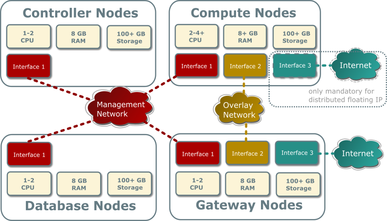
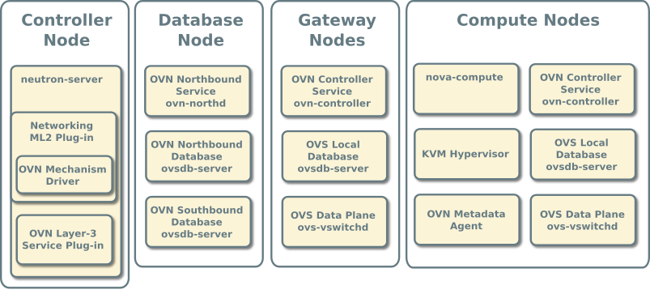
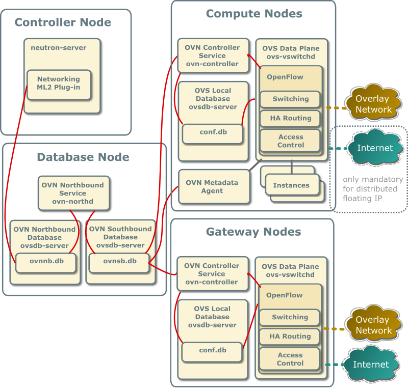
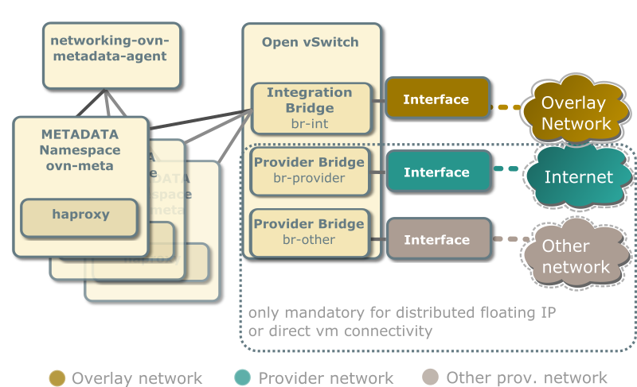

.. _refarch-refarch:

======================
Reference architecture
======================

The reference architecture defines the minimum environment necessary
to deploy OpenStack with Open Virtual Network (OVN) integration for
the Networking service in production with sufficient expectations
of scale and performance. For evaluation purposes, you can deploy this
environment using the :doc:`Installation Guide </install/ovn/index>` or
`Vagrant <https://github.com/openstack/neutron/tree/master/vagrant/ovn>`_.
Any scaling or performance evaluations should use bare metal instead of
virtual machines.

Layout
------

The reference architecture includes a minimum of four nodes.

The controller node contains the following components that provide enough
functionality to launch basic instances:

* One network interface for management
* Identity service
* Image service
* Networking management with ML2 mechanism driver for OVN (control plane)
* Compute management (control plane)

The database node contains the following components:

* One network interface for management
* OVN northbound service (``ovn-northd``)
* Open vSwitch (OVS) database service (``ovsdb-server``) for the OVN
  northbound database (``ovnnb.db``)
* Open vSwitch (OVS) database service (``ovsdb-server``) for the OVN
  southbound database (``ovnsb.db``)

.. note::

   For functional evaluation only, you can combine the controller and
   database nodes.

The two compute nodes contain the following components:

* Two or three network interfaces for management, overlay networks, and
  optionally provider networks
* Compute management (hypervisor)
* Hypervisor (KVM)
* OVN controller service (``ovn-controller``)
* OVS data plane service (``ovs-vswitchd``)
* OVS database service (``ovsdb-server``) with OVS local configuration
  (``conf.db``) database
* OVN metadata agent (``ovn-metadata-agent``)

The gateway nodes contain the following components:

* Three network interfaces for management, overlay networks and provider
  networks.
* OVN controller service (``ovn-controller``)
* OVS data plane service (``ovs-vswitchd``)
* OVS database service (``ovsdb-server``) with OVS local configuration
  (``conf.db``) database

.. note::

   Each OVN metadata agent provides metadata service locally on the compute
   nodes in a lightweight way. Each network being accessed by the instances of
   the compute node will have a corresponding metadata ovn-metadata-$net_uuid
   namespace, and inside an haproxy will funnel the requests to the
   ovn-metadata-agent over a unix socket.

   Such namespace can be very helpful for debug purposes to access the local
   instances on the compute node. If you login as root on such compute node
   you can execute:

   ip netns ovn-metadata-$net_uuid exec ssh user@my.instance.ip.address

Hardware layout
~~~~~~~~~~~~~~~

Service layout
~~~~~~~~~~~~~~

Networking service with OVN integration
---------------------------------------

The reference architecture deploys the Networking service with OVN
integration as described in the following scenarios:

With ovn driver, all the E/W traffic which traverses a virtual
router is completely distributed, going from compute to compute node
without passing through the gateway nodes.

N/S traffic that needs SNAT (without floating IPs) will always pass
through the centralized gateway nodes, although, as soon as you
have more than one gateway node ovn driver will make use of
the HA capabilities of ovn.

Centralized Floating IPs
~~~~~~~~~~~~~~~~~~~~~~~~

In this architecture, all the N/S router traffic (snat and floating
IPs) goes through the gateway nodes.

The compute nodes don't need connectivity to the external network,
although it could be provided if we wanted to have direct connectivity
to such network from some instances.

For external connectivity, gateway nodes have to set ``ovn-cms-options``
with ``enable-chassis-as-gw`` in Open_vSwitch table's external_ids column,
for example:

.. code-block:: console

 $ ovs-vsctl set open . external-ids:ovn-cms-options="enable-chassis-as-gw"

Distributed Floating IPs (DVR)
~~~~~~~~~~~~~~~~~~~~~~~~~~~~~~

In this architecture, the floating IP N/S traffic flows directly
from/to the compute nodes through the specific provider network
bridge. In this case compute nodes need connectivity to the external
network.

Each compute node contains the following network components:

.. note::

   The Networking service creates a unique network namespace for each
   virtual network that enables the metadata service.

Several external connections can be optionally created via provider
bridges. Those can be used for direct vm connectivity to the specific
networks or the use of distributed floating ips.

.. _refarch_database-access:

Accessing OVN database content
------------------------------

OVN stores configuration data in a collection of OVS database tables.
The following commands show the contents of the most common database
tables in the northbound and southbound databases. The example database
output in this section uses these commands with various output filters.

.. code-block:: console

   $ ovn-nbctl list Logical_Switch
   $ ovn-nbctl list Logical_Switch_Port
   $ ovn-nbctl list ACL
   $ ovn-nbctl list Address_Set
   $ ovn-nbctl list Logical_Router
   $ ovn-nbctl list Logical_Router_Port
   $ ovn-nbctl list Gateway_Chassis

   $ ovn-sbctl list Chassis
   $ ovn-sbctl list Encap
   $ ovn-nbctl list Address_Set
   $ ovn-sbctl lflow-list
   $ ovn-sbctl list Multicast_Group
   $ ovn-sbctl list Datapath_Binding
   $ ovn-sbctl list Port_Binding
   $ ovn-sbctl list MAC_Binding
   $ ovn-sbctl list Gateway_Chassis

.. note::

   By default, you must run these commands from the node containing
   the OVN databases.

.. _refarch-adding-compute-node:

Adding a compute node
---------------------

When you add a compute node to the environment, the OVN controller
service on it connects to the OVN southbound database and registers
the node as a chassis.

.. code-block:: console

   _uuid               : 9be8639d-1d0b-4e3d-9070-03a655073871
   encaps              : [2fcefdf4-a5e7-43ed-b7b2-62039cc7e32e]
   external_ids        : {ovn-bridge-mappings=""}
   hostname            : "compute1"
   name                : "410ee302-850b-4277-8610-fa675d620cb7"
   vtep_logical_switches: []

The ``encaps`` field value refers to tunnel endpoint information
for the compute node.

.. code-block:: console

   _uuid               : 2fcefdf4-a5e7-43ed-b7b2-62039cc7e32e
   ip                  : "10.0.0.32"
   options             : {}
   type                : geneve

Security Groups/Rules
---------------------

When a Neutron Security Group is created, the equivalent Port Group in OVN
(pg-<security_group_id> is created). This Port Group references Neutron SG id
in its external_ids column.

When a Neutron Port is created, the equivalent Logical Port in OVN is added to
those Port Groups associated to the Neutron Security Groups this port belongs
to.

When a Neutron Port is deleted, the associated Logical Port in OVN is deleted.
Since the schema includes a weak reference to the port, when the LSP gets
deleted, it is automatically deleted from any Port Group entry where it was
previously present.

Every time a security group rule is created, instead of figuring out the ports
affected by its SG and inserting an ACL row which will be referenced by
different Logical Switches, we just reference it from the associated
Port Group.

.. todo: add block with openstack security group rule example

OVN operations
~~~~~~~~~~~~~~

#. Creating a security group will cause the OVN mechanism driver to create
   a port group in the Port_Group table of the northbound DB:

   .. code-block:: console

      _uuid               : e96c5994-695d-4b9c-a17b-c7375ad281e2
      acls                : [33c3c2d0-bc7b-421b-ace9-10884851521a, c22170ec-da5d-4a59-b118-f7f0e370ebc4]
      external_ids        : {"neutron:security_group_id"="ccbeffee-7b98-4b6f-adf7-d42027ca6447"}
      name                : pg_ccbeffee_7b98_4b6f_adf7_d42027ca6447
      ports               : []

   And it also creates the default ACLs for egress traffic in the ACL table of
   the northbound DB:

   .. code-block:: console

      _uuid               : 33c3c2d0-bc7b-421b-ace9-10884851521a
      action              : allow-related
      direction           : from-lport
      external_ids        : {"neutron:security_group_rule_id"="655b0d7e-144e-4bd8-9243-10a261b91041"}
      log                 : false
      match               : "inport == @pg_ccbeffee_7b98_4b6f_adf7_d42027ca6447 && ip4"
      meter               : []
      name                : []
      priority            : 1002
      severity            : []

      _uuid               : c22170ec-da5d-4a59-b118-f7f0e370ebc4
      action              : allow-related
      direction           : from-lport
      external_ids        : {"neutron:security_group_rule_id"="a303a34f-5f19-494f-a9e2-e23f246bfcad"}
      log                 : false
      match               : "inport == @pg_ccbeffee_7b98_4b6f_adf7_d42027ca6447 && ip6"
      meter               : []
      name                : []
      priority            : 1002
      severity            : []

Ports with no security groups
~~~~~~~~~~~~~~~~~~~~~~~~~~~~~

When a port doesn't belong to any Security Group and port security is enabled,
we, by default, drop all the traffic to/from that port. In order to implement
this through Port Groups, we'll create a special Port Group with a fixed name
(``neutron_pg_drop``) which holds the ACLs to drop all the traffic.

This PG is created automatically once before neutron-server forks into workers.

Networks
--------

.. toctree::
   :maxdepth: 1

   provider-networks
   selfservice-networks

Routers
-------

.. toctree::
   :maxdepth: 1

   routers

.. todo: Explain L3HA modes available starting at OVS 2.8

Instances
---------

Launching an instance causes the same series of operations regardless
of the network. The following example uses the ``provider`` provider
network, ``cirros`` image, ``m1.tiny`` flavor, ``default`` security
group, and ``mykey`` key.

.. toctree::
   :maxdepth: 1

   launch-instance-provider-network
   launch-instance-selfservice-network

.. todo: Add north-south when OVN gains support for it.

   Traffic flows
   -------------

   East-west for instances on the same provider network
   ~~~~~~~~~~~~~~~~~~~~~~~~~~~~~~~~~~~~~~~~~~~~~~~~~~~~

   East-west for instances on different provider networks
   ~~~~~~~~~~~~~~~~~~~~~~~~~~~~~~~~~~~~~~~~~~~~~~~~~~~~~~

   East-west for instances on the same self-service network
   ~~~~~~~~~~~~~~~~~~~~~~~~~~~~~~~~~~~~~~~~~~~~~~~~~~~~~~~~

   East-west for instances on different self-service networks
   ~~~~~~~~~~~~~~~~~~~~~~~~~~~~~~~~~~~~~~~~~~~~~~~~~~~~~~~~~~
