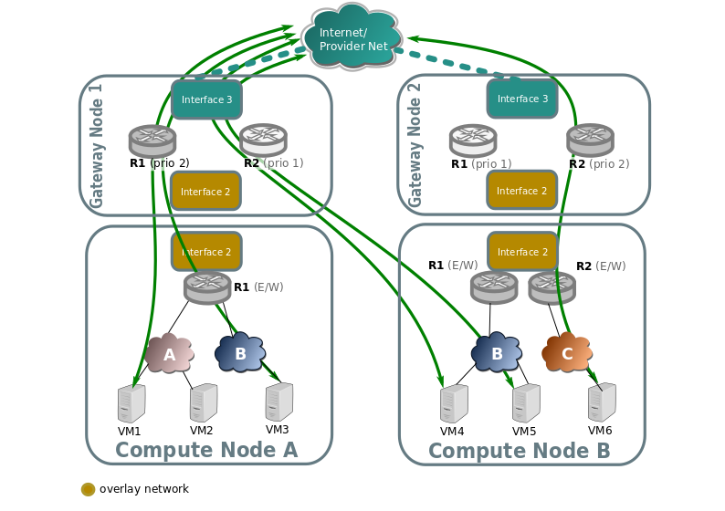
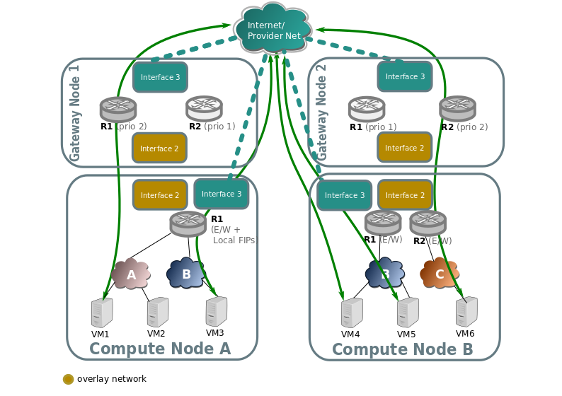
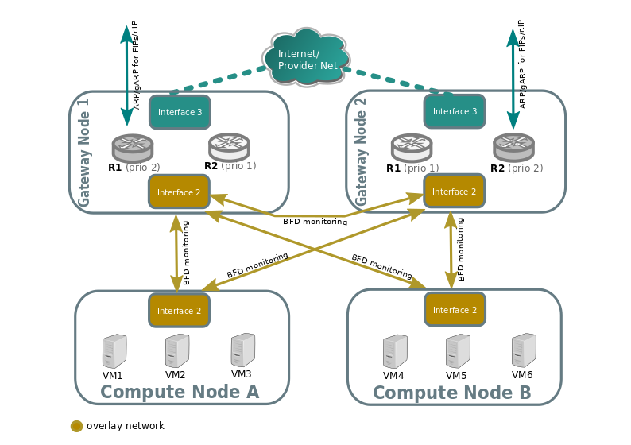
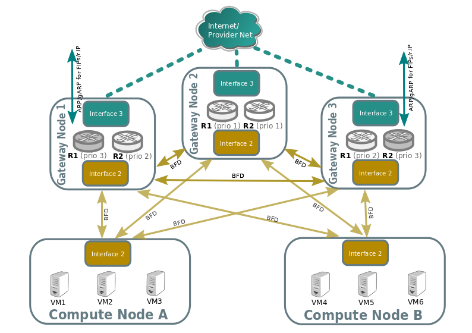
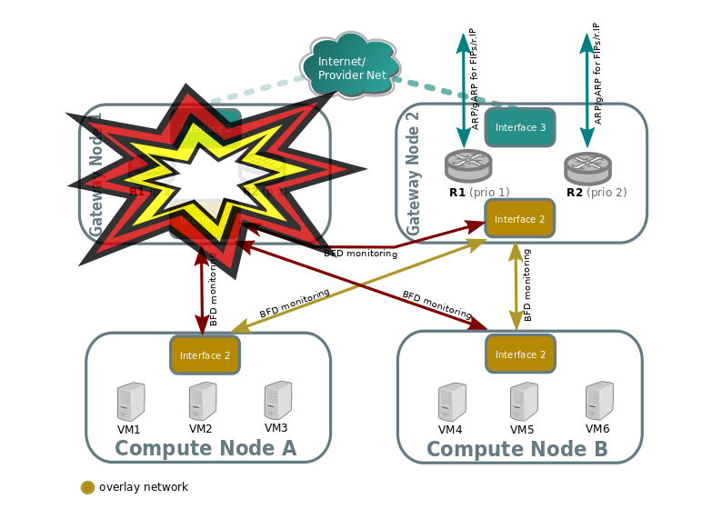
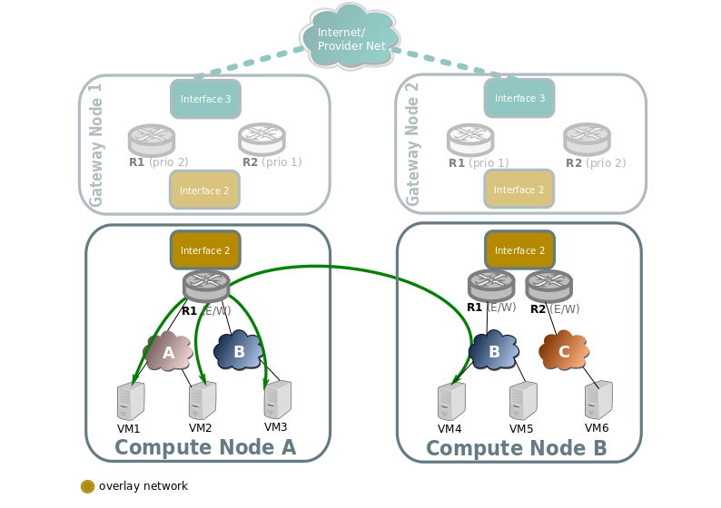
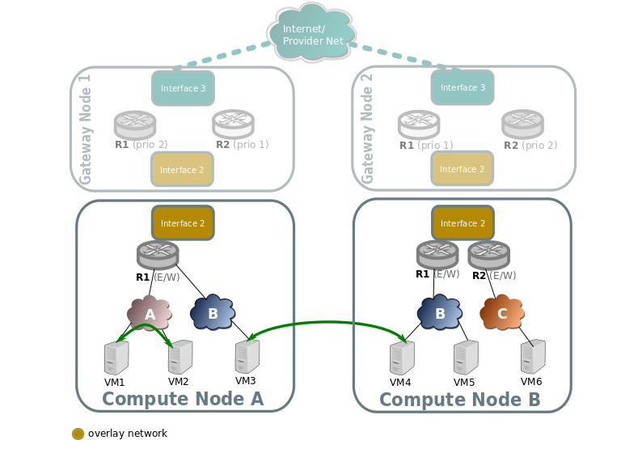

.. _ovn_routing:

=======
Routing
=======

North/South
-----------

The different configurations are detailed in the
:doc:`/admin/ovn/refarch/refarch`

Non distributed FIP
~~~~~~~~~~~~~~~~~~~

North/South traffic flows through the active chassis for each router for SNAT
traffic, and also for FIPs.

When an external network connected to the router is represented by FLAT or
VLAN network type, active chassis is identified by the external Logical Router
Port. In practice this means, that LRP will have ``hosting-chassis`` property
set in a ``status`` row for the external LRP. You can also check Chassis
priorities for the LRP with ``lrp-get-gateway-chassis`` command. Changing the
priority will result in traffic failover to another Chassis.

In case of connecting another Geneve network to the router as external network
(by creating ``access_as_external`` RBAC rule for such network), router itself
will be pinned to Chassis rather than it's LRP. In this scenario Logical Router
does have ``chassis`` property defined inside the ``options`` row.
With that ``GATEWAY_PORT`` will not be defined for dnat_and_snat rules which
are created for FIPs as this will make traffic to pass through the LRP that
is not bound to any Chassis.

Distributed Floating IP
~~~~~~~~~~~~~~~~~~~~~~~

In the following diagram we can see how VMs with no Floating IP (VM1, VM6)
still communicate throught the gateway nodes using SNAT on the edge routers
R1 and R2.

While VM3, VM4, and VM5 have an assigned floating IP, and it's traffic flows
directly through the local provider bridge/interface to the external network.

L3HA support
~~~~~~~~~~~~

Ovn driver implements L3 high availability in a transparent way. You
don't need to enable any config flags. As soon as you have more than
one chassis capable of acting as an l3 gateway to the specific external
network attached to the router it will schedule the router gateway port
to multiple chassis, making use of the ``gateway_chassis`` column on OVN's
``Logical_Router_Port`` table.

In order to have external connectivity, either:

* Some gateway nodes have ``ovn-cms-options`` with the value
  ``enable-chassis-as-gw`` in Open_vSwitch table's external_ids column, or

* if no gateway node exists with the external ids column set with that
  value, then all nodes would be eligible to host gateway chassis.

Example to how to enabled chassis to host gateways:
 .. code-block:: console

  $ ovs-vsctl set open . external-ids:ovn-cms-options="enable-chassis-as-gw"

At the low level, functionality is all implemented mostly by OpenFlow rules
with bundle active_passive outputs. The ARP responder and router
enablement/disablement is handled by ovn-controller. Gratuitous ARPs for FIPs
and router external addresses are periodically sent by ovn-controller itself.

BFD monitoring
^^^^^^^^^^^^^^

OVN monitors the availability of the chassis via the BFD protocol, which is
encapsulated on top of the Geneve tunnels established from chassis to chassis.

Each chassis that is marked as a gateway chassis will monitor all the other
gateway chassis in the deployment as well as compute node chassis, to let the
gateways enable/disable routing of packets and ARP responses / announcements.

Each compute node chassis will monitor each gateway chassis via BFD to
automatically steer external traffic (snat/dnat) through the active chassis
for a given router.

The gateway nodes monitor each other in star topology. Compute nodes don't
monitor each other because that's not necessary.

Failover (detected by BFD)
~~~~~~~~~~~~~~~~~~~~~~~~~~

Look at the following example:

Compute nodes BFD monitoring of the gateway nodes will detect that
tunnel endpoint going to gateway node 1 is down, so. So traffic output that
needs to get into the external network through the router will be directed
to the lower priority chassis for R1. R2 stays the same because Gateway Node
2 was already the highest priority chassis for R2.

Gateway node 2 will detect that tunnel endpoint to gateway node 1 is down, so
it will become responsible for the external leg of R1, and it's ovn-controller
will populate flows for the external ARP responder, traffic forwarding (N/S)
and periodic gratuitous ARPs.

Gateway node 2 will also bind the external port of the router (represented
as a chassis-redirect port on the South Bound database).

If Gateway node 1 is still alive, failure over interface 2 will be detected
because it's not seeing any other nodes.

No mechanisms are still present to detect external network failure, so as good
practice to detect network failure we recommend that all interfaces are handled
over a single bonded interface with VLANs.

Supported failure modes are:
   - gateway chassis becomes disconnected from network (tunneling interface)
   - ovs-vswitchd is stopped (it's responsible for BFD signaling)
   - ovn-controller is stopped, as ovn-controller will remove himself as a
     registered chassis.

.. note::
   As a side note, it's also important to understand, that as for VRRP or CARP
   protocols, this detection mechanism only works for link failures, but not
   for routing failures.

Failback
~~~~~~~~

L3HA behaviour is preemptive in OVN (at least for the time being) since that
would balance back the routers to the original chassis, avoiding any of the
gateway nodes becoming a bottleneck.

East/West
---------

East/West traffic on ovn driver is completely distributed, that means
that routing will happen internally on the compute nodes without the need
to go through the gateway nodes.

Traffic going through a virtual router, different subnets
~~~~~~~~~~~~~~~~~~~~~~~~~~~~~~~~~~~~~~~~~~~~~~~~~~~~~~~~~

Traffic going through a virtual router, and going from a virtual network/subnet
to another will flow directly from compute to compute node encapsulated as
usual, while all the routing operations like decreasing TTL or switching MAC
addresses will be handled in OpenFlow at the source host of the packet.

Traffic across the same subnet
~~~~~~~~~~~~~~~~~~~~~~~~~~~~~~

Traffic across a subnet will happen as described in the following diagram,
although this kind of communication doesn't make use of routing at all (just
encapsulation) it's been included for completeness.

Traffic goes directly from instance to instance through br-int in the case
of both instances living in the same host (VM1 and VM2), or via
encapsulation when living on different hosts (VM3 and VM4).

Packet fragmentation
~~~~~~~~~~~~~~~~~~~~

The Neutron configuration variable ``[ovn]ovn_emit_need_to_frag`` configures
OVN to emit the "need to frag" packets in case of MTU mismatches. This
configuration option allows Neutron to set, in the router gateway
``Logical_Router_Port``, the option "gateway_mtu". If a packet from any
network reaches the gateway ``Logical_Router_Port``, OVN will send the "need
for frag" message.

In order to allow any E/W or N/S traffic to cross the router, the value of
"gateway_mtu" will have the lowest MTU value off all networks connected to the
router. This could impact the performance of the traffic using the networks
connected to the router if the MTU defined is low. But the user can unset the
Neutron configuration flag in order to avoid the fragmentation, at the cost
of limiting the communication between networks with different MTUs.
