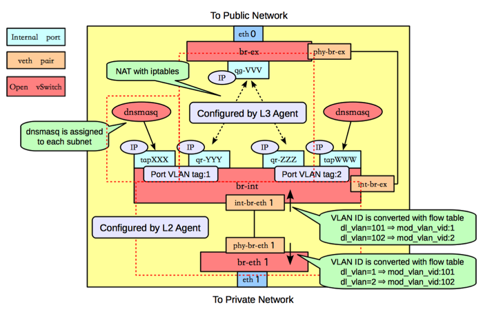
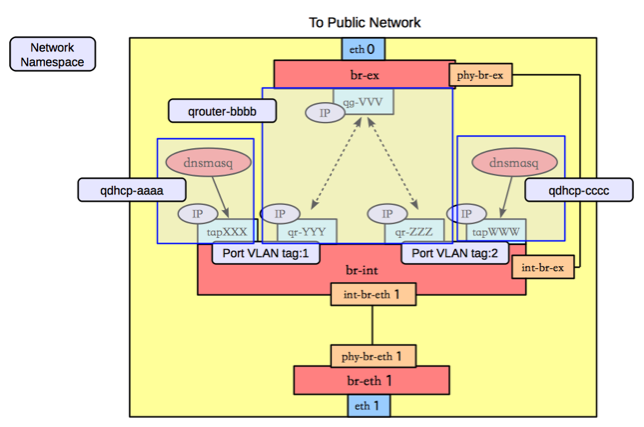

..
      Licensed under the Apache License, Version 2.0 (the "License"); you may
      not use this file except in compliance with the License. You may obtain
      a copy of the License at

          http://www.apache.org/licenses/LICENSE-2.0

      Unless required by applicable law or agreed to in writing, software
      distributed under the License is distributed on an "AS IS" BASIS, WITHOUT
      WARRANTIES OR CONDITIONS OF ANY KIND, either express or implied. See the
      License for the specific language governing permissions and limitations
      under the License.

      Convention for heading levels in Neutron devref:
      =======  Heading 0 (reserved for the title in a document)
      -------  Heading 1
      ~~~~~~~  Heading 2
      +++++++  Heading 3
      '''''''  Heading 4
      (Avoid deeper levels because they do not render well.)

Layer 3 Networking in Neutron - via Layer 3 agent & OpenVSwitch
===============================================================

This page discusses the usage of Neutron with Layer 3 functionality enabled.

Neutron logical network setup
-----------------------------
::

        vagrant@bionic64:~/devstack$ openstack network list
        +--------------------------------------+---------+----------------------------------------------------------------------------+
        | ID                                   | Name    | Subnets                                                                    |
        +--------------------------------------+---------+----------------------------------------------------------------------------+
        | 6ece2847-971b-487a-9c7b-184651ebbc82 | public  | 0d9c4261-4046-462f-9d92-64fb89bc3ae6, 9e90b059-da97-45b8-8cb8-f9370217e181 |
        | 713bae25-8276-4e0a-a453-e59a1d65425a | private | 6fa3bab9-103e-45d5-872c-91f21b52ceda, c5c9f5c2-145d-46d2-a513-cf675530eaed |
        +--------------------------------------+---------+----------------------------------------------------------------------------+

        vagrant@bionic64:~/devstack$ openstack subnet list
        +--------------------------------------+---------------------+--------------------------------------+--------------------+
        | ID                                   | Name                | Network                              | Subnet             |
        +--------------------------------------+---------------------+--------------------------------------+--------------------+
        | 0d9c4261-4046-462f-9d92-64fb89bc3ae6 | public-subnet       | 6ece2847-971b-487a-9c7b-184651ebbc82 | 172.24.4.0/24      |
        | 6fa3bab9-103e-45d5-872c-91f21b52ceda | ipv6-private-subnet | 713bae25-8276-4e0a-a453-e59a1d65425a | 2001:db8:8000::/64 |
        | 9e90b059-da97-45b8-8cb8-f9370217e181 | ipv6-public-subnet  | 6ece2847-971b-487a-9c7b-184651ebbc82 | 2001:db8::/64      |
        | c5c9f5c2-145d-46d2-a513-cf675530eaed | private-subnet      | 713bae25-8276-4e0a-a453-e59a1d65425a | 10.0.0.0/24        |
        +--------------------------------------+---------------------+--------------------------------------+--------------------+

        vagrant@bionic64:~/devstack$ openstack port list
        +--------------------------------------+------+-------------------+----------------------------------------------------------------------------------------------------+--------+
        | ID                                   | Name | MAC Address       | Fixed IP Addresses                                                                                 | Status |
        +--------------------------------------+------+-------------------+----------------------------------------------------------------------------------------------------+--------+
        | 420abb60-2a5a-4e80-90a3-3ff47742dc53 |      | fa:16:3e:2d:5c:4e | ip_address='172.24.4.7', subnet_id='0d9c4261-4046-462f-9d92-64fb89bc3ae6'                          | ACTIVE |
        |                                      |      |                   | ip_address='2001:db8::1', subnet_id='9e90b059-da97-45b8-8cb8-f9370217e181'                         |        |
        | b42d789d-c9ed-48a1-8822-839c4599301e |      | fa:16:3e:0a:ff:24 | ip_address='10.0.0.1', subnet_id='c5c9f5c2-145d-46d2-a513-cf675530eaed'                            | ACTIVE |
        | cfff6574-091c-4d16-a54b-5b7f3eab89ce |      | fa:16:3e:a0:a3:9e | ip_address='10.0.0.2', subnet_id='c5c9f5c2-145d-46d2-a513-cf675530eaed'                            | ACTIVE |
        |                                      |      |                   | ip_address='2001:db8:8000:0:f816:3eff:fea0:a39e', subnet_id='6fa3bab9-103e-45d5-872c-91f21b52ceda' |        |
        | e3b7fede-277e-4c72-b66c-418a582b61ca |      | fa:16:3e:13:dd:42 | ip_address='2001:db8:8000::1', subnet_id='6fa3bab9-103e-45d5-872c-91f21b52ceda'                    | ACTIVE |
        +--------------------------------------+------+-------------------+----------------------------------------------------------------------------------------------------+--------+

        vagrant@bionic64:~/devstack$ openstack subnet show c5c9f5c2-145d-46d2-a513-cf675530eaed
        +-------------------+--------------------------------------+
        | Field             | Value                                |
        +-------------------+--------------------------------------+
        | allocation_pools  | 10.0.0.2-10.0.0.254                  |
        | cidr              | 10.0.0.0/24                          |
        | created_at        | 2016-11-08T21:55:22Z                 |
        | description       |                                      |
        | dns_nameservers   |                                      |
        | enable_dhcp       | True                                 |
        | gateway_ip        | 10.0.0.1                             |
        | host_routes       |                                      |
        | id                | c5c9f5c2-145d-46d2-a513-cf675530eaed |
        | ip_version        | 4                                    |
        | ipv6_address_mode | None                                 |
        | ipv6_ra_mode      | None                                 |
        | name              | private-subnet                       |
        | network_id        | 713bae25-8276-4e0a-a453-e59a1d65425a |
        | project_id        | 35e3820f7490493ca9e3a5e685393298     |
        | revision_number   | 2                                    |
        | service_types     |                                      |
        | subnetpool_id     | b1f81d96-d51d-41f3-96b5-a0da16ad7f0d |
        | updated_at        | 2016-11-08T21:55:22Z                 |
        +-------------------+--------------------------------------+

Neutron logical router setup
----------------------------

::

        vagrant@bionic64:~/devstack$ openstack router list
        +--------------------------------------+---------+--------+-------+-------------+-------+----------------------------------+
        | ID                                   | Name    | Status | State | Distributed | HA    | Project                          |
        +--------------------------------------+---------+--------+-------+-------------+-------+----------------------------------+
        | 82fa9a47-246e-4da8-a864-53ea8daaed42 | router1 | ACTIVE | UP    | False       | False | 35e3820f7490493ca9e3a5e685393298 |
        +--------------------------------------+---------+--------+-------+-------------+-------+----------------------------------+
        vagrant@bionic64:~/devstack$ openstack router show router1
        +-------------------------+------------------------------------------------------------------------------------------------------------------------------------------------------+
        | Field                   | Value                                                                                                                                                |
        +-------------------------+------------------------------------------------------------------------------------------------------------------------------------------------------+
        | admin_state_up          | UP                                                                                                                                                   |
        | availability_zone_hints |                                                                                                                                                      |
        | availability_zones      | nova                                                                                                                                                 |
        | created_at              | 2016-11-08T21:55:30Z                                                                                                                                 |
        | description             |                                                                                                                                                      |
        | distributed             | False                                                                                                                                                |
        | external_gateway_info   | {"network_id": "6ece2847-971b-487a-9c7b-184651ebbc82", "enable_snat": true, "external_fixed_ips": [{"subnet_id": "0d9c4261-4046-462f-                |
        |                         | 9d92-64fb89bc3ae6", "ip_address": "172.24.4.7"}, {"subnet_id": "9e90b059-da97-45b8-8cb8-f9370217e181", "ip_address": "2001:db8::1"}]}                |
        | flavor_id               | None                                                                                                                                                 |
        | ha                      | False                                                                                                                                                |
        | id                      | 82fa9a47-246e-4da8-a864-53ea8daaed42                                                                                                                 |
        | name                    | router1                                                                                                                                              |
        | project_id              | 35e3820f7490493ca9e3a5e685393298                                                                                                                     |
        | revision_number         | 8                                                                                                                                                    |
        | routes                  |                                                                                                                                                      |
        | status                  | ACTIVE                                                                                                                                               |
        | updated_at              | 2016-11-08T21:55:51Z                                                                                                                                 |
        +-------------------------+------------------------------------------------------------------------------------------------------------------------------------------------------+
        vagrant@bionic64:~/devstack$ openstack port list --router router1
        +--------------------------------------+------+-------------------+---------------------------------------------------------------------------------+--------+
        | ID                                   | Name | MAC Address       | Fixed IP Addresses                                                              | Status |
        +--------------------------------------+------+-------------------+---------------------------------------------------------------------------------+--------+
        | 420abb60-2a5a-4e80-90a3-3ff47742dc53 |      | fa:16:3e:2d:5c:4e | ip_address='172.24.4.7', subnet_id='0d9c4261-4046-462f-9d92-64fb89bc3ae6'       | ACTIVE |
        |                                      |      |                   | ip_address='2001:db8::1', subnet_id='9e90b059-da97-45b8-8cb8-f9370217e181'      |        |
        | b42d789d-c9ed-48a1-8822-839c4599301e |      | fa:16:3e:0a:ff:24 | ip_address='10.0.0.1', subnet_id='c5c9f5c2-145d-46d2-a513-cf675530eaed'         | ACTIVE |
        | e3b7fede-277e-4c72-b66c-418a582b61ca |      | fa:16:3e:13:dd:42 | ip_address='2001:db8:8000::1', subnet_id='6fa3bab9-103e-45d5-872c-91f21b52ceda' | ACTIVE |
        +--------------------------------------+------+-------------------+---------------------------------------------------------------------------------+--------+

See the `Networking Guide <../../admin/deploy-ovs-selfservice.html#create-initial-networks>`_
for more detail on the creation of networks, subnets, and routers.

Neutron Routers are realized in OpenVSwitch
-------------------------------------------

"router1" in the Neutron logical network is realized through a port ("qr-0ba8700e-da") in OpenVSwitch - attached to "br-int"::

        vagrant@bionic64:~/devstack$ sudo ovs-vsctl show
        b9b27fc3-5057-47e7-ba64-0b6afe70a398
            Bridge br-int
                Port "qr-0ba8700e-da"
                    tag: 1
                    Interface "qr-0ba8700e-da"
                        type: internal
                Port br-int
                    Interface br-int
                        type: internal
                Port int-br-ex
                    Interface int-br-ex
                Port "tapbb60d1bb-0c"
                    tag: 1
                    Interface "tapbb60d1bb-0c"
                        type: internal
                Port "qvob2044570-ad"
                    tag: 1
                    Interface "qvob2044570-ad"
                Port "int-br-eth1"
                    Interface "int-br-eth1"
            Bridge "br-eth1"
                Port "phy-br-eth1"
                    Interface "phy-br-eth1"
                Port "br-eth1"
                    Interface "br-eth1"
                        type: internal
            Bridge br-ex
                Port phy-br-ex
                    Interface phy-br-ex
                Port "qg-0143bce1-08"
                    Interface "qg-0143bce1-08"
                        type: internal
                Port br-ex
                    Interface br-ex
                        type: internal
            ovs_version: "1.4.0+build0"

        vagrant@bionic64:~/devstack$ brctl show
        bridge name	bridge id		STP enabled	interfaces
        br-eth1		0000.e2e7fc5ccb4d	no
        br-ex		0000.82ee46beaf4d	no		phy-br-ex
                                                                qg-39efb3f9-f0
                                                                qg-77e0666b-cd
        br-int		0000.5e46cb509849	no		int-br-ex
                                                                qr-54c9cd83-43
                                                                qvo199abeb2-63
                                                                qvo1abbbb60-b8
                                                                tap74b45335-cc
        qbr199abeb2-63		8000.ba06e5f8675c	no		qvb199abeb2-63
                                                                tap199abeb2-63
        qbr1abbbb60-b8		8000.46a87ed4fb66	no		qvb1abbbb60-b8
                                                                tap1abbbb60-b8
        virbr0		8000.000000000000	yes

Finding the router in ip/ipconfig
---------------------------------

The neutron-l3-agent uses the Linux IP stack and iptables to perform L3 forwarding and NAT.
In order to support multiple routers with potentially overlapping IP addresses, neutron-l3-agent
defaults to using Linux network namespaces to provide isolated forwarding contexts. As a result,
the IP addresses of routers will not be visible simply by running "ip addr list" or "ifconfig" on
the node. Similarly, you will not be able to directly ping fixed IPs.

To do either of these things, you must run the command within a particular router's network
namespace. The namespace will have the name "qrouter-<UUID of the router>.

For example::

        vagrant@bionic64:~$ openstack router list
        +--------------------------------------+---------+-------------------------------------------------------------------------+
        | ID                                   | Name    | Status | State | Distributed | HA    | Project                          |
        +--------------------------------------+---------+-------------------------------------------------------------------------+
        | ad948c6e-afb6-422a-9a7b-0fc44cbb3910 | router1 | Active | UP    | True        | False | 35e3820f7490493ca9e3a5e685393298 |
        +--------------------------------------+---------+-------------------------------------------------------------------------+
        vagrant@bionic64:~/devstack$ sudo ip netns exec qrouter-ad948c6e-afb6-422a-9a7b-0fc44cbb3910 ip addr list
        18: lo: <LOOPBACK,UP,LOWER_UP> mtu 16436 qdisc noqueue state UNKNOWN
            link/loopback 00:00:00:00:00:00 brd 00:00:00:00:00:00
            inet 127.0.0.1/8 scope host lo
            inet6 ::1/128 scope host
               valid_lft forever preferred_lft forever
        19: qr-54c9cd83-43: <BROADCAST,MULTICAST,PROMISC,UP,LOWER_UP> mtu 1500 qdisc noqueue state UNKNOWN
            link/ether fa:16:3e:dd:c1:8f brd ff:ff:ff:ff:ff:ff
            inet 10.0.0.1/24 brd 10.0.0.255 scope global qr-54c9cd83-43
            inet6 fe80::f816:3eff:fedd:c18f/64 scope link
               valid_lft forever preferred_lft forever
        20: qg-77e0666b-cd: <BROADCAST,MULTICAST,PROMISC,UP,LOWER_UP> mtu 1500 qdisc noqueue state UNKNOWN
            link/ether fa:16:3e:1f:d3:ec brd ff:ff:ff:ff:ff:ff
            inet 192.168.27.130/28 brd 192.168.27.143 scope global qg-77e0666b-cd
            inet6 fe80::f816:3eff:fe1f:d3ec/64 scope link
               valid_lft forever preferred_lft forever

Provider Networking
-------------------

Neutron can also be configured to create `provider networks <../../admin/archives/adv-features.html#provider-networks>`_.

L3 agent extensions
-------------------

See :doc:`l3_agent_extensions`.

Further Reading
---------------

* `Packet Pushers - Neutron Network Implementation on Linux <http://packetpushers.net/openstack-quantum-network-implementation-in-linux/>`_
* `OpenStack Networking Guide <../../admin/index.html>`_
* `Neutron - Layer 3 API extension <https://docs.openstack.org/api-ref/network/v2/index.html#layer-3-networking>`_
* `Darragh O'Reilly -  The Quantum L3 router and floating IPs <http://techbackground.blogspot.com/2013/05/the-quantum-l3-router-and-floating-ips.html>`_
