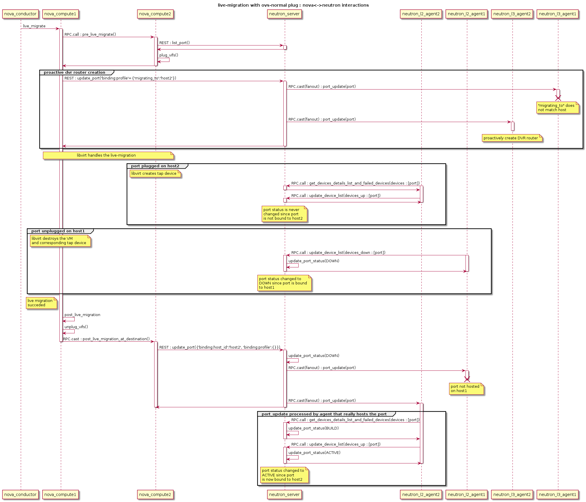

..
      Licensed under the Apache License, Version 2.0 (the "License"); you may
      not use this file except in compliance with the License. You may obtain
      a copy of the License at

          http://www.apache.org/licenses/LICENSE-2.0

      Unless required by applicable law or agreed to in writing, software
      distributed under the License is distributed on an "AS IS" BASIS, WITHOUT
      WARRANTIES OR CONDITIONS OF ANY KIND, either express or implied. See the
      License for the specific language governing permissions and limitations
      under the License.

      Convention for heading levels in Neutron devref:
      =======  Heading 0 (reserved for the title in a document)
      -------  Heading 1
      ~~~~~~~  Heading 2
      +++++++  Heading 3
      '''''''  Heading 4
      (Avoid deeper levels because they do not render well.)

Live-migration
==============

Let's consider a VM with one port migrating from host1 with nova-compute1,
neutron-l2-agent1 and neutron-l3-agent1 to host2 with nova-compute2 and
neutron-l2-agent2 and neutron-l3agent2.

Since the VM that is about to migrate is hosted by nova-compute1, nova sends
the live-migration order to nova-compute1 through RPC.

Nova Live Migration consists of the following stages:

* Pre-live-migration

* Live-migration-operation

* Post-live-migration

Pre-live-migration actions
--------------------------

Nova-compute1 will first ask nova-compute2 to perform pre-live-migration
actions with a synchronous RPC call.
Nova-compute2 will use neutron REST API to retrieve the list of VM's ports.
Then, it calls its vif driver to create the VM's port (VIF) using plug_vifs().

In the case Open vSwitch Hybrid plug is used, Neutron-l2-agent2 will detect
this new VIF, request the device details from the neutron server and configure
it accordingly. However, port's status won't change, since this port is
not bound to nova-compute2.

Nova-compute1 calls setup_networks_on_hosts. This updates the Neutron ports
binding:profile with the information of the target host. The port update RPC
message sent out by Neutron server will be received by neutron-l3-agent2,
which proactively sets up the DVR router.

If pre-live-migration fails, nova rollbacks and port is removed from host2.
If pre-live-migration succeeds, nova proceeds with live-migration-operation.

Potential error cases related to networking
~~~~~~~~~~~~~~~~~~~~~~~~~~~~~~~~~~~~~~~~~~~

* Plugging the VIFs on host2 fails

  As Live migration operation was not yet started, the instance resides
  active on host1.

.. _live_mig_operation:

Live-migration-operation
------------------------
Once nova-compute2 has performed pre-live-migration actions, nova-compute1 can
start the live-migration. This results in the creation of the VM and its
corresponding tap interface on node 2.

In the case Open vSwitch normal plug, linux bridge or MacVTap is being used,
Neutron-l2-agent2 will detect this new tap device and configure it accordingly.
However, port's status won't change, since this port is not bound to
nova-compute2.

As soon as the instance is active on host2, the original instance on host1
gets removed and with it the corresponding tap device. Assuming OVS-hybrid plug
is NOT used, Neutron-l2-agent1 detects the removal and tells the neutron
server to set the port's status to DOWN state with RPC messages.

There is no rollback if failure happens in live-migration-operation stage.
TBD: Error are handled by the post-live-migration stage.

Potential error cases related to networking
~~~~~~~~~~~~~~~~~~~~~~~~~~~~~~~~~~~~~~~~~~~

* Some host devices that are specified in the instance definition are not
  present on the target host. Migration fails before it really started.
  This can happen with MacVTap agent. See bug
  https://bugs.launchpad.net/bugs/1550400

Post-live-migration actions
---------------------------

Once live-migration succeeded, both nova-compute1 and nova-compute2
perform post-live-migration actions. Nova-compute1 which is aware of
the success will send a RPC cast to nova-compute2 to tell it to perform
post-live-migration actions.

On host2, nova-compute2 sends a REST call
"update_port(binding=host2, profile={})" to the neutron server to tell it to
update the port's binding. This will clear the port binding information and
move the port's status to DOWN. The ML2 plugin will then try to rebind the
port according to its new host. This update_port REST call always triggers a
port-update RPC fanout message to every neutron-l2-agent. Since
neutron-l2-agent2 is now hosting the port, it will take this message into
account and re-synchronize the port by asking the neutron server details about
it through RPC messages. This will move the port from DOWN status to BUILD,
and then back to ACTIVE.
This update also removes the 'migrating_to' value from the portbindng
dictionary. It's not clearing it totally, like indicated by {}, but just
removing the 'migrating_to' key and value.

On host1, nova-compute1 calls its vif driver to unplug the VM's port.

Assuming, Open vSwitch Hybrid plug is used, Neutron-l2-agent1 detects the
removal and tells the neutron server to set the port's status to DOWN state
with RPC messages. For all other cases this happens as soon as the instance
and its tap device got destroyed on host1, like described in
:ref:`live_mig_operation`.

If neutron didn't already processed the REST call "update_port(binding=host2)",
the port status will effectively move to BUILD and then to DOWN. Otherwise,
the port is bound to host2, and neutron won't change the port status since
it's not bound the host that is sending RPC messages.

There is no rollback if failure happens in post-live-migration stage. In the
case of an error, the instance is set into "ERROR" state.

Potential error cases related to networking
~~~~~~~~~~~~~~~~~~~~~~~~~~~~~~~~~~~~~~~~~~~

* Portbinding for host2 fails

  If this happens, the vif_type of the port is set to 'binding_failed'.
  When Nova tries to recreated the domain.xml on the migration target
  it will stumble over this invalid vif_type and fail. The instance is put
  into "ERROR" state.

Post-Copy Migration
-------------------

Usually, Live Migration is executed as pre-copy migration. The instance is
active on host1 until nearly all memory has been copied to host2. If a
certain threshold of copied memory is met, the instance on the source get's
paused, the rest of the memory copied over and the instance started on
the target. The challenge with this approach is, that migration might take
a infinite amount of time, when the instance is heavily writing to memory.

This issue gets solved with post-copy migration. At some point in time,
the instance on host2 will be set to active, although still
a huge amount of memory pages reside only on host1. The phase that starts
now is called the post_copy phase. If the instance tries to access a memory
page that has not yet been transferred, libvirt/qemu takes care of moving this
page to the target immediately. New pages will only be written to the source.
With this approach the migration operation takes a finite amount of time.

Today, the rebinding of the port from host1 to host2 happens
in the post_live_migration phase, after migration finished. This is fine for
the pre-copy case, as the time windows between the activation of the instance
on the target and the binding of the port to the target is pretty small. This
becomes more problematic for the post-copy migration case. The instance
becomes active on the target pretty early but the portbinding still happens
after migration finished. During this time window, the instance might not be
reachable via the network. This should be solved with bug
https://bugs.launchpad.net/nova/+bug/1605016

Error recovery
--------------

If the Live Migration fails, Nova will revert the operation. That implies
deleting any object created in the database or in the destination compute
node. However, in some cases have been reported the presence of `duplicated
port bindings per port <https://bugs.launchpad.net/neutron/+bug/1979072>`_.
In this state, the port cannot be migrated until the inactive port binding
(the failed destination host port binding) has been deleted.

To this end, the script ``neutron-remove-duplicated-port-bindings`` has been
created. This script finds all duplicated port binding (that means, all port
bindings that point to the same port) and deletes the inactive one.

.. note::

   This script cannot be executed while a Live Migration or a cross cell Cold
   Migration. The script will delete the inactive port binding and will break
   the process.

Flow Diagram
------------

OVS Normal plug, Linux bridge, MacVTap, SR-IOV
~~~~~~~~~~~~~~~~~~~~~~~~~~~~~~~~~~~~~~~~~~~~~~

OVS-Hybrid plug
~~~~~~~~~~~~~~~

The sequence with RPC messages from neutron-l2-agent processed first is
described in the following UML sequence diagram

.. image:: images/live-mig-ovs-hybrid.png
