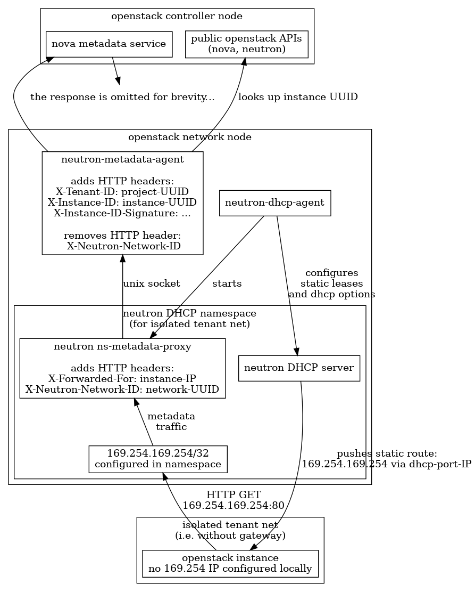
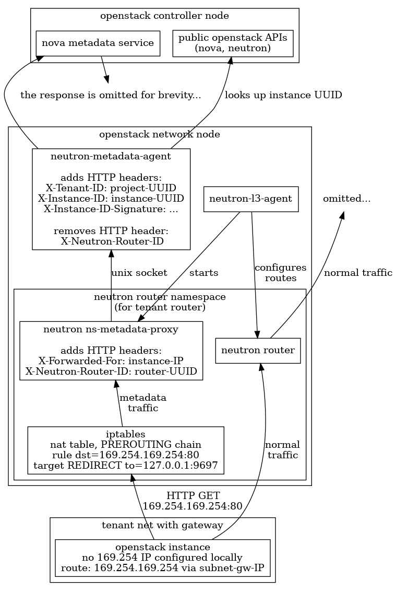

..

=======================================
Metadata Service Architectural Overview
=======================================

The following figures give an overview of the traditional implementation of the
metadata service primarily focusing on the component view and the flow of
information. There are two distinct figures depicting the metadata service as
implemented in isolated networks or in networks with a router.

Please be aware that these figures are not complete. They do not apply to
:ref:`ml2/ovn implementation<metadata_api>` or to
`distributed metadata <https://specs.openstack.org/openstack/neutron-specs/specs/yoga/distributed-metadata-data-path.html>`_.
They also omit details like IPv6 metadata or redundancy in the deployment.

Metadata on isolated networks - DHCP Agent
------------------------------------------

Metadata on networks with a router - L3 Agent
---------------------------------------------

