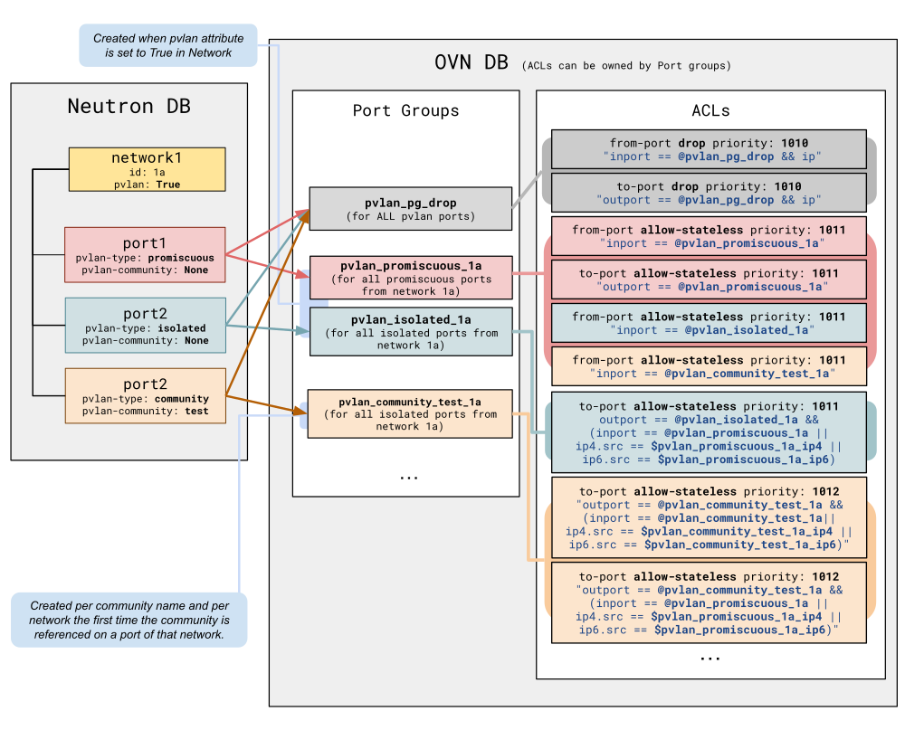

.. _pvlan:

=======================
ML2/OVN Private VLAN
=======================

Private VLAN (PVLAN) is a service plugin that provides a port-level traffic
isolation model for Neutron networks backed by ML2/OVN.

Port Types
----------

Every port on a PVLAN-enabled network is assigned one of three types:

- **promiscuous** — can communicate with any other port on the network.
  This is the default. Special ports such as metadata ports are always
  treated as promiscuous.
- **isolated** — can communicate only with promiscuous ports.
- **community** — can communicate only with ports in the same named
  community and with promiscuous ports. The community name is a free-form
  string stored alongside the port type.

OVN Implementation
------------------

The PVLAN OVN driver implements PVLAN isolation using OVN Port Groups and ACLs,
just like Security Groups. Both features can be used simultaneously on the same
project, but PVLAN takes higher priority over Security Groups.

PVLAN ACLs run at priorities 1010–1012. OVN security group ACLs run at lower
priorities (1000–1002). Because the drop ACL at priority 1010 fires before any
security group allow rule, PVLAN takes full precedence over security group
rules for any port that belongs to ``pvlan_pg_drop``. A PVLAN port cannot be
reached via a security group rule that would otherwise allow the traffic.

PVLAN only applies to ports on networks where ``pvlan=true``.

Port Groups
~~~~~~~~~~~

The following port groups are managed:

+---------------------------------------+-------------------------------+
| Name pattern                          | Scope                         |
+=======================================+===============================+
| ``pvlan_pg_drop``                     | Global (one per deployment)   |
+---------------------------------------+-------------------------------+
| ``pvlan_promiscuous_<net_id>``        | Per PVLAN-enabled network     |
+---------------------------------------+                               +
| ``pvlan_isolated_<net_id>``           |                               |
+---------------------------------------+-------------------------------+
| ``pvlan_community_<name>_<net_id>``   | Per community per network     |
+---------------------------------------+-------------------------------+

``net_id`` in port group names has hyphens replaced with underscores to
comply with OVN port group naming rules.

``pvlan_pg_drop`` is created at process startup (``PROCESS / AFTER_INIT``)
using a raw OVSDB transaction that atomically inserts the port group together
with its two drop ACLs.

.. warning::

   OVN uses a local ARP responder. This causes community and isolated ports to
   reply to ARP requests from any other ports in the same L2 network before ACL
   filtering happens.

ACL Glossary
~~~~~~~~~~~~

These concepts are related to how PVLAN is implemented and need to be known to
understand the existing ACLs and how they are defined:

- **Direction**: ``from-lport`` or ``to-lport``. Used to implement filters on
  traffic arriving from a logical port or forwarded to a logical port. These
  rules are applied to the logical switch’s ingress or egress pipeline,
  respectively.

- **Match**: Expression that indicates which packets match the ACL.

- **Port Group reference** (``@``): Used with ``inport`` and ``outport`` to
  match against the set of port names in a Port Group. This reference is
  resolved per-chassis, so it only matches ports that are local to the chassis
  evaluating the rule. This is fine for ``from-lport`` ACLs (where ``inport``
  is always local to the source chassis) and for ``outport`` in ``to-lport``
  ACLs (where the destination port is always local to the evaluating chassis).
  Port Group references are also needed for the metadata ``localport``: the
  OVN metadata agent responds with ``ip4.src=169.254.169.254``, which is not
  the port's allocated IP and therefore not present in the auto-generated
  address sets. Since ``localport`` type LSPs are present on every chassis,
  ``inport`` always resolves correctly for them.

- **Address Set** (``$``): OVN automatically maintains address sets for every
  Port Group (``$<pg_name>_ip4`` and ``$<pg_name>_ip6``) containing the IP
  addresses of the ports in that group. Unlike ``@``, address sets match
  against packet-level fields (``ip4.src``, ``ip6.src``) that are carried in
  the frame itself and work regardless of which chassis evaluates the rule.
  This is needed in compound ``to-lport`` ACLs where the source port may be on
  a different chassis than the destination -- using ``inport ==
  @pvlan_promiscuous_<net>`` would fail because the promiscuous port is not
  local to the destination chassis.

ACL Priority Scheme
~~~~~~~~~~~~~~~~~~~

Three priority levels are used, all above the range used by security group
ACLs:

+--------------------------+----------+--------------------------------------+
| Constant                 | Priority | Purpose                              |
+==========================+==========+======================================+
| ``DROP_ALL_PRIORITY``    | 1010     | Drop ACLs on ``pvlan_pg_drop``       |
+--------------------------+----------+--------------------------------------+
| ``PROMISCUOUS_PRIORITY`` | 1011     | Allow ACLs for promisc / isolated PGs|
+--------------------------+----------+--------------------------------------+
| ``COMMUNITY_PRIORITY``   | 1012     | Allow ACLs for community PGs         |
+--------------------------+----------+--------------------------------------+

Because every PVLAN port is a member of ``pvlan_pg_drop``, all traffic is
dropped by default at priority 1010. Higher-priority allow ACLs then
selectively permit the traffic patterns allowed by each port type.

Community Port Group Lifecycle
~~~~~~~~~~~~~~~~~~~~~~~~~~~~~~

Community port groups are created lazily on first use (when the first port
with that community name is added to the network) and deleted automatically
when the last member is removed. Deletion also removes the corresponding
``from-lport`` allow rule from the promiscuous port group.

ACL Rules per Port Group
~~~~~~~~~~~~~~~~~~~~~~~~

``pvlan_pg_drop`` port group (global):

.. code-block::

   drop  to-lport    priority=1010  outport == @pvlan_pg_drop && ip
   drop  from-lport  priority=1010  inport  == @pvlan_pg_drop && ip

``pvlan_promiscuous_<net>`` port group (created on network enable):

.. code-block::

   allow-stateless  to-lport    priority=1011  outport == @pvlan_promiscuous_<net>
   allow-stateless  from-lport  priority=1011  inport  == @pvlan_promiscuous_<net>
   allow-stateless  from-lport  priority=1011  inport  == @pvlan_isolated_<net>

When a community port group is created, an additional rule is appended to the
promiscuous port group:

.. code-block::

   allow-stateless  from-lport  priority=1011  inport  == @pvlan_community_<name>_<net>

This rule is removed when the community port group is deleted (i.e., when its
last member port is removed).

``pvlan_isolated_<net>`` port group (created on network enable):

.. code-block::

   allow-stateless  to-lport  priority=1011
       outport == @pvlan_isolated_<net>
       && (inport == @pvlan_promiscuous_<net>
           || ip4.src == $pvlan_promiscuous_<net>_ip4
           || ip6.src == $pvlan_promiscuous_<net>_ip6)

``pvlan_community_<name>_<net>`` port group (created on demand):

.. code-block::

   allow-stateless  to-lport  priority=1012
       outport == @pvlan_community_<name>_<net>
       && (inport == @pvlan_community_<name>_<net>
           || ip4.src == $pvlan_community_<name>_<net>_ip4
           || ip6.src == $pvlan_community_<name>_<net>_ip6)

   allow-stateless  to-lport  priority=1012
       outport == @pvlan_community_<name>_<net>
       && (inport == @pvlan_promiscuous_<net>
           || ip4.src == $pvlan_promiscuous_<net>_ip4
           || ip6.src == $pvlan_promiscuous_<net>_ip6)

The following diagram shows how objects in the Neutron DB map to OVN DB
objects:

- ``port1``, ``port2`` and ``port3`` are part of ``network1``, which has PVLAN
  enabled. Each port has its equivalent ``Logical_Switch_Port`` (LSP) object in
  OVN. LSPs can be part of one or more Port Groups. In PVLAN, every port will
  belong to the Port Group for its category and to the general
  ``pvlan_pg_drop``.

- **Colors** indicate the **type of traffic** each ACL allows. Red for
  promiscuous, blue for isolated, and orange for community-related traffic.

- **Port Groups can be related to one or more ACLs.** The diagram shows the
  Port Group ownership for each ACL, as described in the previous section.

Example: Promiscuous to Isolated across Chassis
~~~~~~~~~~~~~~~~~~~~~~~~~~~~~~~~~~~~~~~~~~~~~~~

Consider an isolated port on compute 1 and a promiscuous port on compute 0,
both on the same PVLAN-enabled network.

**Promiscuous (compute 0) -> Isolated (compute 1):**

1. On compute 0 (source chassis), ``from-lport`` ACLs are evaluated on the
   ingress pipeline:

   - ``drop from-lport priority=1010 inport == @pvlan_pg_drop && ip`` --
     matches. Would drop.
   - ``allow-stateless from-lport priority=1011 inport ==
     @pvlan_promiscuous_<net>`` -- matches because the promiscuous port is
     local to compute 0. Priority 1011 beats 1010. **Traffic is allowed.**

2. On compute 1 (destination chassis), ``to-lport`` ACLs are evaluated on the
   egress pipeline:

   - ``drop to-lport priority=1010 outport == @pvlan_pg_drop && ip`` --
     matches. Would drop.
   - The isolated PG's compound ACL is evaluated:
     ``outport == @pvlan_isolated_<net>`` matches (the isolated port is local).
     For the source condition: ``inport == @pvlan_promiscuous_<net>`` does
     **not** match because the promiscuous port is on compute 0, not local to
     compute 1. However, ``ip4.src == $pvlan_promiscuous_<net>_ip4`` **does**
     match because the packet's source IP is in the address set, which is
     chassis-agnostic. Priority 1011 beats 1010. **Traffic is allowed.**

References
----------

More information about OVN objects is available at
https://man7.org/linux/man-pages/man5/ovn-nb.5.html.
