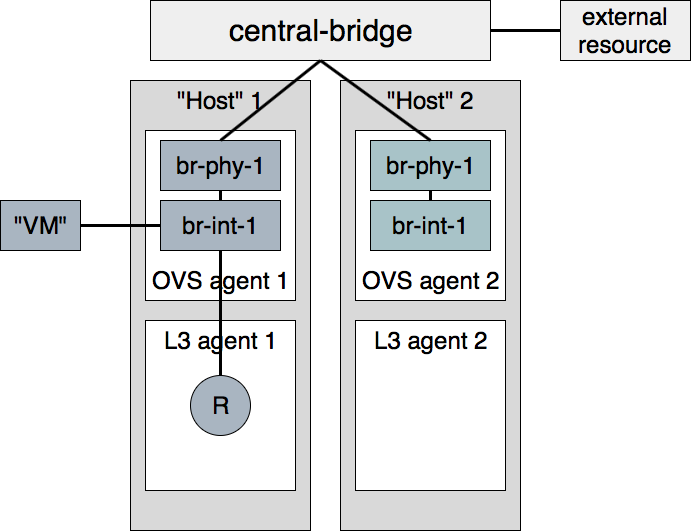

..
      Licensed under the Apache License, Version 2.0 (the "License"); you may
      not use this file except in compliance with the License. You may obtain
      a copy of the License at

          http://www.apache.org/licenses/LICENSE-2.0

      Unless required by applicable law or agreed to in writing, software
      distributed under the License is distributed on an "AS IS" BASIS, WITHOUT
      WARRANTIES OR CONDITIONS OF ANY KIND, either express or implied. See the
      License for the specific language governing permissions and limitations
      under the License.

      Convention for heading levels in Neutron devref:
      =======  Heading 0 (reserved for the title in a document)
      -------  Heading 1
      ~~~~~~~  Heading 2
      +++++++  Heading 3
      '''''''  Heading 4
      (Avoid deeper levels because they do not render well.)

.. _fullstack_testing:

Full Stack Testing
==================

How?
++++

Full stack tests set up their own Neutron processes (Server & agents). They
assume a working Rabbit and MySQL server before the run starts. Instructions
on how to run fullstack tests on a VM are available below.

Each test defines its own topology (What and how many servers and agents should
be running).

Since the test runs on the machine itself, full stack testing enables
"white box" testing. This means that you can, for example, create a router
through the API and then assert that a namespace was created for it.

Full stack tests run in the Neutron tree with Neutron resources alone. You
may use the Neutron API (The Neutron server is set to NOAUTH so that Keystone
is out of the picture). VMs may be simulated with a container-like class:
neutron.tests.fullstack.resources.machine.FakeFullstackMachine.
An example of its usage may be found at:
neutron/tests/fullstack/test_connectivity.py.

Full stack testing can simulate multi node testing by starting an agent
multiple times. Specifically, each node would have its own copy of the
OVS/LinuxBridge/DHCP/L3 agents, all configured with the same "host" value.
Each OVS agent is connected to its own pair of br-int/br-ex, and those bridges
are then interconnected.
For LinuxBridge agent each agent is started in its own namespace, called
"host-<some_random_value>". Such namespaces are connected with OVS "central"
bridge to each other.

Segmentation at the database layer is guaranteed by creating a database
per test. The messaging layer achieves segmentation by utilizing a RabbitMQ
feature called 'vhosts'. In short, just like a MySQL server serve multiple
databases, so can a RabbitMQ server serve multiple messaging domains.
Exchanges and queues in one 'vhost' are segmented from those in another
'vhost'.

Please note that if the change you would like to test using fullstack tests
involves a change to python-neutronclient as well as neutron, then you should
make sure your fullstack tests are in a separate third change that depends on
the python-neutronclient change using the 'Depends-On' tag in the commit
message. You will need to wait for the next release of python-neutronclient,
and a minimum version bump for python-neutronclient in the global requirements,
before your fullstack tests will work in the gate.  This is because tox uses
the version of python-neutronclient listed in the upper-constraints.txt file in
the openstack/requirements repository.

When?
+++++

1) You'd like to test the interaction between Neutron components (Server
   and agents) and have already tested each component in isolation via unit or
   functional tests. You should have many unit tests, fewer tests to test
   a component and even fewer to test their interaction. Edge cases should
   not be tested with full stack testing.
2) You'd like to increase coverage by testing features that require multi node
   testing such as l2pop, L3 HA and DVR.
3) You'd like to test agent restarts. We've found bugs in the OVS, DHCP and
   L3 agents and haven't found an effective way to test these scenarios. Full
   stack testing can help here as the full stack infrastructure can restart an
   agent during the test.

Example
+++++++

Neutron offers a Quality of Service API, initially offering bandwidth
capping at the port level. In the reference implementation, it does this by
utilizing an OVS feature.
neutron.tests.fullstack.test_qos.TestBwLimitQoSOvs.test_bw_limit_qos_policy_rule_lifecycle
is a positive example of how the fullstack testing infrastructure should be used.
It creates a network, subnet, QoS policy & rule and a port utilizing that policy.
It then asserts that the expected bandwidth limitation is present on the OVS
bridge connected to that port. The test is a true integration test, in the
sense that it invokes the API and then asserts that Neutron interacted with
the hypervisor appropriately.

How to run fullstack tests locally?
+++++++++++++++++++++++++++++++++++

Fullstack tests can be run locally. That makes it much easier to understand
exactly how it works, debug issues in the existing tests or write new ones.
To run fullstack tests locally, you should clone
`Devstack <https://opendev.org/openstack/devstack/>` and `Neutron
<https://opendev.org/openstack/neutron>` repositories. When repositories are
available locally, the first thing which needs to be done is preparation of the
environment. There is a simple script in Neutron to do that.

.. code-block:: console

   $ export VENV=dsvm-fullstack
   $ tools/configure_for_func_testing.sh /opt/stack/devstack -i

This will prepare needed files, install required packages, etc. When it is
done you should see a message like:

.. code-block:: console

   Phew, we're done!

That means that all went well and you should be ready to run fullstack tests
locally. Of course there are many tests there and running all of them can
take a pretty long time so lets try to run just one:

.. code-block:: console

   $ tox -e dsvm-fullstack neutron.tests.fullstack.test_qos.TestBwLimitQoSOvs.test_bw_limit_qos_policy_rule_lifecycle
   dsvm-fullstack create: /opt/stack/neutron/.tox/dsvm-fullstack
   dsvm-fullstack installdeps: -chttps://releases.openstack.org/constraints/upper/master, -r/opt/stack/neutron/requirements.txt, -r/opt/stack/neutron/test-requirements.txt, -r/opt/stack/neutron/neutron/tests/functional/requirements.txt
   dsvm-fullstack develop-inst: /opt/stack/neutron
   {0} neutron.tests.fullstack.test_qos.TestBwLimitQoSOvs.test_bw_limit_qos_policy_rule_lifecycle(ingress) [40.395436s] ... ok
   {1} neutron.tests.fullstack.test_qos.TestBwLimitQoSOvs.test_bw_limit_qos_policy_rule_lifecycle(egress) [43.277898s] ... ok
   Stopping rootwrap daemon process with pid=12657
   Running upgrade for neutron ...
   OK
   /usr/lib/python3.8/subprocess.py:942: ResourceWarning: subprocess 13475 is still running
     _warn("subprocess %s is still running" % self.pid,
   ResourceWarning: Enable tracemalloc to get the object allocation traceback
   Stopping rootwrap daemon process with pid=12669
   Running upgrade for neutron ...
   OK
   /usr/lib/python3.8/subprocess.py:942: ResourceWarning: subprocess 13477 is still running
     _warn("subprocess %s is still running" % self.pid,
   ResourceWarning: Enable tracemalloc to get the object allocation traceback

   ======
   Totals
   ======
   Ran: 2 tests in 43.3367 sec.
    - Passed: 2
    - Skipped: 0
    - Expected Fail: 0
    - Unexpected Success: 0
    - Failed: 0
   Sum of execute time for each test: 83.6733 sec.

   ==============
   Worker Balance
   ==============
    - Worker 0 (1 tests) => 0:00:40.395436
    - Worker 1 (1 tests) => 0:00:43.277898
   ___________________________________________________________________________________________________________________________________________________________ summary ___________________________________________________________________________________________________________________________________________________________
     dsvm-fullstack: commands succeeded
     congratulations :)

That means that our test was run successfully.
Now you can start hacking, write new fullstack tests or debug failing ones as
needed.

Debugging tests locally
+++++++++++++++++++++++

If you need to debug a fullstack test locally you can use the ``remote_pdb``
module for that. First need to install remote_pdb module in the virtual
environment created for fullstack testing by tox.

.. code-block:: console

   $ .tox/dsvm-fullstack/bin/pip install remote_pdb

Then you need to install a breakpoint in your code. For example, lets do that
in the
neutron.tests.fullstack.test_qos.TestBwLimitQoSOvs.test_bw_limit_qos_policy_rule_lifecycle
module:

.. code-block:: python

    def test_bw_limit_qos_policy_rule_lifecycle(self):
        import remote_pdb; remote_pdb.set_trace(port=1234)
        new_limit = BANDWIDTH_LIMIT + 100

Now you can run the test again:

.. code-block:: console

   $ tox -e dsvm-fullstack neutron.tests.fullstack.test_qos.TestBwLimitQoSOvs.test_bw_limit_qos_policy_rule_lifecycle

It will pause with message like:

.. code-block:: console

   RemotePdb session open at 127.0.0.1:1234, waiting for connection ...

And now you can start debugging using ``telnet`` tool:

.. code-block:: console

   $ telnet 127.0.0.1 1234
   Trying 127.0.0.1...
   Connected to 127.0.0.1.
   Escape character is '^]'.
   >
   /opt/stack/neutron/neutron/tests/fullstack/test_qos.py(208)test_bw_limit_qos_policy_rule_lifecycle()
   -> new_limit = BANDWIDTH_LIMIT + 100
   (Pdb)

From that point you can start debugging your code in the same way you
usually do with ``pdb`` module.

Checking test logs
++++++++++++++++++

Each fullstack test is spawning its own, isolated environment with needed
services. So, for example, it can be ``neutron-server``, ``neutron-ovs-agent``
or ``neutron-dhcp-agent``. And often there is a need to check logs of some of
those processes. That is of course possible when running fullstack tests
locally. By default, logs are stored in ``/opt/stack/logs/dsvm-fullstack-logs``.
The logs directory can be defined by the environment variable ``OS_LOG_PATH``.
In that directory there are directories with names matching names of the
tests, for example:

.. code-block:: console

   $ ls -l
   total 224
   drwxr-xr-x 2 vagrant vagrant   4096 Nov 26 16:49 TestBwLimitQoSOvs.test_bw_limit_qos_policy_rule_lifecycle_egress_
   -rw-rw-r-- 1 vagrant vagrant  94928 Nov 26 16:50 TestBwLimitQoSOvs.test_bw_limit_qos_policy_rule_lifecycle_egress_.txt
   drwxr-xr-x 2 vagrant vagrant   4096 Nov 26 16:49 TestBwLimitQoSOvs.test_bw_limit_qos_policy_rule_lifecycle_ingress_
   -rw-rw-r-- 1 vagrant vagrant 121027 Nov 26 16:54 TestBwLimitQoSOvs.test_bw_limit_qos_policy_rule_lifecycle_ingress_.txt

For each test there is a directory and txt file with the same name. This txt
file contains the log from the test runner. So you can check exactly what was
done by the test when it was run. This file contains logs from all runs of the
same test. So if you run the test 10 times, you will have the logs from all
10 runs of the test.
In the directory with same name there are logs from the neutron services run
during the test, for example:

.. code-block:: console

   $ ls -l TestBwLimitQoSOvs.test_bw_limit_qos_policy_rule_lifecycle_ingress_/
   total 1836
   -rw-rw-r-- 1 vagrant vagrant 333371 Nov 26 16:40 neutron-openvswitch-agent--2020-11-26--16-40-38-818499.log
   -rw-rw-r-- 1 vagrant vagrant 552097 Nov 26 16:53 neutron-openvswitch-agent--2020-11-26--16-49-29-716615.log
   -rw-rw-r-- 1 vagrant vagrant 461483 Nov 26 16:41 neutron-server--2020-11-26--16-40-35-875937.log
   -rw-rw-r-- 1 vagrant vagrant 526070 Nov 26 16:54 neutron-server--2020-11-26--16-49-26-758447.log

Here each file is only from one run and one service. In the name of the file
there is timestamp of when the service was started.

Debugging fullstack failures in the gate
++++++++++++++++++++++++++++++++++++++++

Sometimes there is a need to investigate reason that a test failed in the gate.
After every ``neutron-fullstack`` job run, on the Zuul job page there are logs
available. In the directory ``controller/logs/dsvm-fullstack-logs`` you can find
exactly the same files with logs from each test case as mentioned above.

You can also check, for example, the journal log from the node where the tests
were run. All those logs are available in the file
``controller/logs/devstack.journal.xz`` in the jobs logs.
In ``controller/logs/devstack.journal.README.txt`` there are also
instructions on how to download and check those journal logs locally.
