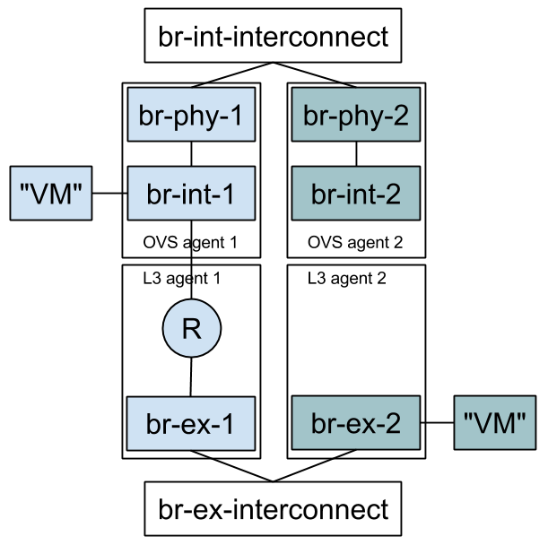

==========================
Neutron Full Stack Testing
==========================

Why?
====

The idea behind "fullstack" testing is to fill a gap between unit + functional
tests and Tempest. Tempest tests are expensive to run, difficult to run in
a multi node environment, and are often very high level and provide little
indication to what is wrong, only that something is wrong. Developers further
benefit from full stack testing as it can sufficiently simulate a real
environment and provide a rapidly reproducible way to verify code as you're
still writing it.

How?
====

Full stack tests set up their own Neutron processes (Server & agents). They
assume a working Rabbit and MySQL server before the run starts. Instructions
on how to run fullstack tests on a VM are available at TESTING.rst:
http://git.openstack.org/cgit/openstack/neutron/tree/TESTING.rst

Each test defines its own topology (What and how many servers and agents should
be running).

Since the test runs on the machine itself, full stack testing enables
"white box" testing. This means that you can, for example, create a router
through the API and then assert that a namespace was created for it.

Full stack tests run in the Neutron tree with Neutron resources alone. You
may use the Neutron API (The Neutron server is set to NOAUTH so that Keystone
is out of the picture). instances may be simulated with a helper class that
contains a container-like object in its own namespace and IP address. It has
helper methods to send different kinds of traffic. The "instance" may be
connected to br-int or br-ex, to simulate internal or external traffic.

Full stack testing can simulate multi node testing by starting an agent
multiple times. Specifically, each node would have its own copy of the
OVS/DHCP/L3 agents, all configured with the same "host" value. Each OVS agent
is connected to its own pair of br-int/br-ex, and those bridges are then
interconnected.

When?
=====

1) You'd like to test the interaction between Neutron components (Server
   and agents) and have already tested each component in isolation via unit or
   functional tests. You should have many unit tests, fewer tests to test
   a component and even fewer to test their interaction. Edge cases should
   not be tested with full stack testing.
2) You'd like to increase coverage by testing features that require multi node
   testing such as l2pop, L3 HA and DVR.
3) You'd like to test agent restarts. We've found bugs in the OVS, DHCP and
   L3 agents and haven't found an effective way to test these scenarios. Full
   stack testing can help here as the full stack infrastructure can restart an
   agent during the test.

Short Term Goals
================

* Multinode & Stability:
    - Interconnect the internal and external bridges
    - Convert the L3 HA failover functional test to a full stack test
    - Write a test for DHCP HA / Multiple DHCP agents per network
* Write DVR tests
* Write L3 HA tests
* Write a test that validates L3 HA + l2pop integration after
  https://bugs.launchpad.net/neutron/+bug/1365476 is fixed.
* Write a test that validates DVR + L3 HA integration after
  https://bugs.launchpad.net/neutron/+bug/1365473 is fixed.

None of these tasks currently have owners. Feel free to send patches!

After these tests are merged, it should be fair to start asking contributors to
add full stack tests when appropriate in the patches themselves and not after
the fact as there will probably be something to copy/paste from.

Long Term Goals
===============

* Currently we configure the OVS agent with VLANs segmentation (Only because
  it's easier). This allows us to validate most functionality, but we might
  need to support tunneling somehow.
* How will advanced services use the full stack testing infrastructure? Full
  stack tests infrastructure classes are expected to change quite a bit over
  the next coming months. This means that other repositories may import these
  classes and break from time to time, or copy them in their repositories
  instead. Since changes to full stack testing infrastructure is a given,
  XaaS repositories should be copying it and not importing it directly.
* Currently we configure the Neutron server with the ML2 plugin and the OVS
  mechanism driver. We may modularize the topology configuration further to
  allow to rerun full stack tests against different Neutron plugins or ML2
  mechanism drivers.
