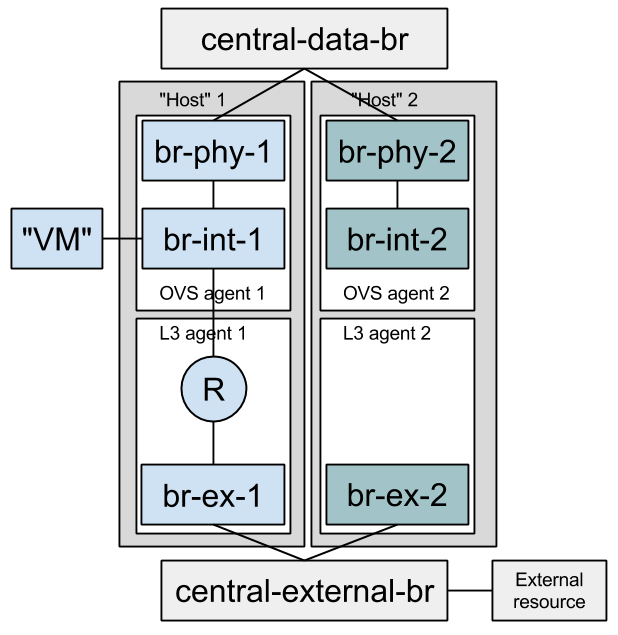

..
      Licensed under the Apache License, Version 2.0 (the "License"); you may
      not use this file except in compliance with the License. You may obtain
      a copy of the License at

          http://www.apache.org/licenses/LICENSE-2.0

      Unless required by applicable law or agreed to in writing, software
      distributed under the License is distributed on an "AS IS" BASIS, WITHOUT
      WARRANTIES OR CONDITIONS OF ANY KIND, either express or implied. See the
      License for the specific language governing permissions and limitations
      under the License.

      Convention for heading levels in Neutron devref:
      =======  Heading 0 (reserved for the title in a document)
      -------  Heading 1
      ~~~~~~~  Heading 2
      +++++++  Heading 3
      '''''''  Heading 4
      (Avoid deeper levels because they do not render well.)

Full Stack Testing
==================

Why?
----

The idea behind "fullstack" testing is to fill a gap between unit + functional
tests and Tempest. Tempest tests are expensive to run, and target black box API
tests exclusively. Tempest requires an OpenStack deployment to be run against,
which can be difficult to configure and setup. Full stack testing addresses
these issues by taking care of the deployment itself, according to the topology
that the test requires. Developers further benefit from full stack testing as
it can sufficiently simulate a real environment and provide a rapidly
reproducible way to verify code while you're still writing it.

How?
----

Full stack tests set up their own Neutron processes (Server & agents). They
assume a working Rabbit and MySQL server before the run starts. Instructions
on how to run fullstack tests on a VM are available in our
`TESTING.rst. <development.environment.html#id2>`_

Each test defines its own topology (What and how many servers and agents should
be running).

Since the test runs on the machine itself, full stack testing enables
"white box" testing. This means that you can, for example, create a router
through the API and then assert that a namespace was created for it.

Full stack tests run in the Neutron tree with Neutron resources alone. You
may use the Neutron API (The Neutron server is set to NOAUTH so that Keystone
is out of the picture). VMs may be simulated with a container-like class:
neutron.tests.fullstack.resources.machine.FakeFullstackMachine.
An example of its usage may be found at:
neutron/tests/fullstack/test_connectivity.py.

Full stack testing can simulate multi node testing by starting an agent
multiple times. Specifically, each node would have its own copy of the
OVS/DHCP/L3 agents, all configured with the same "host" value. Each OVS agent
is connected to its own pair of br-int/br-ex, and those bridges are then
interconnected.

Segmentation at the database layer is guaranteed by creating a database
per test. The messaging layer achieves segmentation by utilizing a RabbitMQ
feature called 'vhosts'. In short, just like a MySQL server serve multiple
databases, so can a RabbitMQ server serve multiple messaging domains.
Exchanges and queues in one 'vhost' are segmented from those in another
'vhost'.

When?
-----

1) You'd like to test the interaction between Neutron components (Server
   and agents) and have already tested each component in isolation via unit or
   functional tests. You should have many unit tests, fewer tests to test
   a component and even fewer to test their interaction. Edge cases should
   not be tested with full stack testing.
2) You'd like to increase coverage by testing features that require multi node
   testing such as l2pop, L3 HA and DVR.
3) You'd like to test agent restarts. We've found bugs in the OVS, DHCP and
   L3 agents and haven't found an effective way to test these scenarios. Full
   stack testing can help here as the full stack infrastructure can restart an
   agent during the test.

Example
-------

Neutron offers a Quality of Service API, initially offering bandwidth
capping at the port level. In the reference implementation, it does this by
utilizing an OVS feature.
neutron.tests.fullstack.test_qos.TestQoSWithOvsAgent.test_qos_policy_rule_lifecycle
is a positive example of how the fullstack testing infrastructure should be used.
It creates a network, subnet, QoS policy & rule and a port utilizing that policy.
It then asserts that the expected bandwidth limitation is present on the OVS
bridge connected to that port. The test is a true integration test, in the
sense that it invokes the API and then asserts that Neutron interacted with
the hypervisor appropriately.

Prerequisites
-------------

Fullstack test suite assumes 240.0.0.0/3 range in root namespace of the test
machine is available for its usage.

Short Term Goals
----------------

* Multinode & Stability:
    - Convert the L3 HA failover functional test to a full stack test
    - Write a test for DHCP HA / Multiple DHCP agents per network
* Write DVR tests
* Write additional L3 HA tests
* Write a test that validates DVR + L3 HA integration after
  https://bugs.launchpad.net/neutron/+bug/1365473 is fixed.

Long Term Goals
---------------

* How will advanced services use the full stack testing infrastructure? Full
  stack tests infrastructure classes are expected to change quite a bit over
  the next coming months. This means that other repositories may import these
  classes and break from time to time, or copy them in their repositories
  instead. Since changes to full stack testing infrastructure is a given,
  XaaS repositories should be copying it and not importing it directly.
* Currently we configure the Neutron server with the ML2 plugin and the OVS
  mechanism driver. We may modularize the topology configuration further to
  allow to rerun full stack tests against different Neutron plugins or ML2
  mechanism drivers.
* Add OVS ARP responder coverage when the gate supports OVS 2.1+
