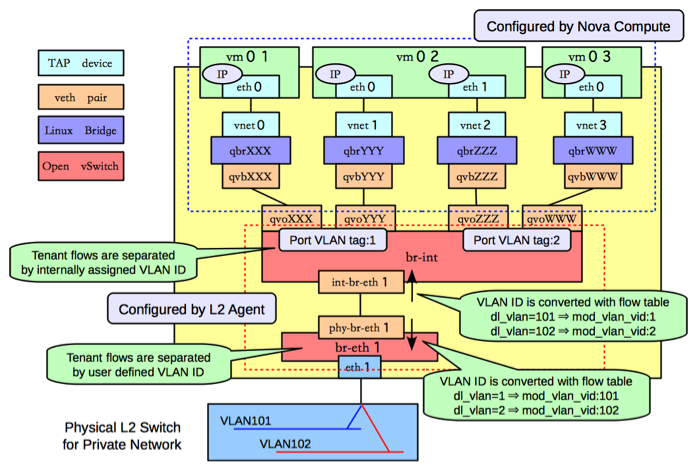

====================
OpenVSwitch L2 Agent
====================

This Agent uses the `OpenVSwitch`_ virtual switch to create L2
connectivity for instances, along with bridges created in conjunction
with OpenStack Nova for filtering.

ovs-neutron-agent can be configured to use different networking technologies
to create tenant isolation.
These technologies are implemented as ML2 type drivers which are used in
conjunction with the OpenVSwitch mechanism driver.

VLAN Tags
---------

.. _OpenVSwitch: http://openvswitch.org

GRE Tunnels
-----------

GRE Tunneling is documented in depth in the `Networking in too much
detail <http://openstack.redhat.com/Networking_in_too_much_detail>`_
by RedHat.

VXLAN Tunnels
-------------

VXLAN is an overlay technology which encapsulates MAC frames
at layer 2 into a UDP header.
More information can be found in `The VXLAN wiki page.
<http://en.wikipedia.org/wiki/Virtual_Extensible_LAN>`_

Bridge Management
-----------------

In order to make the agent capable of handling more than one tunneling
technology, to decouple the requirements of segmentation technology
from tenant isolation, and to preserve backward compatibility for OVS
agents working without tunneling, the agent relies on a tunneling bridge,
or br-tun, and the well known integration bridge, or br-int.

All VM VIFs are plugged into the integration bridge. VM VIFs on a given
virtual network share a common "local" VLAN (i.e. not propagated
externally). The VLAN id of this local VLAN is mapped to the physical
networking details realizing that virtual network.

For virtual networks realized as VXLAN/GRE tunnels, a Logical Switch
(LS) identifier is used to differentiate tenant traffic on inter-HV
tunnels. A mesh of tunnels is created to other Hypervisors in the
cloud. These tunnels originate and terminate on the tunneling bridge
of each hypervisor, leaving br-int unaffected. Port patching is done
to connect local VLANs on the integration bridge to inter-hypervisor
tunnels on the tunnel bridge.

For each virtual network realized as a VLAN or flat network, a veth
or a pair of patch ports is used to connect the local VLAN on
the integration bridge with the physical network bridge, with flow
rules adding, modifying, or stripping VLAN tags as necessary, thus
preserving backward compatibility with the way the OVS agent used
to work prior to the tunneling capability (for more details, please
look at https://review.openstack.org/#/c/4367).

Bear in mind, that this design decision may be overhauled in the
future to support existing VLAN-tagged traffic (coming from NFV VMs
for instance) and/or to deal with potential QinQ support natively
available in the Open vSwitch.

Further Reading
---------------

* `Darragh O'Reilly - The Open vSwitch plugin with VLANs <http://techbackground.blogspot.com/2013/07/the-open-vswitch-plugin-with-vlans.html>`_
