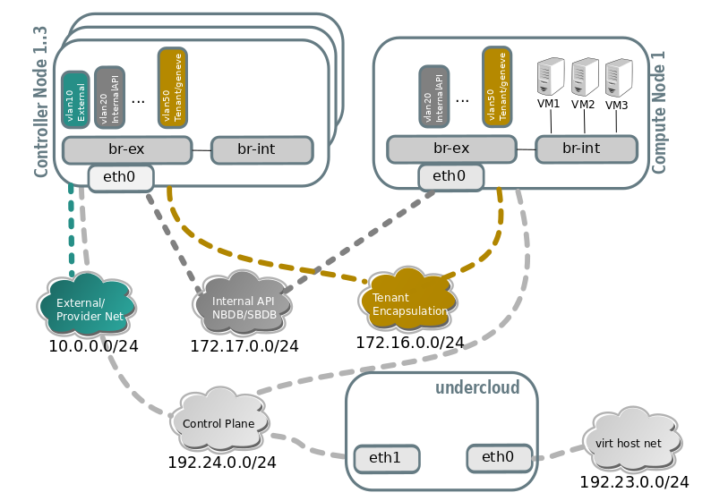
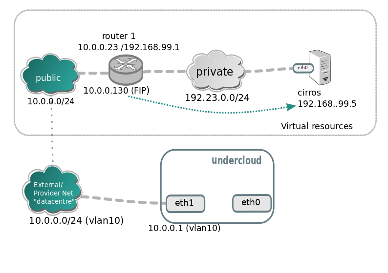

.. _tripleo_install:

=============================
TripleO/RDO based deployments
=============================

`TripleO <http://tripleo.org/>`_ is a project aimed at installing,
upgrading and operating OpenStack clouds using OpenStack's own cloud
facilities as the foundation.

`RDO <http://rdoproject.org/>`_ is the OpenStack distribution that runs on
top of CentOS, and can be deployed via TripleO.

`TripleO Quickstart`_ is an easy way to try out TripleO in a libvirt
virtualized environment.

In this document we will stick to the details of installing a 3 controller
+ 1 compute in high availability through TripleO Quickstart, but the
non-quickstart details in this document also work with TripleO.

.. _`TripleO Quickstart`: https://github.com/openstack/tripleo-quickstart/blob/master/README.rst

.. note::
   This deployment requires 32GB for the VMs, so your host may have >32GB of
   RAM at least. If you have 32GB I recommend to trim down the compute node
   memory in "config/nodes/3ctlr_1comp.yml" to 2GB and controller nodes to 5GB.

Deployment steps
================

#. Download the quickstart.sh script with curl:

   .. code-block:: console

      $ curl -O https://raw.githubusercontent.com/openstack/tripleo-quickstart/master/quickstart.sh

#. Install the necessary dependencies by running:

   .. code-block:: console

      $ bash quickstart.sh --install-deps

#. Clone the tripleo-quickstart and neutron repositories:

   .. code-block:: console

      $ git clone https://opendev.org/openstack/tripleo-quickstart
      $ git clone https://opendev.org/openstack/neutron

#. Once you're done, run quickstart as follows (3 controller HA + 1 compute):

   .. code-block:: console

      # Exporting the tags is a workaround until the bug
      # https://bugs.launchpad.net/tripleo/+bug/1737602 is resolved

      $ export ansible_tags="untagged,provision,environment,libvirt,\
      undercloud-scripts,undercloud-inventory,overcloud-scripts,\
      undercloud-setup,undercloud-install,undercloud-post-install,\
      overcloud-prep-config"

      $ bash ./quickstart.sh --tags $ansible_tags --teardown all \
      --release master-tripleo-ci \
      --nodes tripleo-quickstart/config/nodes/3ctlr_1comp.yml  \
      --config neutron/tools/tripleo/ovn.yml \
      $VIRTHOST

   .. note::

      When deploying directly on ``localhost`` use the loopback address
      127.0.0.2 as your $VIRTHOST. The loopback address 127.0.0.1 is
      reserved by ansible. Also make sure that 127.0.0.2 is accessible
      via public keys::

        $ cat ~/.ssh/id_rsa.pub >> ~/.ssh/authorized_keys

   .. note::
      You can adjust RAM/VCPUs if you want by editing
      *config/nodes/3ctlr_1comp.yml* before running the above command. If
      you have enough memory stick to the defaults. We recommend using 8GB
      of RAM for the controller nodes.

#. When quickstart has finished you will have 5 VMs ready to be used, 1 for
   the undercloud (TripleO's node to deploy your openstack from), 3 VMs for
   controller nodes and 1 VM for the compute node.

#. Log in into the undercloud:

   .. code-block:: console

      $ ssh -F ~/.quickstart/ssh.config.ansible undercloud

#. Prepare overcloud container images:

   .. code-block:: console

       [stack@undercloud ~]$ ./overcloud-prep-containers.sh

#. Run inside the undercloud:

   .. code-block:: console

       [stack@undercloud ~]$ ./overcloud-deploy.sh

#. Grab a coffee, that may take around 1 hour (depending on your hardware).

#. If anything goes wrong, go to IRC on OFTC, and ask on #oooq

Description of the environment
==============================

Once deployed, inside the undercloud root directory two files are present:
stackrc and overcloudrc, which will let you connect to the APIs of the
undercloud (managing the openstack node), and to the overcloud (where
your instances would live).

We can find out the existing controller/computes this way:

.. code-block:: console

   [stack@undercloud ~]$ source stackrc
   (undercloud) [stack@undercloud ~]$ openstack server list -c Name -c Networks -c Flavor
   +-------------------------+------------------------+--------------+
   | Name                    | Networks               | Flavor       |
   +-------------------------+------------------------+--------------+
   | overcloud-controller-1  | ctlplane=192.168.24.16 | oooq_control |
   | overcloud-controller-0  | ctlplane=192.168.24.14 | oooq_control |
   | overcloud-controller-2  | ctlplane=192.168.24.12 | oooq_control |
   | overcloud-novacompute-0 | ctlplane=192.168.24.13 | oooq_compute |
   +-------------------------+------------------------+--------------+

Network architecture of the environment
~~~~~~~~~~~~~~~~~~~~~~~~~~~~~~~~~~~~~~~

Connecting to one of the nodes via ssh
~~~~~~~~~~~~~~~~~~~~~~~~~~~~~~~~~~~~~~

We can connect to the IP address in the `openstack server list` we showed
before.

.. code-block:: console

   (undercloud) [stack@undercloud ~]$ ssh heat-admin@192.168.24.16
   Last login: Wed Feb 21 14:11:40 2018 from 192.168.24.1

   [heat-admin@overcloud-controller-1 ~]$ ps fax | grep ovn-controller
    20422 ?        S<s   30:40 ovn-controller unix:/var/run/openvswitch/db.sock -vconsole:emer -vsyslog:err -vfile:info --no-chdir --log-file=/var/log/openvswitch/ovn-controller.log --pidfile=/var/run/openvswitch/ovn-controller.pid --detach

   [heat-admin@overcloud-controller-1 ~]$ sudo ovs-vsctl show
   bb413f44-b74f-4678-8d68-a2c6de725c73
   Bridge br-ex
     fail_mode: standalone
     ...
     Port "patch-provnet-84d63c87-aad1-43d0-bdc9-dca5145b6fe6-to-br-int"
         Interface "patch-provnet-84d63c87-aad1-43d0-bdc9-dca5145b6fe6-to-br-int"
             type: patch
             options: {peer="patch-br-int-to-provnet-84d63c87-aad1-43d0-bdc9-dca5145b6fe6"}
     Port "eth0"
         Interface "eth0"
     ...
   Bridge br-int
     fail_mode: secure
      Port "ovn-c8b85a-0"
      Interface "ovn-c8b85a-0"
          type: geneve
          options: {csum="true", key=flow, remote_ip="172.16.0.17"}
      Port "ovn-b5643d-0"
         Interface "ovn-b5643d-0"
             type: geneve
             options: {csum="true", key=flow, remote_ip="172.16.0.14"}
      Port "ovn-14d60a-0"
         Interface "ovn-14d60a-0"
             type: geneve
             options: {csum="true", key=flow, remote_ip="172.16.0.12"}
      Port "patch-br-int-to-provnet-84d63c87-aad1-43d0-bdc9-dca5145b6fe6"
         Interface "patch-br-int-to-provnet-84d63c87-aad1-43d0-bdc9-dca5145b6fe6"
             type: patch
             options: {peer="patch-provnet-84d63c87-aad1-43d0-bdc9-dca5145b6fe6-to-br-int"}
      Port br-int
         Interface br-int
             type: internal

Initial resource creation
=========================

Well, now you have a virtual cloud with 3 controllers in HA, and one compute
node, but no instances or routers running. We can give it a try and create a
few resources:

You can use the following script to create the resources.

.. code-block:: console

   ssh -F ~ /.quickstart/ssh.config.ansible undercloud

   source ~/overcloudrc

   curl http://download.cirros-cloud.net/0.5.0/cirros-0.5.1-x86_64-disk.img \
     > cirros-0.5.1-x86_64-disk.img
   openstack image create "cirros" --file cirros-0.5.1-x86_64-disk.img   \
                  --disk-format qcow2 --container-format bare --public

   openstack network create public --provider-physical-network datacentre \
                                   --provider-network-type vlan \
                                   --provider-segment 10 \
                                   --external --share

   openstack subnet create --network public public --subnet-range 10.0.0.0/24 \
                            --allocation-pool start=10.0.0.20,end=10.0.0.250 \
                            --dns-nameserver 8.8.8.8 --gateway 10.0.0.1 \
                            --no-dhcp

   openstack network create private
   openstack subnet create --network private private \
                           --subnet-range 192.168.99.0/24
   openstack router create router1

   openstack router set --external-gateway public router1
   openstack router add subnet router1 private

   openstack security group create test
   openstack security group rule create --ingress --protocol tcp \
                                        --dst-port 22 test
   openstack security group rule create --ingress --protocol icmp test
   openstack security group rule create --egress test

   openstack flavor create m1.tiny --disk 1 --vcpus 1 --ram 64

   PRIV_NET=$(openstack network show private -c id -f value)

   openstack server create --flavor m1.tiny --image cirros \
                           --nic net-id=$PRIV_NET --security-group test \
                           --wait cirros

   openstack floating ip create --floating-ip-address 10.0.0.130 public
   openstack server add floating ip cirros 10.0.0.130

.. note::
   You can now log in into the instance if you want.
   In a CirrOS >0.4.0 image, the login account is cirros. The password is
   *gocubsgo*.

.. code-block:: console

   (overcloud) [stack@undercloud ~]$ ssh cirros@10.0.0.130
   cirros@10.0.0.130's password:

   $ ip a | grep eth0 -A 10
   2: eth0: <BROADCAST,MULTICAST,UP,LOWER_UP> mtu 1442 qdisc pfifo_fast qlen 1000
       link/ether fa:16:3e:85:b4:66 brd ff:ff:ff:ff:ff:ff
       inet 192.168.99.5/24 brd 192.168.99.255 scope global eth0
          valid_lft forever preferred_lft forever
       inet6 fe80::f816:3eff:fe85:b466/64 scope link
          valid_lft forever preferred_lft forever

   $ ping 10.0.0.1
   PING 10.0.0.1 (10.0.0.1): 56 data bytes
   64 bytes from 10.0.0.1: seq=0 ttl=63 time=2.145 ms
   64 bytes from 10.0.0.1: seq=1 ttl=63 time=1.025 ms
   64 bytes from 10.0.0.1: seq=2 ttl=63 time=0.836 ms
   ^C
   --- 10.0.0.1 ping statistics ---
   3 packets transmitted, 3 packets received, 0% packet loss
   round-trip min/avg/max = 0.836/1.335/2.145 ms

   $ ping 8.8.8.8
   PING 8.8.8.8 (8.8.8.8): 56 data bytes
   64 bytes from 8.8.8.8: seq=0 ttl=52 time=3.943 ms
   64 bytes from 8.8.8.8: seq=1 ttl=52 time=4.519 ms
   64 bytes from 8.8.8.8: seq=2 ttl=52 time=3.778 ms

   $ curl http://169.254.169.254/2009-04-04/meta-data/instance-id
   i-00000002
